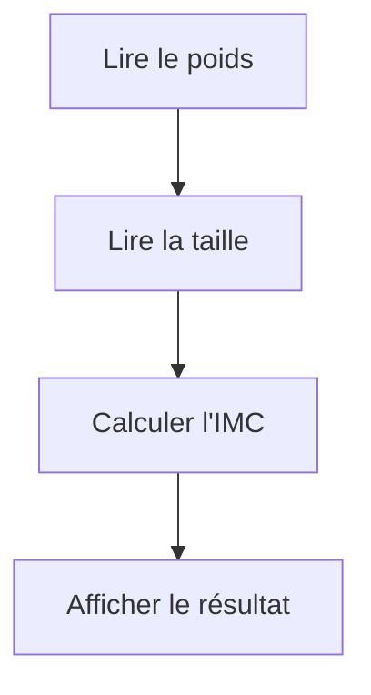
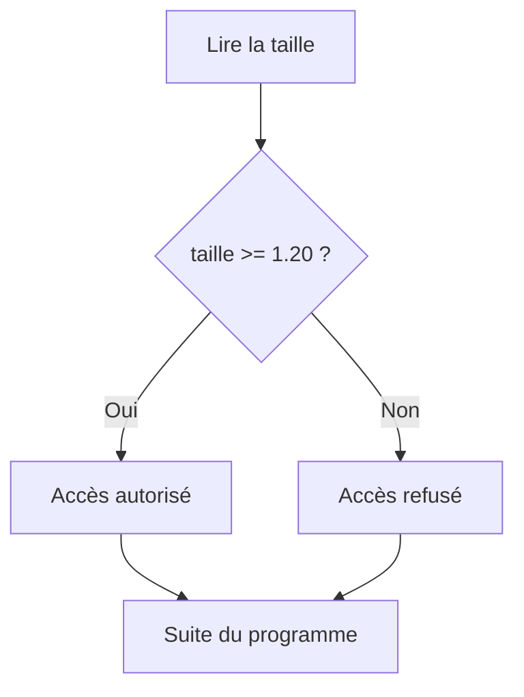
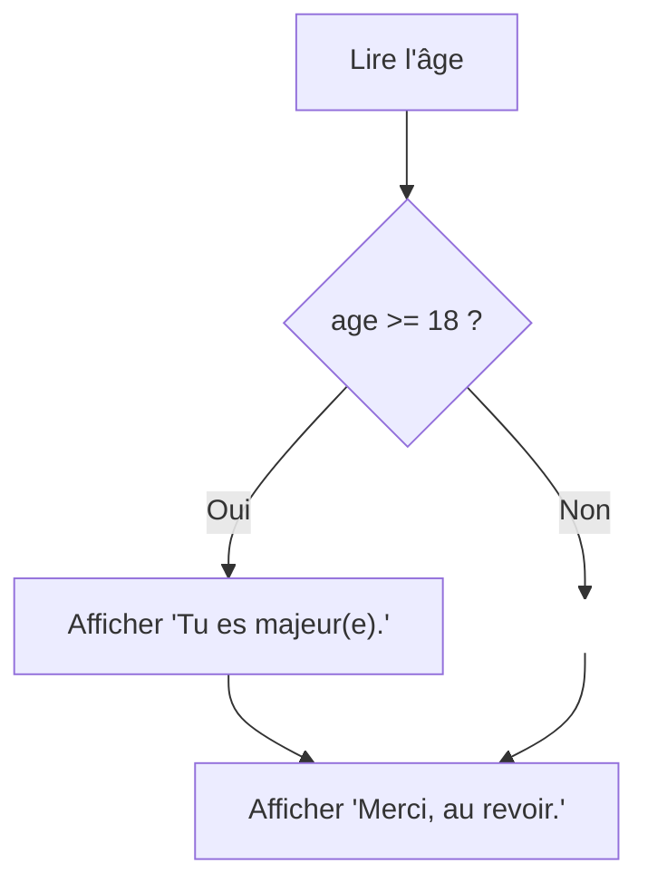
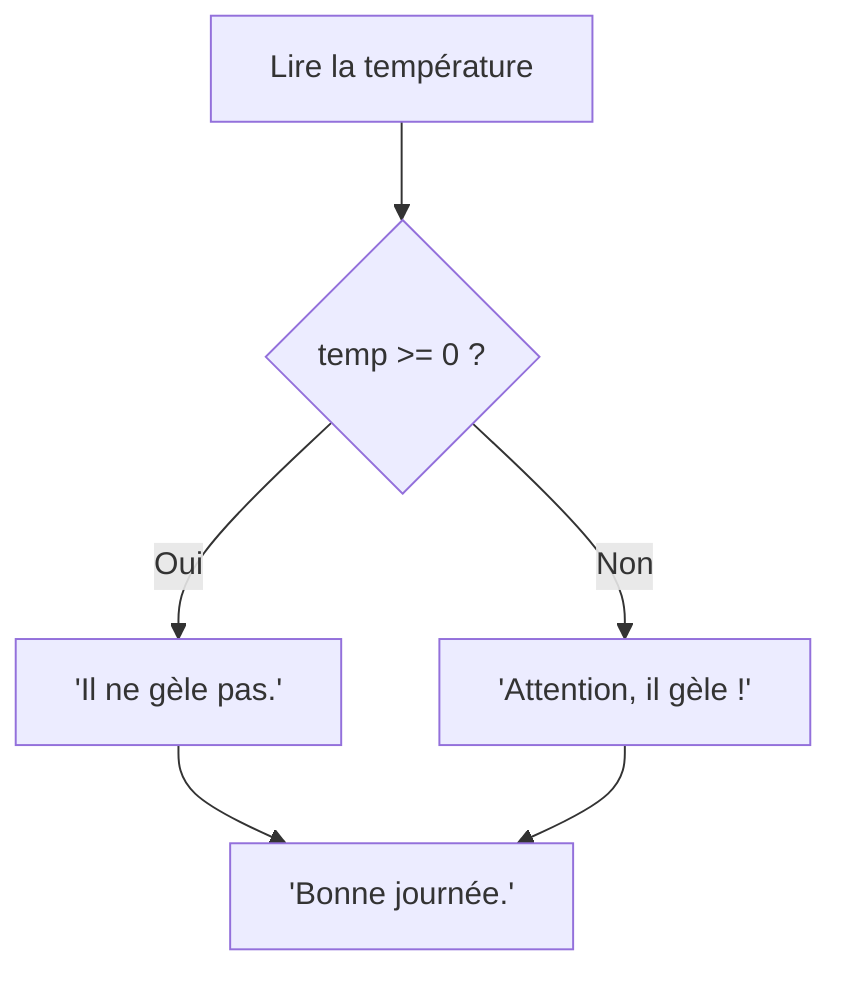
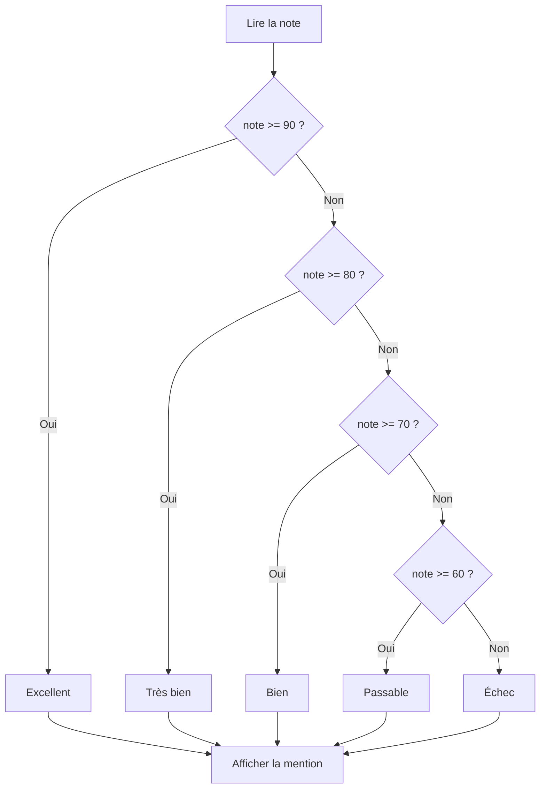
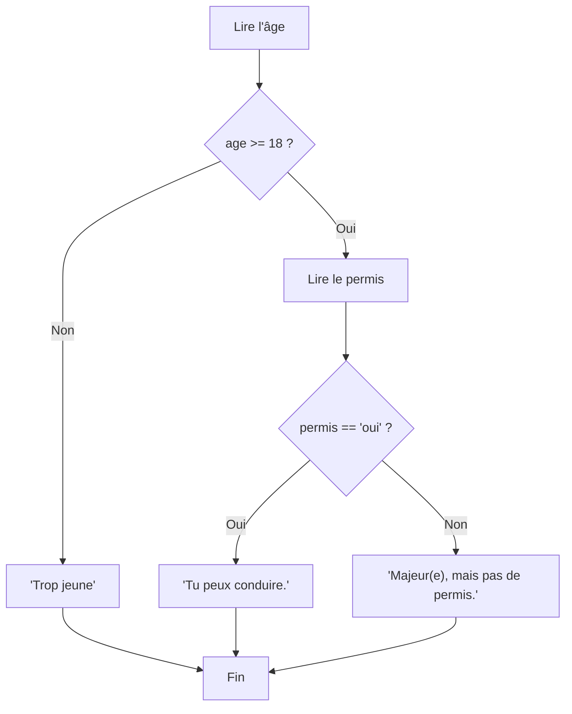

import { Tabs, TabItem, Aside, Steps, Card, CardGrid } from '@astrojs/starlight/components';

## Le flux d'un programme

Jusqu'à maintenant, tous tes programmes suivaient un chemin unique : les instructions s'exécutent **une après l'autre**, de haut en bas, sans jamais dévier. C'est ce qu'on appelle un **flux séquentiel**.

```python
poids = float(input("Poids (kg) : "))
taille = float(input("Taille (m) : "))
imc = poids / taille ** 2
print("Ton IMC est :", format(imc, ".2f"))
```

On peut visualiser ce programme comme un flux linéaire :



Chaque boîte représente une **instruction**, et les flèches montrent l'**ordre d'exécution**. Le programme entre par le haut et sort par le bas, sans surprise.

<Aside type="tip" title="Penser en flux">
Concevoir un programme, c'est d'abord imaginer un **flux** : une suite d'étapes qui transforment des données d'entrée en un résultat de sortie. Avant d'écrire du code, demande-toi toujours : « Quelles sont les étapes ? Dans quel ordre ? »
</Aside>

---

## Quand le flux linéaire ne suffit plus

Dans la réalité, les problèmes demandent souvent de **prendre des décisions**. Considère ces situations :

> *Un site web affiche « Bonjour » le matin et « Bonsoir » le soir.*

> *Un parc d'attractions n'admet que les visiteurs mesurant au moins 1,20 m sur certains manèges.*

> *Une facture applique un rabais de 10 % si le client est membre.*

Dans chacun de ces cas, le programme ne peut pas simplement dérouler les mêmes instructions à chaque fois. Il doit **examiner une condition** puis **choisir un chemin** parmi plusieurs possibles.

C'est exactement ce que fait une **bifurcation** dans le flux :



Le losange représente une **question** (une condition). Selon la réponse, le flux emprunte un chemin ou l'autre. Mais les deux chemins se **rejoignent** ensuite : le programme continue normalement après la bifurcation.

<Aside type="note" title="Vocabulaire">
On parle de **structure conditionnelle**, de **branchement** ou de **bifurcation**. En anglais : *conditional statement* ou *branching*. L'idée est la même : le flux du programme se divise en fonction d'une condition.
</Aside>

---

## Écrire des conditions en Python

Pour que Python puisse prendre une décision, il a besoin d'une **condition** — une expression qui vaut soit `True` (vrai), soit `False` (faux). Ces deux valeurs forment le type **booléen** (`bool`).

```python
>>> 5 > 3
True
>>> 2 == 7
False
>>> type(True)
<class 'bool'>
```

### Opérateurs de comparaison

Les opérateurs de comparaison permettent de comparer deux valeurs. Le résultat est toujours un booléen.

| Opérateur | Signification | Exemple | Résultat |
|---|---|---|---|
| `==` | Égal à | `5 == 5` | `True` |
| `!=` | Différent de | `5 != 3` | `True` |
| `<` | Strictement inférieur à | `3 < 5` | `True` |
| `>` | Strictement supérieur à | `5 > 5` | `False` |
| `<=` | Inférieur ou égal à | `5 <= 5` | `True` |
| `>=` | Supérieur ou égal à | `3 >= 5` | `False` |

Tu peux tester ces expressions directement dans le shell IDLE :

```python
>>> age = 22
>>> age >= 18
True
>>> age == 15
False
>>> temperature = -5
>>> temperature < 0
True
```

<Aside type="caution" title="== vs =">
Ne confonds pas `=` (affectation) et `==` (comparaison). C'est l'une des erreurs les plus fréquentes chez les débutants :
```python
x = 5      # Affecte la valeur 5 à x
x == 5     # Compare x à 5 → True
x == 3     # Compare x à 3 → False
```
</Aside>

On peut aussi comparer des chaînes de caractères. Python compare alors l'ordre **alphabétique** (plus précisément, l'ordre des codes Unicode) :

```python
>>> "alice" == "alice"
True
>>> "alice" == "Alice"
False
>>> "a" < "b"
True
```

<Aside type="caution" title="Majuscules et minuscules">
Pour Python, `"alice"` et `"Alice"` sont **différents**. Les majuscules ont un code Unicode plus petit que les minuscules, donc `"A" < "a"` vaut `True`. Fais attention lors des comparaisons de chaînes saisies par l'utilisateur !
</Aside>

### Opérateurs logiques

Les opérateurs logiques permettent de **combiner** plusieurs conditions pour former des conditions plus complexes.

| Opérateur | Signification | Exemple | Résultat |
|---|---|---|---|
| `and` | **ET** — les deux conditions doivent être vraies | `5 > 3 and 2 < 4` | `True` |
| `or` | **OU** — au moins une condition doit être vraie | `5 > 3 or 2 > 4` | `True` |
| `not` | **NON** — inverse la condition | `not 5 > 3` | `False` |

#### L'opérateur `and`

`and` retourne `True` seulement si les **deux** conditions sont vraies :

| Condition A | Condition B | `A and B` |
|---|---|---|
| `True` | `True` | `True` |
| `True` | `False` | `False` |
| `False` | `True` | `False` |
| `False` | `False` | `False` |

```python
>>> age = 25
>>> citoyen = "oui"
>>> age >= 18 and citoyen == "oui"
True
>>> age >= 18 and citoyen == "non"
False
```

#### L'opérateur `or`

`or` retourne `True` si **au moins une** des conditions est vraie :

| Condition A | Condition B | `A or B` |
|---|---|---|
| `True` | `True` | `True` |
| `True` | `False` | `True` |
| `False` | `True` | `True` |
| `False` | `False` | `False` |

```python
>>> jour = "samedi"
>>> jour == "samedi" or jour == "dimanche"
True
>>> jour == "lundi" or jour == "mardi"
False
```

#### L'opérateur `not`

`not` inverse simplement la valeur : `True` devient `False` et vice versa.

```python
>>> est_pluie = False
>>> not est_pluie
True
```

#### Combiner les opérateurs

On peut combiner `and`, `or` et `not` dans une même expression. L'ordre de priorité est : `not` d'abord, puis `and`, puis `or`. En cas de doute, utilise des **parenthèses** pour clarifier :

```python
# Sans parenthèses : not, puis and, puis or
>>> True or False and not True
True

# Avec parenthèses : intention claire
>>> (True or False) and (not True)
False
```

<Aside type="tip" title="Conseil pratique">
Même si tu connais les règles de priorité, les parenthèses rendent le code **plus lisible**. N'hésite pas à en mettre pour que ton intention soit claire, autant pour toi que pour ceux qui liront ton code.

```python
# Plus clair grâce aux parenthèses
if (age >= 18) and (citoyen == "oui"):
    print("Tu as le droit de vote.")
```
</Aside>

#### Comparaison chaînée (particularité de Python)

Python offre une syntaxe spéciale pour vérifier qu'une valeur se trouve dans un intervalle :

```python
# Les deux écritures sont équivalentes
>>> note = 75
>>> note >= 60 and note < 90
True
>>> 60 <= note < 90          # Comparaison chaînée — plus lisible
True
```

C'est une particularité de Python que peu d'autres langages offrent. Elle se lit naturellement comme en mathématiques : $60 \leq \text{note} < 90$.

---

## Le `if` en Python

### Le `if` seul — faire quelque chose *seulement si*

La forme la plus simple : on exécute un bloc de code **seulement si** une condition est vraie. Si elle est fausse, on ne fait rien de spécial.

```python
age = int(input("Ton âge : "))

if age >= 18:
    print("Tu es majeur(e).")

print("Merci, au revoir.")
```



**Avec `age = 22` :**
```
Tu es majeur(e).
Merci, au revoir.
```

**Avec `age = 15` :**
```
Merci, au revoir.
```

Le `print("Merci, au revoir.")` s'exécute **toujours**, car il est en dehors du `if` (pas d'indentation).

---

### Anatomie d'un `if`

```python
if age >= 18:
    print("Tu es majeur(e).")
```

<Steps>
1. Le mot-clé `if`
2. Une **condition** (une expression qui vaut `True` ou `False`)
3. Les **deux-points** `:` à la fin de la ligne
4. Le **bloc indenté** (décalé de 4 espaces) : les instructions à exécuter si la condition est vraie
</Steps>

<Aside type="caution" title="Les trois erreurs classiques">

**1. Oublier les deux-points `:`**
```python
if age >= 18     # ❌ SyntaxError: expected ':'
    print("Majeur")

if age >= 18:    # ✅
    print("Majeur")
```

**2. Oublier l'indentation**
```python
if age >= 18:
print("Majeur")     # ❌ IndentationError: expected an indented block

if age >= 18:
    print("Majeur") # ✅ indenté de 4 espaces
```

**3. Utiliser `=` au lieu de `==`**
```python
if age = 18:     # ❌ SyntaxError (affectation, pas comparaison)

if age == 18:    # ✅ comparaison
```
</Aside>

---

### Le `if-else` — deux chemins

Quand tu veux faire une chose **ou** une autre, utilise `if-else` :

```python
temperature = float(input("Température (°C) : "))

if temperature >= 0:
    print("Il ne gèle pas.")
else:
    print("Attention, il gèle !")

print("Bonne journée.")
```



Le `else` n'a **pas de condition** : c'est le chemin emprunté quand la condition du `if` est fausse. On passe obligatoirement par **un** des deux chemins, jamais les deux.

---

### Le `if-elif-else` — plusieurs conditions

Quand il y a plus de deux possibilités, on enchaîne les conditions avec `elif` (contraction de *else if*) :

```python
note = float(input("Note (%) : "))

if note >= 90:
    mention = "Excellent"
elif note >= 80:
    mention = "Très bien"
elif note >= 70:
    mention = "Bien"
elif note >= 60:
    mention = "Passable"
else:
    mention = "Échec"

print("Mention :", mention)
```



<Aside type="tip" title="L'ordre des conditions compte">
Python teste les conditions **de haut en bas**. Dès qu'une condition est vraie, il exécute le bloc correspondant et **ignore tout le reste**.

C'est pourquoi on n'a pas besoin de tester les deux bornes de chaque intervalle. Par exemple, si on arrive au test `note >= 80`, c'est que `note >= 90` était déjà faux. On sait donc que la note est entre 80 et 89.
</Aside>

#### Règles du `if-elif-else`

| Élément | Quantité | Condition ? | Obligatoire ? |
|---|---|---|---|
| `if` | Exactement 1 | Oui | Oui |
| `elif` | 0, 1, 2, ... autant que nécessaire | Oui | Non |
| `else` | 0 ou 1 | Non | Non |

Le `else` est le **filet de sécurité** : il attrape tout ce qui n'a été capté par aucune condition précédente. Il est optionnel, mais souvent recommandé.

---

### Le `if` imbriqué — une décision dans une décision

Parfois, une décision dépend d'une autre décision prise avant. On place alors un `if` **à l'intérieur** d'un autre `if` :

```python
age = int(input("Ton âge : "))

if age >= 18:
    permis = input("As-tu ton permis ? (oui/non) : ")
    if permis == "oui":
        print("Tu peux conduire.")
    else:
        print("Tu es majeur(e), mais tu n'as pas de permis.")
else:
    print("Tu es trop jeune pour conduire.")
```



<Aside type="caution" title="L'indentation double">
Dans un `if` imbriqué, le bloc intérieur est indenté **deux fois** (8 espaces par rapport à la marge) :
```python
if age >= 18:                    # niveau 1 (0 espace)
    permis = input("...")        # niveau 2 (4 espaces)
    if permis == "oui":          # niveau 2 (4 espaces)
        print("Tu peux...")      # niveau 3 (8 espaces)
    else:                        # niveau 2 (4 espaces)
        print("Pas de permis")   # niveau 3 (8 espaces)
else:                            # niveau 1 (0 espace)
    print("Trop jeune")          # niveau 2 (4 espaces)
```
Chaque niveau d'indentation correspond à un **niveau de décision**. Plus le code est indenté, plus il dépend de conditions « parentes ».
</Aside>

#### Quand imbriquer ? Quand utiliser `elif` ?

Utilise **`elif`** quand les conditions sont **mutuellement exclusives** et portent sur le même sujet :

```python
# Les conditions portent toutes sur la note
if note >= 90:
    mention = "Excellent"
elif note >= 80:
    mention = "Très bien"
elif note >= 60:
    mention = "Passable"
else:
    mention = "Échec"
```

Utilise un **`if` imbriqué** quand une condition **dépend** d'une autre ou porte sur un sujet différent :

```python
# Le permis n'a de sens que si l'âge est suffisant
if age >= 18:
    if permis == "oui":
        print("Tu peux conduire.")
```

---

## Les pièges courants

### Piège 1 : `if` indépendants vs `if-elif`

Dans cet exemple, les deux `if` sont indépendants. Ils seront donc tous les deux testés.
```python
note = 95
if note >= 90:
    print("Excellent")    # ← s'exécute
if note >= 80:
    print("Très bien")    # ← s'exécute AUSSI !
```

**Correction avec if-elif:** dès qu'une condition est vraie, les suivantes sont ignorées
```python
note = 95
if note >= 90:
    print("Excellent")    # ← s'exécute
elif note >= 80:
    print("Très bien")    # ← ignoré, car le if était déjà vrai
```

<Aside type="caution" title="Retiens ceci">
Avec des `if` indépendants, **chaque condition est testée** séparément. Avec `if-elif`, dès qu'un bloc s'exécute, **tous les `elif` et le `else` sont ignorés**.
</Aside>

---

### Piège 2 : le `else` orphelin

Le `else` se rattache toujours au **dernier `if` ou `elif`** du même niveau d'indentation.
Dans cet exemple, le `else` se rattache au `if` le plus proche (le deuxième: `if x > 100`)

```python
x = 5
if x > 0:
    print("Positif")
    if x > 100:
        print("Grand nombre")
    else:
        print("Petit nombre")  # ← s'exécute (x > 0 mais pas > 100)
```

Si tu voulais que le `else` se rattache au premier `if`, il faudrait changer l'indentation :

```python
x = -3
if x > 0:
    print("Positif")
    if x > 100:
        print("Grand nombre")
else:
    print("Négatif ou nul")  # ← rattaché au premier if
```

---

### Piège 3 : comparer des types différents

```python
age = input("Ton âge : ")   # age est un str !

if age >= 18:                # ❌ compare un str avec un int
    print("Majeur")
```

Ce code ne plante pas toujours, mais il ne fonctionne **pas correctement**. La chaîne `"22"` n'est pas le nombre `22`. N'oublie jamais de convertir :

```python
age = int(input("Ton âge : "))  # ✅ age est un int

if age >= 18:
    print("Majeur")
```

---

### Piège 4 : le bloc vide

Python interdit les blocs vides. Si tu veux « ne rien faire » dans un cas, utilise `pass` :

```python
if note >= 60:
    pass  # On ne fait rien pour l'instant (à compléter plus tard)
else:
    print("Échec")
```

<Aside type="tip" title="Quand utiliser pass ?">
`pass` est un espace réservé (*placeholder*). Il est utile quand tu structures ton programme et que tu veux écrire la logique du `if-else` avant de remplir les détails.  
C'est comme écrire **« TODO »** dans un brouillon.
</Aside>

---

### Piège 5 : conditions toujours vraies ou toujours fausses

Dans cet exemple, la condition (`x > 5 or x < 20`) est toujours vrai, qu'importe la valeur de `x`. Donc, le `else` ne sera jamais atteint.
```python
x = 10
if x > 5 or x < 20:    # Tout nombre est > 5 OU < 20
    print("Toujours ici")
else:
    print("Jamais ici")  # Code mort !
```

L'erreur vient de la logique : il fallait probablement `and` au lieu de `or` :

```python
# ✅ Teste si x est entre 5 et 20
if x > 5 and x < 20:
    print("Entre 5 et 20")
```

---

## En résumé

| Structure | Quand l'utiliser |
|---|---|
| `if` seul | Tu veux faire quelque chose **seulement si** une condition est vraie, sinon rien |
| `if-else` | Tu as exactement **deux cas** : vrai ou faux |
| `if-elif-else` | Tu as **plusieurs cas** mutuellement exclusifs |
| `if` imbriqué | Une décision **dépend** d'une décision précédente |

---

## Bonus : l'expression conditionnelle (opérateur ternaire)

Python permet d'écrire un `if-else` simple **sur une seule ligne**. C'est ce qu'on appelle une **expression conditionnelle** (ou opérateur ternaire) :

```python
# Forme classique
if age >= 18:
    statut = "majeur"
else:
    statut = "mineur"

# Équivalent en une ligne
statut = "majeur" if age >= 18 else "mineur"
```

La syntaxe est :

```
valeur_si_vrai if condition else valeur_si_faux
```

Quelques exemples :

```python
# Valeur absolue
resultat = nombre if nombre >= 0 else -nombre

# Parité
parite = "pair" if n % 2 == 0 else "impair"

# Maximum de deux nombres
maximum = a if a >= b else b

# Dans un print directement
print("Accès", "autorisé" if mot_de_passe == "abc123" else "refusé")
```

<Aside type="caution" title="À utiliser avec modération">
L'opérateur ternaire est pratique pour les cas **simples et courts**. Si la logique est complexe ou si les expressions sont longues, un `if-else` classique sera plus lisible :

```python
# ❌ Trop complexe pour un ternaire — difficile à lire
prix = prix * 0.9 if membre == "oui" and total > 100 else prix * 0.95 if total > 50 else prix

# ✅ Plus clair en if-elif-else
if membre == "oui" and total > 100:
    prix = prix * 0.9
elif total > 50:
    prix = prix * 0.95
```
</Aside>

<Aside type="note" title="Expression vs instruction">
Le ternaire est une **expression** : il produit une valeur. Un `if-else` classique est une **instruction** : il exécute des actions. C'est pour ça que le ternaire peut être utilisé à droite d'un `=` ou à l'intérieur d'un `print()`.
</Aside>