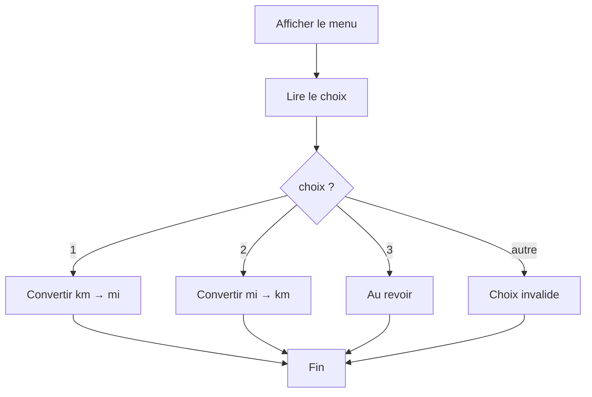
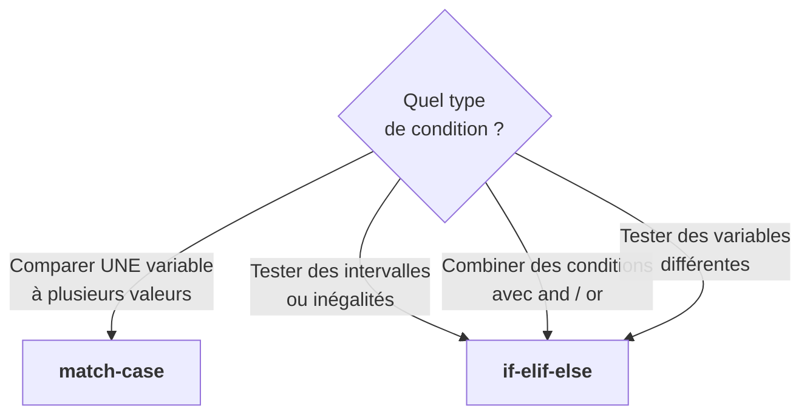
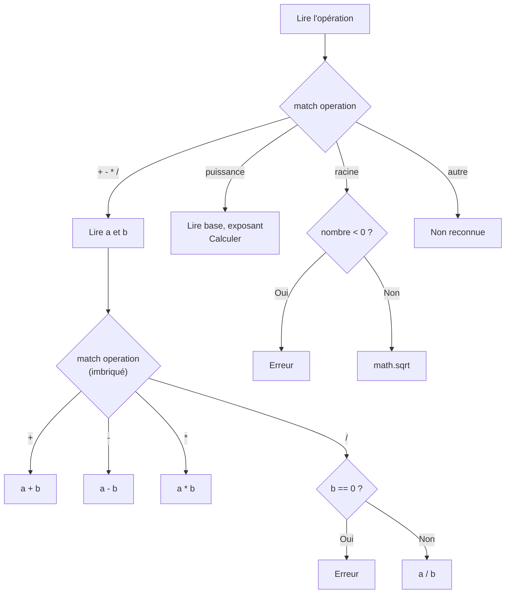

import { Tabs, TabItem, Aside, Steps, Card, CardGrid } from '@astrojs/starlight/components';

## Le problème : trop de répétition dans l'usage des instructions `elif`

Supposons un code comme celui-ci qui affiche le jour de la semaine correspondant à un chiffre donné

```python
jour = input("Numéro du jour (1-7) : ")

if jour == "1":
    nom = "Lundi"
elif jour == "2":
    nom = "Mardi"
elif jour == "3":
    nom = "Mercredi"
elif jour == "4":
    nom = "Jeudi"
elif jour == "5":
    nom = "Vendredi"
elif jour == "6":
    nom = "Samedi"
elif jour == "7":
    nom = "Dimanche"
else:
    nom = "Invalide"

print(nom)
```

Ça fonctionne, mais c'est répétitif. Chaque `elif` teste la **même variable** (`jour`) avec `==`. Quand on a beaucoup de cas distincts à traiter, cette approche devient lourd à lire et à maintenir.

La plupart des langages de programmation offrent une structure dédiée pour ce genre de situation. En **C**, **Java**, **JavaScript** et **C#**, c'est l'instruction `switch-case`. En **Rust**, c'est `match`. Python, longtemps, n'avait rien d'équivalent — il fallait se contenter de chaînes de `if-elif`.

Ce n'est plus le cas depuis **Python 3.10** (octobre 2021), qui a introduit le **`match-case`**.

<Aside type="note" title="Plus qu'un simple switch">
Le `match-case` de Python va plus loin que le `switch` traditionnel. Au lieu de simplement comparer une valeur à des constantes, il fait du **filtrage par motif** (*structural pattern matching*) : il peut examiner la **structure** d'une donnée (listes, tuples, objets) et en extraire des parties. Tu verras un aperçu de cette capacité plus loin dans la page.
</Aside>

<Tabs>
<TabItem label="Python">
```python
match jour:
    case "lundi":
        print("Début de semaine")
    case "vendredi":
        print("Fin de semaine")
    case _:
        print("Autre jour")
```
</TabItem>
<TabItem label="JavaScript">
```javascript
switch (jour) {
    case "lundi":
        console.log("Début de semaine");
        break;
    case "vendredi":
        console.log("Fin de semaine");
        break;
    default:
        console.log("Autre jour");
}
```
</TabItem>
<TabItem label="Java">
```java
switch (jour) {
    case "lundi":
        System.out.println("Début de semaine");
        break;
    case "vendredi":
        System.out.println("Fin de semaine");
        break;
    default:
        System.out.println("Autre jour");
}
```
</TabItem>
</Tabs>

---

## Syntaxe du `match-case`

```python
match variable:
    case valeur_1:
        instructions_1
    case valeur_2:
        instructions_2
    case valeur_3:
        instructions_3
    case _:
        instructions_par_defaut
```

<Steps>
1. Le mot-clé `match` suivi de la **valeur à examiner** et de `:`
2. Un ou plusieurs blocs `case` suivis d'un **motif** (*pattern*) et de `:`
3. Le bloc indenté sous chaque `case` : les instructions à exécuter si le motif correspond
4. Le cas `_` (underscore) : le **cas par défaut**, qui attrape tout ce qui n'a pas été capté
</Steps>

Voici le même programme qu'avant, réécrit avec `match-case` :

```python
jour = input("Numéro du jour (1-7) : ")

match jour:
    case "1":
        nom = "Lundi"
    case "2":
        nom = "Mardi"
    case "3":
        nom = "Mercredi"
    case "4":
        nom = "Jeudi"
    case "5":
        nom = "Vendredi"
    case "6":
        nom = "Samedi"
    case "7":
        nom = "Dimanche"
    case _:
        nom = "Invalide"

print(nom)
```

Le code est plus lisible : on voit immédiatement que chaque `case` correspond à une valeur possible de `jour`, sans la répétition de `jour ==` à chaque ligne.

<Aside type="note" title="Pas de break en Python">
Dans les langages comme C, Java et JavaScript, il faut ajouter `break` à la fin de chaque `case`, sinon l'exécution « tombe » dans le cas suivant (*fall-through*). En Python, ce problème n'existe pas : chaque `case` s'arrête automatiquement après son bloc.
</Aside>

---

## `if-elif-else` vs. `match-case`

Supposons un programme qui interprète des commandes envoyées à un robot.  
Ici, nous voyons comment traiter les divers cas de commande avec l'instruction
`if-elif-else` et l'équivalent avec l'instruction `match-case`.

Comme tu le constateras, lorsque l'on compare une même variable à plusieurs valeurs fixes,
l'instruction `match-case` est souvent plus lisible et plus adaptée qu'une succession de `if-elif`.

<Tabs>
<TabItem label="if-elif-else">
```python
commande = input("Commande envoyé au robot: ")

if commande == "FW" or commande == "fw":
    print("Le robot avance")
elif commande == "BW" or commande == "bw":
    print("Le robot recule")
elif commande == "LT" or commande == "lt":
    print("Le robot tourne à gauche")
elif commande == "RT" or commande == "rt":
    print("Le robot tourne à droite")
elif commande == "STOP" or commande == "stop":
    print("Le robot s'arrête")
else:
    print("Commande invalide")
```
</TabItem>
<TabItem label="match-case">
```python
commande = input("Commande envoyé au robot: ")

match commande:
    case "FW" | "fw":
        print("Le robot avance")
    case "BW" | "bw":
        print("Le robot recule")
    case "LT" | "lt":
        print("Le robot tourne à gauche")
    case "RT" | "rt":
        print("Le robot tourne à droite")
    case "STOP" | "stop":
        print("Le robot s'arrête")
    case _:
        print("Commande invalide")
```
</TabItem>
</Tabs>

| Aspect | `if-elif-else` | `match-case` |
|---|---|---|
| Lisibilité avec beaucoup de cas | Répétitif (`variable ==` partout) | Claire et compacte |
| Conditions complexes <br/> (intervalles, `and`, `or`) | Naturel à écrire | Moins naturel (possible via `if` <br/> dans un `case`) |
| Tester plusieurs valeurs <br/> pour un même cas | Utilise `or` | Utilise le symbole `\|` |
| Cas par défaut | `else` | `case _` |

---

## Ce que `match-case` fait mieux

### Regrouper plusieurs valeurs avec `|`

Avec `if-elif`, regrouper des valeurs demande des `or` :

```python
jour = input("Jour : ")

if jour == "samedi" or jour == "dimanche":
    print("Fin de semaine")
elif jour == "lundi" or jour == "mardi" or jour == "mercredi" or jour == "jeudi" or jour == "vendredi":
    print("Jour de semaine")
else:
    print("Jour invalide")
```

Avec `match-case`, le symbole `|` (pipe) signifie « ou » et simplifie grandement l'écriture :

```python
jour = input("Jour : ")

match jour:
    case "samedi" | "dimanche":
        print("Fin de semaine")
    case "lundi" | "mardi" | "mercredi" | "jeudi" | "vendredi":
        print("Jour de semaine")
    case _:
        print("Jour invalide")
```

<Aside type="caution" title="On ne peut pas empiler les case">
Dans des langages comme C, Java ou JavaScript, on peut « empiler » plusieurs `case` les uns à la suite des autres pour qu'ils partagent le même bloc de code (grâce au *fall-through*) :

```javascript
// JavaScript — empilage de case (fall-through)
switch (jour) {
    case "samedi":
    case "dimanche":
        console.log("Fin de semaine");
        break;
}
```

**En Python, c'est impossible.** Chaque `case` doit avoir son propre bloc. 
Si tu essaies d'empiler, cela créra une erreur (*SyntaxError*) comme dans le cas suivant :

```python
match jour:
    case "samedi":
    case "dimanche":
        print("Fin de semaine")
```

La seule façon de regrouper des valeurs est d'utiliser le **`|`** sur une même ligne :

```python
match jour:
    case "samedi" | "dimanche":
        print("Fin de semaine")
```
</Aside>
---

### Menus et choix utilisateur

Le `match-case` est particulièrement adapté aux **menus interactifs** où l'utilisateur choisit parmi des options prédéfinies :

```python
print("=== CONVERTISSEUR ===")
print("1. Kilomètres → Milles")
print("2. Milles → Kilomètres")
print("3. Quitter")

choix = input("Ton choix : ")

match choix:
    case "1":
        km = float(input("Distance en km : "))
        milles = km * 0.621371
        print(format(km, ".2f"), "km =", format(milles, ".2f"), "milles")
    case "2":
        milles = float(input("Distance en milles : "))
        km = milles * 1.60934
        print(format(milles, ".2f"), "milles =", format(km, ".2f"), "km")
    case "3":
        print("Au revoir !")
    case _:
        print("Choix invalide")
```

Le flux de ce programme est facile à visualiser :



---

### Catégoriser des codes ou des symboles

Le `match-case` est idéal quand tu dois associer des **codes à des significations** :

```python
print("=== CODE HTTP ===")
code = int(input("Code de statut : "))

match code:
    case 200:
        print("OK — La requête a réussi")
    case 301:
        print("Redirection permanente")
    case 404:
        print("Page non trouvée")
    case 500:
        print("Erreur interne du serveur")
    case _:
        print("Code", code, "— non documenté")
```

```python
print("=== NOTATION MUSICALE ===")
note = input("Note (do, ré, mi, ...) : ")

match note:
    case "do":
        frequence = 261.63
    case "ré":
        frequence = 293.66
    case "mi":
        frequence = 329.63
    case "fa":
        frequence = 349.23
    case "sol":
        frequence = 392.00
    case "la":
        frequence = 440.00
    case "si":
        frequence = 493.88
    case _:
        frequence = 0

if frequence > 0:
    print("Fréquence :", format(frequence, ".2f"), "Hz")
else:
    print("Note inconnue")
```

---

## Quand utiliser `match-case` vs `if-elif-else` ?



| Situation | Structure recommandée |
|---|---|
| Menu avec options prédéfinies | `match-case` |
| Codes ou symboles à interpréter | `match-case` |
| Regrouper plusieurs valeurs (`\|`) | `match-case` |
| Intervalles numériques | `if-elif-else` |
| Conditions combinées (`and`, `or`) | `if-elif-else` |
| Tests sur des variables différentes | `if-elif-else` |

<Aside type="tip" title="En cas de doute">
Le `if-elif-else` fonctionne **dans tous les cas**. Le `match-case` est un outil supplémentaire qui rend certains cas plus lisibles. Si tu hésites, le `if-elif-else` est toujours un choix valide.
</Aside>

---

## Pièges du `match-case`

### Piège 1 : les types doivent correspondre

Le `match-case` compare les valeurs **exactement**, y compris le type :

```python
choix = input("Ton choix : ")  # choix est un str !

match choix:
    case 1:         # ❌ Compare un str à un int → ne correspondra jamais
        print("Option 1")
    case "1":       # ✅ Compare un str à un str
        print("Option 1")
```

<Aside type="caution" title="Rappel">
`input()` retourne toujours un `str`. Si tu écris `case 1:` au lieu de `case "1":`, le cas ne sera jamais atteint. Convertis avec `int()` si tu veux comparer des nombres, ou utilise des chaînes dans les `case`.
</Aside>

---

### Piège 2 : les noms seuls sont des captures, pas des comparaisons

```python
QUITTER = "q"

match commande:
    case QUITTER:     # ⚠️ NE compare PAS à la variable QUITTER !
        print("Bye")  #     Ça CAPTURE la valeur dans une nouvelle variable QUITTER
```

Un nom seul dans un `case` est interprété comme une **variable de capture** : 
il accepte n'importe quelle valeur et la stocke dans ce nom. 
Pour comparer à une constante, utilise une valeur littérale :

```python
match commande:
    case "q":          # ✅ Compare à la chaîne "q"
        print("Bye")
```

---

### Piège 3 : oublier le cas par défaut

Sans `case _`, si aucun motif ne correspond, **rien ne se passe**; le programme poursuivra simplement son exécution.
Dans l'exemple ci-dessous, si `jour == "mardi"`, il n'y aura aucun affichage et aucune erreur.

```python
match jour:
    case "lundi":
        print("Début de semaine")
    case "vendredi":
        print("Presque le weekend !")
```

**Bonne pratique:** Ajoute toujours un `case _` pour gérer les cas imprévus, même si c'est juste pour afficher un message d'erreur :

```python
match jour:
    case "lundi":
        print("Début de semaine")
    case "vendredi":
        print("Presque le weekend !")
    case _:
        print("Jour non géré :", jour)
```

---

## Combiner `match-case` et `if-else`

En pratique, les deux structures se complètent très bien. On utilise `match-case` pour aiguiller le flux vers le bon cas, puis `if-else` à l'intérieur d'un `case` pour affiner avec des conditions plus complexes.

### `if` à l'intérieur d'un `case`

Un programme de commande au restaurant : le `match-case` gère la catégorie, le `if-else` gère la logique propre à chaque catégorie.

```python
print("=== MENU ===")
print("1. Boisson")
print("2. Repas")
print("3. Dessert")

choix = input("Ton choix : ")

match choix:
    case "1":
        format_boisson = input("Petit ou grand ? ")
        if format_boisson == "petit":
            prix = 2.50
        else:
            prix = 4.00
        print("Boisson :", format(prix, ".2f"), "$")

    case "2":
        supplement = input("Avec supplément fromage ? (oui/non) : ")
        prix = 12.00
        if supplement == "oui":
            prix = prix + 2.50
        print("Repas :", format(prix, ".2f"), "$")

    case "3":
        print("Dessert : 6.50 $")

    case _:
        print("Choix invalide")
```

Le `match-case` fait l'**aiguillage principal** (quelle catégorie ?), et le `if-else` à l'intérieur gère les **détails** (quel format ? quel supplément ?).

---

### `match-case` à l'intérieur d'un `if`

L'inverse est aussi possible : un `if-else` pour une décision binaire, puis un `match-case` pour détailler un des cas.

```python
age = int(input("Ton âge : "))

if age < 18:
    print("Accès au parc pour enfants")
else:
    print("=== ATTRACTIONS ADULTES ===")
    print("1. Montagne russe")
    print("2. Grande roue")
    print("3. Maison hantée")

    attraction = input("Ton choix : ")

    match attraction:
        case "1":
            print("Montagne russe — Prépare-toi !")
        case "2":
            print("Grande roue — Profite de la vue !")
        case "3":
            print("Maison hantée — Bonne chance...")
        case _:
            print("Attraction non reconnue")
```

---

### Exemple complet : calculatrice scientifique

Voici un exemple plus étoffé qui montre comment les deux structures coopèrent naturellement. Le `match-case` dirige vers l'opération choisie, et le `if-else` gère les cas particuliers (division par zéro, racine d'un nombre négatif, etc.).

```python
import math

print("=== CALCULATRICE SCIENTIFIQUE ===")
print("Opérations : +, -, *, /, puissance, racine")

operation = input("Opération : ")

match operation:
    case "+" | "-" | "*" | "/":
        a = float(input("Premier nombre : "))
        b = float(input("Deuxième nombre : "))

        match operation:
            case "+":
                resultat = a + b
            case "-":
                resultat = a - b
            case "*":
                resultat = a * b
            case "/":
                if b == 0:
                    print("Erreur : division par zéro")
                    resultat = None
                else:
                    resultat = a / b

        if resultat is not None:
            print("Résultat :", format(resultat, ".2f"))

    case "puissance":
        base = float(input("Base : "))
        exposant = float(input("Exposant : "))
        resultat = base ** exposant
        print("Résultat :", format(resultat, ".2f"))

    case "racine":
        nombre = float(input("Nombre : "))
        if nombre < 0:
            print("Erreur : racine d'un nombre négatif")
        else:
            resultat = math.sqrt(nombre)
            print("Résultat :", format(resultat, ".2f"))

    case _:
        print("Opération non reconnue")
```

Observe comment les rôles se répartissent :

| Structure | Rôle dans cet exemple |
|---|---|
| `match operation:` (premier) | Aiguille vers la catégorie d'opération |
| `match operation:` (imbriqué) | Choisit le bon calcul parmi `+`, `-`, `*`, `/` |
| `if b == 0` | Protège contre la division par zéro |
| `if resultat is not None` | N'affiche le résultat que si le calcul a réussi |
| `if nombre < 0` | Protège contre la racine d'un négatif |



<Aside type="tip" title="Retiens cette idée">
`match-case` et `if-else` ne sont pas en compétition — ce sont des outils complémentaires. Utilise `match-case` pour **aiguiller** selon des valeurs discrètes, et `if-else` pour **affiner** avec des conditions logiques. La combinaison des deux te permet de gérer des programmes de plus en plus complexes de manière organisée.
</Aside>

---

## Bonus : Guard (motif + conditions `if`)

Un **guard** est une condition `if` ajoutée à un `case`. Le motif doit correspondre **et** la condition doit être vraie :

```python
mois = int(input("Entre un mois : "))
jour = int(input("Entre un jour : "))

match mois:
    case 1 | 3 | 5 | 7 | 8 | 10 | 12 if 1 <= jour <= 31:
        print("Date valide")
    case 4 | 6 | 9 | 11 if 1 <= jour <= 30:
        print("Date valide")
    case 2 if 1 <= jour <= 28:
        print("Date valide")
    case m if 1 <= m <= 12:
        print("Jour invalide")
    case _:
        print("Mois invalide")
```

```
Entre un mois : 5
Entre un jour : 25
Date valide
```

Ici, on utilise `match` pour analyser la valeur du mois.  
Chaque `case` regroupe les mois qui ont le même nombre de jours :

- `1 | 3 | 5 | 7 | 8 | 10 | 12` → mois de **31 jours**
- `4 | 6 | 9 | 11` → mois de **30 jours**
- `2` → février (28 jours ici, sans année bissextile)

Après le motif du `case`, on ajoute un `if`.
Ce `if` vérifie que le **jour entré est valide pour ce mois**.

**Par exemple:**
```python
case 4 | 6 | 9 | 11 if 1 <= jour <= 30:
```

Cela signifie :

- Le mois doit être 4, 6, 9 ou 11
- **ET** le jour doit être entre 1 et 30

Si ces deux conditions sont vraies, on affiche `"Date valide"`.

**Ensuite:**
```python
case m if 1 <= m <= 12:
```

Ici, `m` capture le mois si aucun des cas précédents ne correspond.
Donc :

- Le mois est valide (entre 1 et 12)
- Mais le jour ne correspondait à aucun intervalle valide

On affiche alors `"Jour invalide"`.

**Finalement :**
```py
case _:
```

Ce cas attrape tout le reste, donc un **mois invalide** (comme 0 ou 15).


#### En résumé

Ce programme vérifie une date en deux étapes :

1. Est-ce que le mois est valide ?
2. Est-ce que le jour est valide pour ce mois ?

Le `match-case` permet donc de choisir le bon groupe de mois,
et le `if` permet de vérifier que le jour correspond au bon nombre de jours.


<Aside type="caution" title="Lisibilité">
Les guards sont puissants mais peuvent réduire la lisibilité. Pour de simples intervalles numériques, un `if-elif-else` classique reste souvent plus clair. Réserve les guards aux situations où tu combines filtrage structurel et conditions.
</Aside>


---

## Résumé des motifs

| Motif | Correspond à | Exemple |
|---|---|---|
| `42`, `"bonjour"`, `True` | Valeur exacte (littéral) | `case 42:` |
| `x`, `nom` | N'importe quelle valeur (capture) | `case x:` |
| `_` | N'importe quoi (sans capture) | `case _:` |
| `"a" \| "b" \| "c"` | L'une des valeurs | `case "oui" \| "o":` |
| `case x if cond:` | Motif + condition (guard) | `case n if n > 0:` |

Certains motifs attendront que nous introduisons les structures avancées comme les listes pour être revisités

| Motif | Correspond à | Exemple |
|---|---|---|
| `[x, y]` | Liste de 2 éléments | `case [a, b]:` |
| `[premier, *reste]` | Liste d'au moins 1 élément | `case [cmd, *args]:` |
| `(x, y, z)` | Tuple de 3 éléments | `case ("cercle", r):` |
| `{"clé": valeur}` | Dict contenant cette clé | `case {"nom": n}:` |