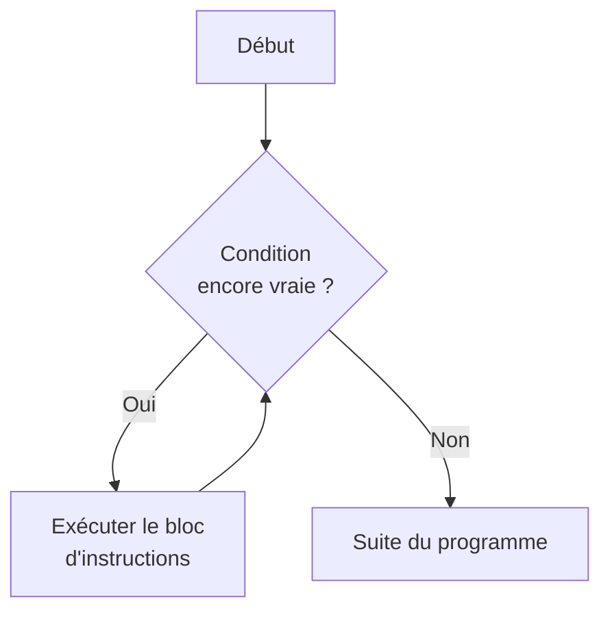
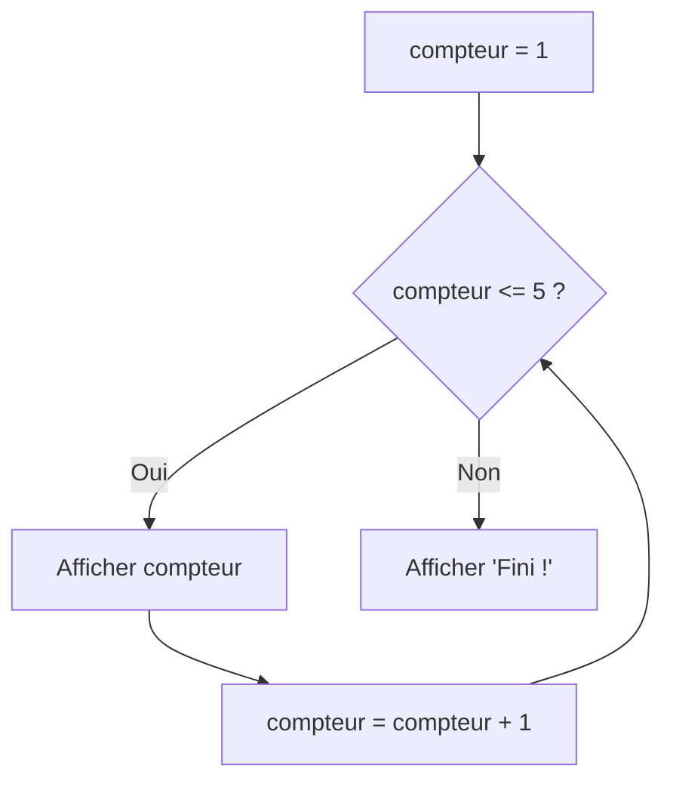
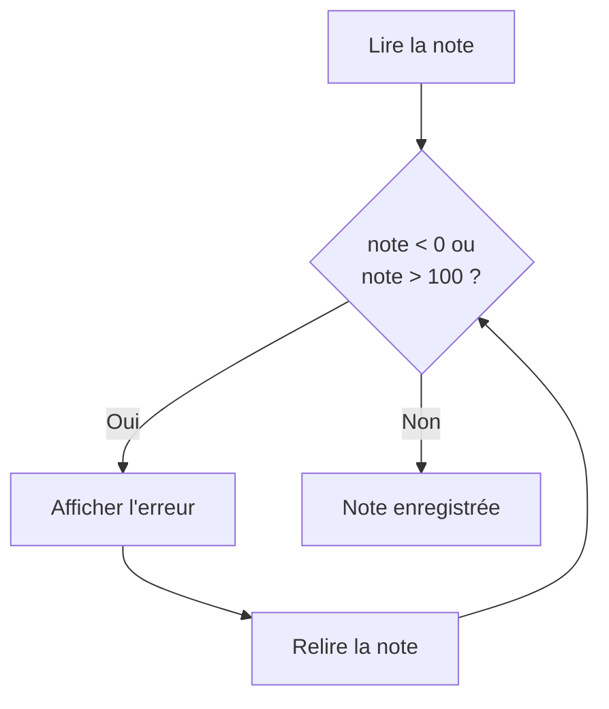
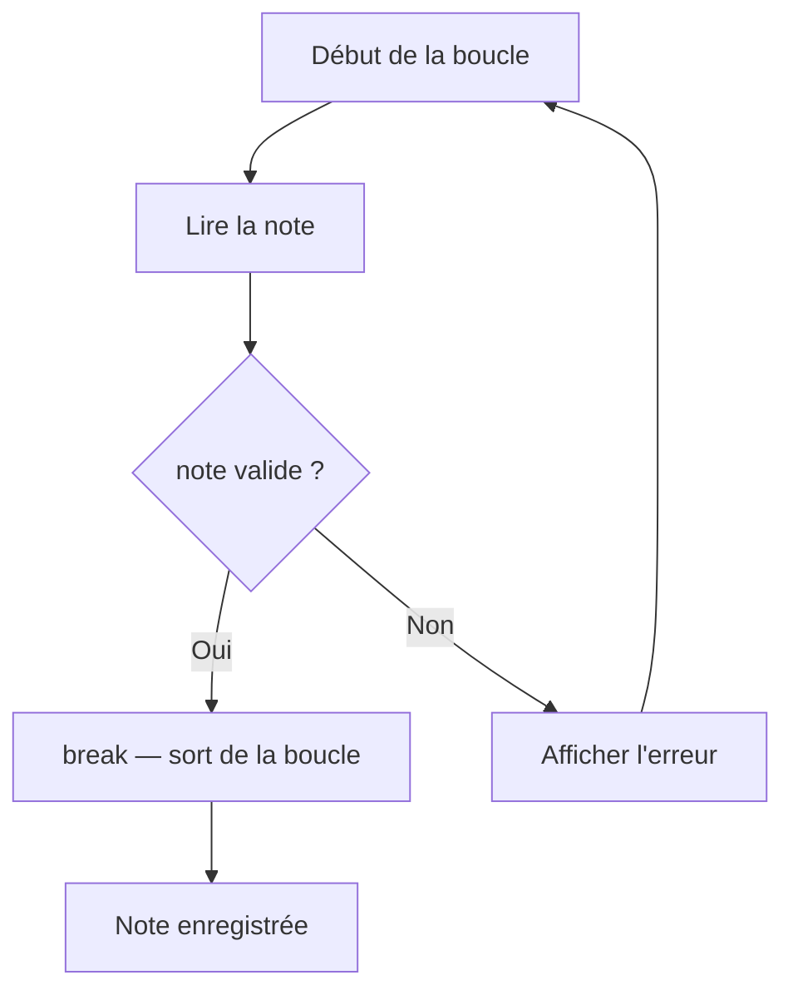
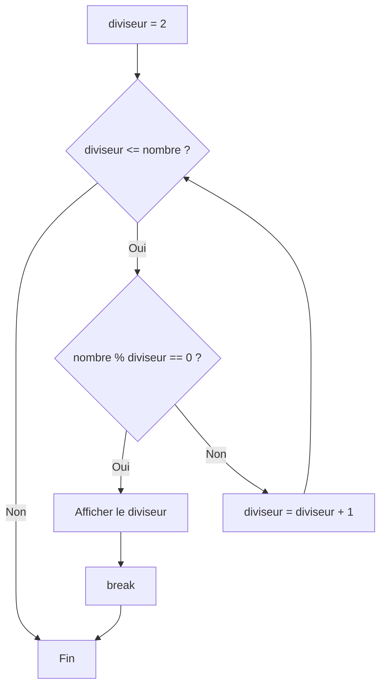
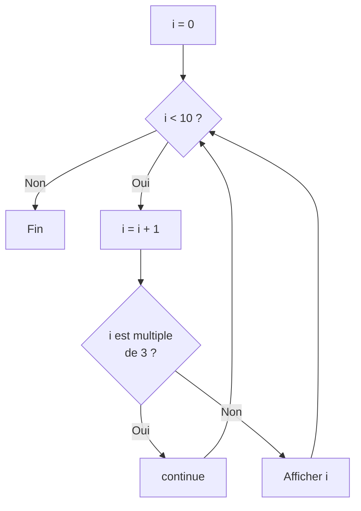
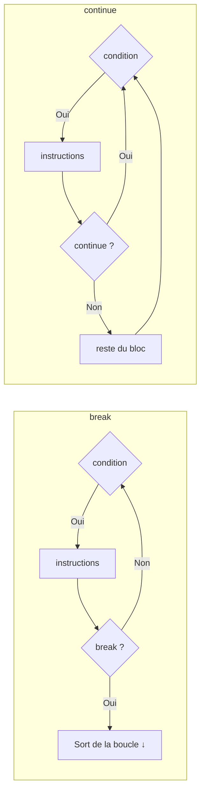
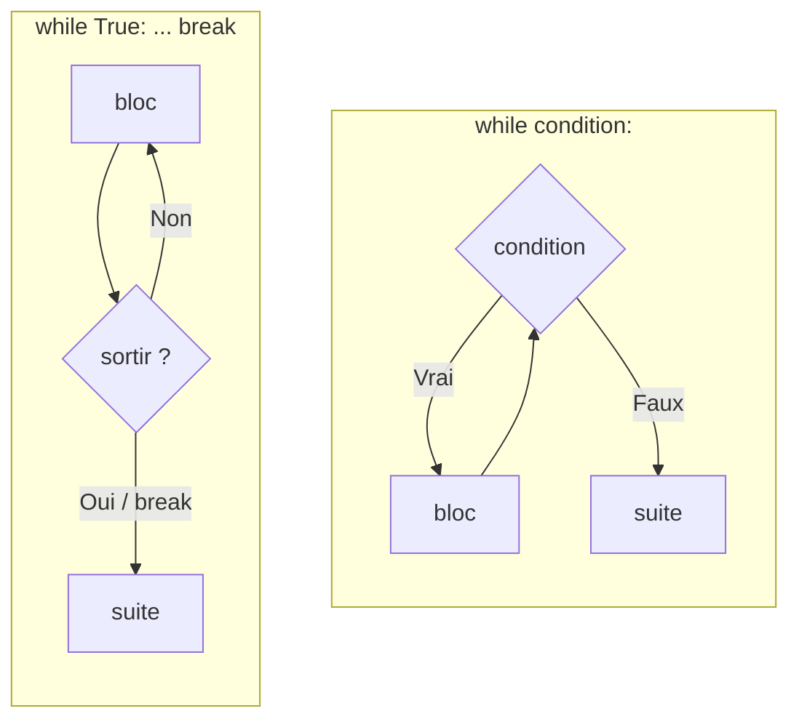

import { Tabs, TabItem, Aside, Steps, Card, CardGrid } from '@astrojs/starlight/components';

## Le besoin de répétition

Jusqu'à maintenant, chaque instruction de tes programmes s'exécute **au plus une fois**. 
Mais beaucoup de problèmes réels demandent de **répéter** une action plusieurs fois.

Imagine que tu veux afficher une table de multiplication :

```python
print("5 x 1 =", 5 * 1)
print("5 x 2 =", 5 * 2)
print("5 x 3 =", 5 * 3)
print("5 x 4 =", 5 * 4)
print("5 x 5 =", 5 * 5)
print("5 x 6 =", 5 * 6)
print("5 x 7 =", 5 * 7)
print("5 x 8 =", 5 * 8)
print("5 x 9 =", 5 * 9)
print("5 x 10 =", 5 * 10)
```

Écrire le programme de cette façon fonctionne, mais c'est pénible. 
Et si on voulait aller jusqu'à 100 ? Ou jusqu'à un nombre choisi par l'utilisateur ? 
Il faudrait recopier des lignes sans fin — ou pire, ne pas pouvoir le faire du tout.

Le problème est encore plus criant avec les programmes **interactifs**. Pense à :

- Un guichet automatique qui **redemande** le NIP tant qu'il est incorrect
- Un jeu qui **répète** la boucle de jeu tant que le joueur n'a pas perdu
- Un capteur de température qui **prend une mesure** toutes les 5 secondes, indéfiniment
- Un programme de saisie qui **redemande** une valeur tant qu'elle n'est pas valide

Dans tous ces cas, on a besoin d'un **flux avec répétition** — une boucle.



Le flux ne descend plus simplement de haut en bas (comme avec le `if-else`) : il **remonte** pour ré-exécuter les mêmes instructions. 
La boucle continue **tant que la condition est vraie**, puis le programme reprend son cours normal.

## Comparer : sans boucle vs avec boucle

Reprenons la table de multiplication. Voici la version avec copier-coller à gauche, et la version avec boucle à droite :

<Tabs>
<TabItem label="Sans boucle (10 lignes)">
```python
print("5 x 1 =", 5 * 1)
print("5 x 2 =", 5 * 2)
print("5 x 3 =", 5 * 3)
print("5 x 4 =", 5 * 4)
print("5 x 5 =", 5 * 5)
print("5 x 6 =", 5 * 6)
print("5 x 7 =", 5 * 7)
print("5 x 8 =", 5 * 8)
print("5 x 9 =", 5 * 9)
print("5 x 10 =", 5 * 10)
```
</TabItem>
<TabItem label="Avec boucle (4 lignes)">
```python
i = 1
while i <= 10:
    print("5 x", i, "=", 5 * i)
    i = i + 1
```
</TabItem>
</Tabs>

La version avec boucle est nettement plus courte, et surtout **elle s'adapte** : change `10` par `1000` et ça fonctionne immédiatement, sans ajouter 990 lignes.

## L'instruction `while`: « Tant que »

### Syntaxe

Le `while` se lit comme en français : « **tant que** la condition est vraie, exécute le bloc ».

```python
while condition:
    instructions
```

<Steps>
1. Le mot-clé `while`
2. Une **condition** (expression booléenne)
3. Les **deux-points** `:`
4. Le **bloc indenté** : les instructions à répéter
</Steps>

À chaque passage (appelé **itération**), Python :
1. Évalue la condition
2. Si elle est `True` → exécute le bloc, puis revient à l'étape 1
3. Si elle est `False` → sort de la boucle et continue après

### Premier exemple : compter de 1 à 5

```python
compteur = 1

while compteur <= 5:
    print(compteur)
    compteur = compteur + 1

print("Fini !")
```

```
1
2
3
4
5
Fini !
```



Suivons l'exécution pas à pas :

| Itération | `compteur` au début | `compteur <= 5` ? | Action |
|---|---|---|---|
| 1 | 1 | `True` | Affiche `1`, compteur → 2 |
| 2 | 2 | `True` | Affiche `2`, compteur → 3 |
| 3 | 3 | `True` | Affiche `3`, compteur → 4 |
| 4 | 4 | `True` | Affiche `4`, compteur → 5 |
| 5 | 5 | `True` | Affiche `5`, compteur → 6 |
| 6 | 6 | `False` | Sort de la boucle |

<Aside type="caution" title="Trois éléments essentiels">
Une boucle `while` bien construite a toujours trois composantes :

1. **Initialisation** — une variable de contrôle est créée avant la boucle (`compteur = 1`)
2. **Condition** — testée à chaque itération (`compteur <= 5`)
3. **Progression** — la variable change à chaque itération (`compteur = compteur + 1`)

Si tu oublies la progression, la condition restera vraie **pour toujours** et ton programme ne s'arrêtera jamais.
</Aside>

### Compter à rebours

On peut aussi compter en descendant :

```python
compte = 5

while compte > 0:
    print(compte)
    compte = compte - 1

print("Décollage !")
```

```
5
4
3
2
1
Décollage !
```

### Accumuler une somme

Le `while` n'est pas limité au simple comptage. On peut accumuler un résultat au fil des itérations :

```python
# Calculer la somme des nombres de 1 à 100
somme = 0
i = 1

while i <= 100:
    somme = somme + i
    i = i + 1

print("La somme de 1 à 100 est :", somme)
```

```
La somme de 1 à 100 est : 5050
```

<Aside type="tip" title="Le patron accumulateur">
On retrouve souvent ce patron :
1. **Initialiser** une variable résultat (`somme = 0`)
2. **Boucler** en ajoutant à chaque itération (`somme = somme + i`)
3. **Afficher** le résultat après la boucle

Ce patron fonctionne pour des sommes, des produits, des comptages, des moyennes, etc.
</Aside>

### Boucle contrôlée par l'utilisateur

C'est là que le `while` montre sa vraie force : répéter une action tant que **l'utilisateur le décide** :

```python
reponse = "oui"

while reponse == "oui":
    nombre = float(input("Entre un nombre : "))
    print("Le double est :", nombre * 2)
    reponse = input("Continuer ? (oui/non) : ")

print("Au revoir !")
```

```
Entre un nombre : 7
Le double est : 14.0
Continuer ? (oui/non) : oui
Entre un nombre : 3.5
Le double est : 7.0
Continuer ? (oui/non) : non
Au revoir !
```

Ici, c'est **impossible** de savoir à l'avance combien de fois la boucle va s'exécuter, car ça dépend de l'utilisateur. 
C'est exactement le type de situation où `while` est indispensable.

### Validation de saisie

Un des usages les plus courants du `while` est de **redemander une valeur** tant qu'elle n'est pas valide.

```python
note = float(input("Note (0 à 100) : "))

while note < 0 or note > 100:
    print("Erreur : la note doit être entre 0 et 100.")
    note = float(input("Note (0 à 100) : "))

print("Note enregistrée :", format(note, ".2f"))
```

```
Note (0 à 100) : -5
Erreur : la note doit être entre 0 et 100.
Note (0 à 100) : 150
Erreur : la note doit être entre 0 et 100.
Note (0 à 100) : 85
Note enregistrée : 85.00
```



<Aside type="note" title="Remarque">
La saisie est faite **deux fois** dans le code : une fois avant la boucle et une fois à l'intérieur. 
C'est un peu redondant, mais c'est le patron classique de validation avec `while`. Tu verras dans la section suivante une façon de l'éviter.
</Aside>

## Le patron « Répéter… tant que » (do-while)

### Le problème

Dans l'exemple de validation ci-dessus, on écrit `input()` **deux fois** : une fois avant la boucle, et une fois à l'intérieur. 
C'est agaçant et source d'erreurs (si tu modifies l'un sans l'autre).

Certains langages offrent une boucle `do-while` qui exécute le bloc **au moins une fois** avant de tester la condition :

```
// Pseudo-code (PAS du Python !)
do {
    lire la note
} while (note invalide)
```

### Python n'a pas de `do-while`

Python ne possède pas de structure `do-while`. Mais on peut la simuler avec `while True` et `break` :

```python
while True:
    note = float(input("Note (0 à 100) : "))
    if note >= 0 and note <= 100:
        break
    print("Erreur : la note doit être entre 0 et 100.")

print("Note enregistrée :", format(note, ".2f"))
```

```
Note (0 à 100) : -5
Erreur : la note doit être entre 0 et 100.
Note (0 à 100) : 85
Note enregistrée : 85.00
```



<Tabs>
<TabItem label="Patron while classique">
Ici, la **saisie est dupliquée**, car la **vérification est fait avant** l'exécution du corps de la boucle.
```python
note = float(input("Note (0 à 100) : "))

while note < 0 or note > 100:
    print("Erreur !")
    note = float(input("Note (0 à 100) : "))
```
</TabItem>
<TabItem label="Patron do-while (while True + break)">
Ici, la **saisie n'apparaît qu'une seule fois**, car le **corps de la boucle est exécuté avant** la vérification.
```python
while True:
    note = float(input("Note (0 à 100) : "))
    if note >= 0 and note <= 100:
        break
    print("Erreur !")
```
</TabItem>
</Tabs>

<Aside type="tip" title="Quand utiliser quel patron ?">

| Patron | Quand l'utiliser |
|---|---|
| `while condition:` | Tu connais la condition **avant** la première itération |
| `while True:` + `break` | Le bloc doit s'exécuter **au moins une fois** avant de tester |

Les deux sont valides. Le patron `while True` + `break` est souvent plus naturel pour les saisies et les menus.
</Aside>

## Les boucles infinies

### Le piège : la boucle qui ne s'arrête jamais

Si la condition du `while` ne devient **jamais** `False`, le programme tourne indéfiniment :

Ici la boucle tourne à l'infinie, car `x` est toujours positif.
```python
x = 1
while x > 0:
    print(x)
    x = x + 1    # x ne fera qu'augmenter → toujours > 0
```

Dans cet exemple, on a oublié d'incrémenter le `compteur`, restant piéger dans la boucle.
```python
compteur = 1
while compteur <= 10:
    print(compteur)
    # Oups ! On a oublié compteur = compteur + 1
    # compteur reste à 1 → boucle infinie
```

<Aside type="caution" title="Comment s'en sortir ?">
Si ton programme semble « gelé » et ne répond plus, c'est probablement une boucle infinie. Pour l'interrompre :

- **Dans IDLE** : <kbd>Ctrl</kbd> + <kbd>C</kbd> (ou menu **Shell → Interrupt Execution**)
- **Dans le terminal** : <kbd>Ctrl</kbd> + <kbd>C</kbd>

Ensuite, vérifie que ta variable de contrôle **progresse** vers la condition d'arrêt.
</Aside>

### La boucle infinie voulue

Paradoxalement, une boucle infinie peut être **intentionnelle**. 
Beaucoup de programmes réels fonctionnent comme une boucle qui ne s'arrête que sous certaines conditions :

```python
# Boucle principale d'un programme interactif
while True:
    commande = input("> ")

    if commande == "quitter":
        print("Au revoir !")
        break

    print("Tu as tapé :", commande)
```

```
> bonjour
Tu as tapé : bonjour
> aide
Tu as tapé : aide
> quitter
Au revoir !
```

Ce patron est très courant : la boucle tourne **indéfiniment**, et c'est l'instruction `break` à l'intérieur qui décide quand s'arrêter.

D'autres exemples de boucles infinies voulues :

```python
# Serveur qui attend des connexions en permanence
while True:
    connexion = attendre_connexion()
    traiter(connexion)

# Boucle de jeu (game loop)
while True:
    lire_entrees()
    mettre_a_jour()
    afficher()

# Capteur IoT qui mesure en continu
while True:
    temperature = lire_capteur()
    envoyer_donnees(temperature)
    attendre(5)  # 5 secondes
```

<Aside type="note" title="Pseudo-code">
Les trois exemples ci-dessus sont du **pseudo-code**: ils illustrent le patron général mais ne fonctionneraient pas tels quels en Python. 
Le patron `while True` + `break` est cependant bien réel et tu l'utiliseras souvent.
</Aside>

---

## `break`: Sortir de la boucle

L'instruction `break` **interrompt immédiatement** la boucle et passe à l'instruction qui suit le `while`. 
Le reste du bloc est ignoré et la condition n'est pas réévaluée.

### Exemple : trouver le premier diviseur

```python
nombre = int(input("Nombre : "))
diviseur = 2

while diviseur <= nombre:
    if nombre % diviseur == 0:
        print("Le plus petit diviseur (autre que 1) est :", diviseur)
        break
    diviseur = diviseur + 1
```

```
Nombre : 15
Le plus petit diviseur (autre que 1) est : 3
```

Dès que le `if` est vrai, `break` sort de la boucle. Pas besoin de continuer à tester les diviseurs suivants.



### Exemple : menu interactif avec `break`

```python
print("=== MENU ===")
print("1. Dire bonjour")
print("2. Afficher la date")
print("3. Quitter")

while True:
    choix = input("Ton choix : ")

    match choix:
        case "1":
            nom = input("Ton nom : ")
            print("Bonjour", nom, "!")
        case "2":
            print("Nous sommes en 2025.")
        case "3":
            print("Au revoir !")
            break
        case _:
            print("Choix invalide, réessaie.")
```

Le programme affiche le menu, puis boucle indéfiniment. Seul le choix `"3"` déclenche le `break` qui met fin au programme.

## `continue`: Passer à l'itération suivante

L'instruction `continue` **saute le reste du bloc** et retourne immédiatement au test de la condition pour l'itération suivante. Contrairement à `break`, elle ne sort **pas** de la boucle.

### Exemple : ignorer les nombres négatifs

```python
i = 0

while i < 10:
    i = i + 1

    if i % 3 == 0:
        continue    # Saute les multiples de 3

    print(i)
```

```
1
2
4
5
7
8
10
```

Les multiples de 3 (3, 6, 9) sont ignorés : quand `continue` est atteint, le `print(i)` est sauté et la boucle passe directement à l'itération suivante.



### Exemple : saisie avec validation (ignorer les entrées vides)

```python
print("Entre 3 noms (ignore les entrées vides) :")

compteur = 0

while compteur < 3:
    nom = input("Nom : ")

    if nom == "":
        print("  → Entrée vide, réessaie.")
        continue

    compteur = compteur + 1
    print("  →", nom, "enregistré (", compteur, "/ 3 )")

print("Terminé !")
```

```
Entre 3 noms (ignore les entrées vides) :
Nom : Alice
  → Alice enregistré ( 1 / 3 )
Nom :
  → Entrée vide, réessaie.
Nom : Bob
  → Bob enregistré ( 2 / 3 )
Nom : Charlie
  → Charlie enregistré ( 3 / 3 )
Terminé !
```

Quand l'utilisateur entre une chaîne vide, `continue` revient au début de la boucle **sans** incrémenter le compteur. L'entrée vide « ne compte pas ».


## Comparaison `break` vs `continue`



| Instruction | Effet | Analogie |
|---|---|---|
| `break` | **Sort** de la boucle immédiatement | Quitter le manège en plein tour |
| `continue` | **Saute** au prochain tour de boucle | Sauter une chanson dans une playlist |

<Aside type="tip" title="Utilise-les avec modération">
`break` et `continue` sont des outils puissants, mais un usage excessif peut rendre le code difficile à suivre. Si tu te retrouves avec plusieurs `break` et `continue` dans la même boucle, c'est peut-être le signe que ta logique pourrait être simplifiée.
</Aside>

## Le `else` d'un `while` (bonus)

Python offre une syntaxe peu connue : un `else` après un `while`. Le bloc `else` s'exécute **seulement si la boucle s'est terminée normalement** (sans `break`).

```python
nombre = int(input("Nombre : "))
diviseur = 2

while diviseur < nombre:
    if nombre % diviseur == 0:
        print(nombre, "n'est pas premier (divisible par", diviseur, ")")
        break
    diviseur = diviseur + 1
else:
    print(nombre, "est un nombre premier")
```

```
Nombre : 7
7 est un nombre premier
```

```
Nombre : 15
15 n'est pas premier (divisible par 3)
```

Si la boucle se termine parce que `diviseur` a dépassé `nombre` (aucun diviseur trouvé), 
le `else` s'exécute → le nombre est premier. Si un `break` interrompt la boucle (un diviseur a été trouvé), le `else` est **ignoré**.

<Aside type="note" title="Mnémonique">
Lis le `else` d'un `while` comme « **si aucun break n'a été atteint** ». C'est utile pour les recherches : « j'ai trouvé → `break`, sinon → `else` ».
</Aside>


## Mini-projet : le jeu de devinettes

Mettons tout ensemble dans un petit jeu. L'ordinateur choisit un nombre secret et le joueur doit le deviner.
{/* 
```python
# devinette.py
import random

print("=== JEU DE DEVINETTES ===")
print("Je pense à un nombre entre 1 et 100.")
print("Tu dois le deviner !")
print()

secret = random.randint(1, 100)
tentatives = 0

while True:
    reponse = int(input("Ta proposition : "))
    tentatives = tentatives + 1

    if reponse < secret:
        print("Trop petit !")
    elif reponse > secret:
        print("Trop grand !")
    else:
        print("Bravo ! Tu as trouvé", secret, "en", tentatives, "tentatives !")
        break

# Appréciation
if tentatives <= 3:
    print("Incroyable, en si peu d'essais !")
elif tentatives <= 7:
    print("Bien joué !")
else:
    print("Tu y es arrivé, mais tu peux faire mieux !")
``` */}

```
=== JEU DE DEVINETTES ===
Je pense à un nombre entre 1 et 100.
Tu dois le deviner !

Ta proposition : 50
Trop grand !
Ta proposition : 25
Trop petit !
Ta proposition : 37
Trop petit !
Ta proposition : 43
Trop grand !
Ta proposition : 40
Bravo ! Tu as trouvé 40 en 5 tentatives !
Bien joué !
```

{/* Ce programme combine :

| Concept | Utilisation |
|---|---|
| `while True` | La boucle principale du jeu |
| `break` | Sort quand le joueur a trouvé |
| `if-elif-else` | Donne les indices (trop petit / trop grand) |
| Variable accumulatrice | `tentatives` compte les essais |
| `match` / `if-elif` final | Appréciation selon le score |
| `random.randint()` | Génère le nombre secret | */}

<Aside type="tip" title="Le module random">
`random.randint(a, b)` retourne un nombre entier aléatoire entre `a` et `b` (inclus). Il faut importer le module au début du programme avec `import random`.
</Aside>

---

## Résumé

### Les structures de répétition



| Patron | Usage | Nombre minimum d'exécutions |
|---|---|---|
| `while condition:` | La condition est connue **avant** | 0 (peut ne jamais exécuter) |
| `while True:` + `break` | Le bloc doit s'exécuter **au moins une fois** | 1 |

### Les instructions de contrôle

| Instruction | Effet dans une boucle |
|---|---|
| `break` | Sort **immédiatement** de la boucle |
| `continue` | Saute au **prochain tour** de boucle |
| `else` (sur `while`) | S'exécute si la boucle finit **sans `break`** |

### Les trois composantes d'un `while`

```python
compteur = 1            # 1. Initialisation

while compteur <= 10:   # 2. Condition
    print(compteur)
    compteur += 1       # 3. Progression
```

Si tu oublies l'une de ces trois composantes, ta boucle ne fonctionnera pas correctement (ou ne s'arrêtera jamais).

### Les pièges à éviter

| Piège | Conséquence | Solution |
|---|---|---|
| Oublier la progression | Boucle infinie | Toujours modifier la variable de contrôle |
| Condition jamais fausse | Boucle infinie | Vérifier que la progression mène vers `False` |
| Condition fausse dès le départ | Bloc jamais exécuté | Utiliser `while True` + `break` si nécessaire |
| `break` hors d'une boucle | `SyntaxError` | `break` et `continue` uniquement dans un `while` (ou `for`) |

---

## Et après ? Un aperçu de `for`

Le `while` est puissant et polyvalent, mais pour certains cas — comme parcourir une séquence connue à l'avance — Python offre une boucle plus concise : le **`for`**.

<Tabs>
<TabItem label="Avec while">
```python
# Afficher les nombres de 1 à 5
i = 1
while i <= 5:
    print(i)
    i = i + 1
```
</TabItem>
<TabItem label="Avec for">
```python
# Afficher les nombres de 1 à 5
for i in range(1, 6):
    print(i)
```
</TabItem>
</Tabs>

Le `for` élimine le besoin d'initialiser et d'incrémenter manuellement la variable. Tu le découvriras en détail dans la prochaine leçon. En attendant, retiens cette règle :

<CardGrid>
  <Card title="Utilise while quand…">
    Tu ne sais **pas à l'avance** combien de fois boucler (saisie utilisateur, recherche, simulation, etc.)
  </Card>
  <Card title="Utilise for quand…">
    Tu sais **exactement** combien de fois boucler ou tu parcours une séquence connue (liste, plage de nombres, etc.)
  </Card>
</CardGrid>