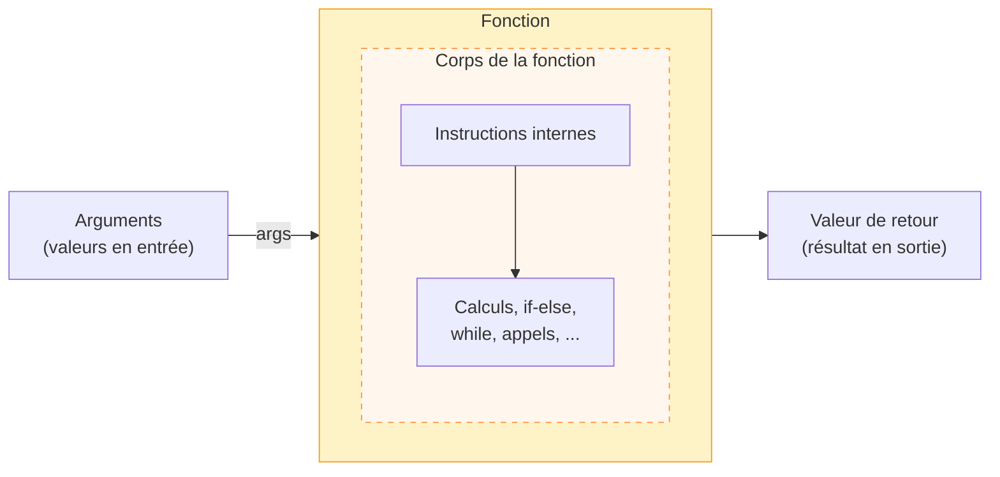
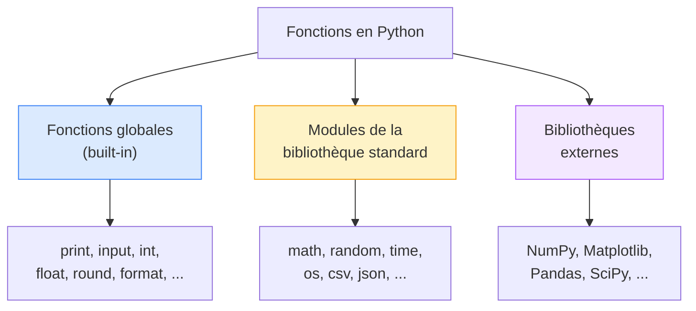

import { Tabs, TabItem, Aside, Steps, Card, CardGrid } from '@astrojs/starlight/components';
import CustomCard from './../../../components/CustomCard.astro';
import CustomCardGrid from './../../../components/CustomCardGrid.astro';


## Anatomie d'une fonction

Avant d'aller plus loin, prenons un moment pour bien comprendre comment fonctionne un
**appel de fonction** comme `print("Bonjour", nom)`, `int(input("Âge: "))` ou `round(22.857, 2)`.

### L'appel de fonction

Une fonction est un bloc de code préfabriqué qui effectue une opération. 
C'est comme un template qu'on peut réutiliser au sein de notre propre code. 
Une fonction **encapsule** un comportement.   
Pour l'utiliser, on l'**appelle** en écrivant son nom suivi de **parenthèses**. 
Si elle recquiert des entrées, celles-ci sont listées entre les parenthèses.

```python
round(22.857, 2)
```

<Aside type='tip' title='Rappel de la fonction round()'>
La fonction `round()` retourne la valeur arrondie (nombre réel) d'un nombre
donné avec un nombre de décimal donné.
```py
round(number, ndigits) → float (ou int si ndigits est omis)
```
Lorsqu'on appelle `round`, il faut indiquer la valeur que l'on souhaite arrondir (`number`) et
**optionnellement**, le nombre de décimales à préserver (`ndigits`).  
Si aucune valeur n'est donnée pour `ndigits`, la fonction assume 0 (valeur par défaut), arrondissant la valeur à l'unité.
</Aside>

#### Décomposons l'appel `round(22.857, 2)` :

```
round( 22.857,  2 )
  │       │     │
  │       │     └── 2e argument (valeur passée au 2e paramètre - ndigits)
  │       └──────── 1er argument (valeur passée au 1er paramètre - number)
  └──────────────── nom de la fonction
```

Cet appel retournera la valeur **22.86**.

### Paramètres et arguments

Ces deux termes sont souvent confondus, mais ils désignent des choses différentes :

- Un **paramètre**, c'est la « boîte vide » définie par la fonction pour recevoir une entrée.  
- Un **argument**, c'est la **valeur concrète** que tu passes au paramètre lors de l'appel. 
Dans l'exemple ci-dessous deux arguments sont passés à la fonction `round`.

```python
#            argument 1   argument 2
#                 ↓         ↓
resultat = round(22.857,    2)
#                 ↑         ↑
#           paramètre 1  paramètre 2
#            (nombre)     (ndigits)
```

<Aside type='tip' title='Importance des paramètres'>
  Les paramètres permettent de **configurer une fonction et de personnaliser son comportement**.
  Lors de l'appel, on fournit des **arguments** qui l'adaptent au contexte.

  **Sans paramètre, une fonction ferait presque toujours la même chose.** 
  Par exemple, pour la fonction `round`, sans le paramètre `ndigits`, la valeur serait toujours
  arrondie à l'unité. 
</Aside>

On peut passer comme argument une **valeur littérale**, une **variable** ou même directement le **résultat d'un appel de fonction** :

```python
age = "25"

int("20")            # Valeur littérale
int(age)             # Variable
int(input("Age: "))  # Résultat d'une fonction
```

### La valeur de retour

Certaines fonctions **retournent une valeur** : elles produisent un résultat que tu peux stocker dans une variable ou utiliser dans une expression.

```python
# round() retourne un nombre → on le stocke dans resultat
resultat = round(22.857, 4)
print(resultat)    # 22.86

# On peut aussi utiliser le retour directement
print("IMC :", format(round(22.857, 2), ".2f"))
```

<Aside type="danger" title="Attention au type de retour">
Chaque fonction retourne un type précis. Confondre les types est une erreur fréquente.  
Le piège le plus courant : `format()` et `input()` retournent des **chaînes**, pas des nombres. 
Tu ne peux pas faire de calcul avec leur résultat sans le **convertir d'abord**.
</Aside>

Certaines fonctions effectuent une **action** sans produire de valeur.  
C'est le cas de `print()` : elle affiche du texte à l'écran, mais ne retourne rien d'utile.
Si nous essayons de stocker le résultat de l'appel (valeur retournée par la fonction) à `print`, nous obtenons la valeur `None`.
La valeur spéciale `None` signifie « rien ».

```python
resultat = print("Bonjour") # Affiche 'Bonjour'
print(resultat) # Affiche None
```

<Aside type="tip" title="Retenir la distinction">
- **Fonctions qui retournent** une valeur : `round()`, `format()`, `int()`, `input()`, `abs()`, `len()`, `max()`, ...
  → On utilise leur résultat dans une variable ou une expression.
- **Fonctions qui agissent** sans retourner : `print()`, `time.sleep()`, ...
  → On les appelle pour leur effet, pas pour leur résultat.
</Aside>

### Récapitulatif



Chaque fonction reçoit des **arguments en entrée**, effectue une opération qui peut produire un **effet** 
visible par l'utilisateur (ex: `print`), et peut **retourner une valeur**.

---

## Les fonctions globales (*built-in*)

Jusqu'à présent, on a utilisé des fonctions sans se poser la question de leur provenance :

```python
nom = input("Ton nom : ")          # Lire une saisie
age = int("22")                    # Convertir en entier
prix = float("9.99")               # Convertir en décimal
imc = round(22.857, 2)             # Arrondir un nombre
texte = format(22.857, ".2f")      # Formater pour l'affichage
print("Bonjour", nom)              # Afficher à l'écran
```

Ces fonctions sont dites **globales** (ou *built-in*) : elles sont disponibles **partout** 
et peuvent être appelées en **tout temps**, sans rien faire de spécial. 
Python les charge automatiquement au démarrage du programme.

### Les fonctions globales que tu connais déjà ou presque

| Fonction | Rôle | Exemple |
|---|---|---|
| `print()` | Afficher à l'écran | `print("Bonjour")` |
| `input()` | Lire une saisie (retourne un `str`) | `input("Nom : ")` |
| `int()` | Convertir en entier | `int("42")` → `42` |
| `float()` | Convertir en nombre décimal | `float("3.14")` → `3.14` |
| `str()` | Convertir en chaîne de caractères | `str(42)` → `"42"` |
| `bool()` | Convertir en booléen | `bool(0)` → `False`, `bool(1)` → `True` |
| `abs()` | Valeur absolue d'un nombre | `abs(-5)` → `5` |
| `round()` | Arrondir un nombre | `round(3.14159, 2)` → `3.14` |
| `format()` | Formater une valeur pour l'affichage | `format(22.86, ".2f")` → `"22.86"` |
| `type()` | Connaître le type d'une valeur | `type(42)` → `<class 'int'>` |
| `isinstance()` | Vérifier le type d'une valeur | `isinstance(42, int)` → `True` |

### Quelques fonctions globales à découvrir

| Fonction | Rôle | Exemple |
|---|---|---|
| `len()` | Connaître la longueur d'une séquence | `len("Bonjour")` → `7` |
| `ord()` | Code numérique d'un caractère | `ord("A")` → `65` |
| `chr()` | Caractère correspondant à un code | `chr(65)` → `"A"` |
| `min()` | Plus petite valeur | `min(3, 7, 1)` → `1` |
| `max()` | Plus grande valeur | `max(3, 7, 1)` → `7` |
| `pow()` | Puissance (comme `**`) | `pow(2, 10)` → `1024` |


<Aside type="tip" title="Combien y en a-t-il ?">
Python possède environ **70 fonctions globales**. Tu n'as pas besoin de toutes les connaître — tu les découvriras au fil des besoins. La liste complète est dans la documentation officielle : [docs.python.org/3/library/functions.html](https://docs.python.org/3/library/functions.html)
</Aside>

### Limite des fonctions globales

Les fonctions globales couvrent des besoins courants. 
Cependant, elles sont loin de suffire pour réaliser toutes les tâches d'un programme réel.

Considère les situations suivantes :

- Trouver le PGCD entre deux nombres → pas de fonction globale pour ça
- Générer un nombre aléatoire → pas de fonction globale
- Envoyer une requête HTTP → pas de fonction globale
- Lire ou écrire un fichier CSV → pas de fonction globale
- Effectuer une opération toutes les 10 secondes → pas de fonction globale

Aucune de ces fonctionnalités n'est disponible directement dans l'*espace global*.

**La solution qu'offre Python:** organiser les fonctions supplémentaires dans des **modules** qu'on peut récupérer au besoin. 
Cela permet de ne pas surcharger l'espace global, d'organiser le code par domaine et de charger uniquement ce qui est nécessaire.


<Aside type="note" title="Qu'est-ce que l'espace global ?">
L'**espace global** (ou *global namespace*), c'est l'ensemble des noms — fonctions, variables, constantes — qui sont accessibles partout dans ton programme sans rien importer. Les fonctions comme `print()`, `input()` et `round()` vivent dans cet espace.

Si Python mettait **toutes** les fonctions existantes dans l'espace global, on aurait des **conflits de noms**, 
car plusieurs fonctions pourraient porter le même nom. 
Par exemple, une fonction `log()` pour les logarithmes et une autre `log()` pour écrire dans un journal d'événements.

Les modules règlent ce problème : chaque module est un **espace de noms séparé**. 
Les fonctions `math.log()` et `logging.log()` coexistent sans conflit, car elles vivent dans des espaces différents.
</Aside>

---

## Les modules

Un **module** est un fichier Python qui regroupe des fonctions et des constantes autour d'un **même thème**. C'est comme une boîte à outils spécialisée :

<CardGrid>
  <Card title="Module math">
    ```python
    import math
    ```
    Donne accès a des fonctions mathématiques avancées et constantes fondamentales:  
    `sqrt`, `sin`, `cos`,`log`, `pi`, etc.
  </Card>
  <Card title="Module random">
    ```python
    import random
    ```
    Donne accès a des fonctions permettant de générer des valeurs aléatoires:  
    `randint`, `choice`, `shuffle`, etc.
  </Card>
  {/* <Card title="Module statistics">
    ```python
    import statistics
    ```
    Donne accès à des fonctions permettan de calculer des mesures statistiques descriptives:
    `mean`, `median`, `stdev`, `mode`, etc.
  </Card>
  <Card title="Module time">
    ```python
    import time
    ```
    Donne accès à des fonctions permettant de manipuler le temps:
    `sleep`, `time`, `localtime`, etc.
  </Card> */}
</CardGrid>

<Aside type="note" title="La bibliothèque standard">
Python est livré avec plus de **200 modules** prêts à l'emploi. C'est ce qu'on appelle la **bibliothèque standard** (*standard library*). On dit souvent que Python vient « batteries incluses » (*batteries included*) — la plupart des outils courants sont déjà là, il suffit de les importer.
</Aside>

### L'instruction `import`

Les fonctions globales sont toujours disponibles. Les modules, eux, doivent être **importés avec l'instruction `import`** avant d'être utilisés.

Par convention, les `import` se placent toujours **au début du fichier**, avant tout le reste du code :

```python {1-2}
import math
import random

print("=== MON PROGRAMME ===")
nombre = random.randint(1, 100)
racine = math.sqrt(nombre)
print(nombre, "→ racine :", format(racine, ".2f"))
```

<Aside type='danger' title='À éviter : import dispersés dans le code'>
```python
print("=== MON PROGRAMME ===")
import random              # Import au milieu du code
nombre = random.randint(1, 100)
import math                # Autre import plus loin
racine = math.sqrt(nombre)
```

Ceci n'est pas une erreur, mais **regrouper les imports en haut rend le programme
plus lisible et plus facile à comprendre** : on voit immédiatement les dépendances du programme.
</Aside>

### Le module `math`

Le module `math` contient les fonctions mathématiques avancées et les constantes fondamentales.

#### Fonctions courantes

| Fonction | Description | Exemple | Résultat |
|---|---|---|---|
| `math.sqrt(x)` | Racine carrée | `math.sqrt(25)` | `5.0` |
| `math.pow(x, y)` | Puissance ($x^y$) | `math.pow(2, 10)` | `1024.0` |
| `math.ceil(x)` | Arrondi vers le haut | `math.ceil(3.2)` | `4` |
| `math.floor(x)` | Arrondi vers le bas | `math.floor(3.8)` | `3` |
| `math.log(x)` | Logarithme naturel (ln) | `math.log(math.e)` | `1.0` |
| `math.log10(x)` | Logarithme en base 10 | `math.log10(1000)` | `3.0` |
| `math.sin(x)` | Sinus (x en radians) | `math.sin(math.pi / 2)` | `1.0` |
| `math.cos(x)` | Cosinus (x en radians) | `math.cos(0)` | `1.0` |
| `math.radians(x)` | Degrés → radians | `math.radians(180)` | `3.14159...` |
| `math.degrees(x)` | Radians → degrés | `math.degrees(math.pi)` | `180.0` |
| `math.factorial(n)` | Factorielle ($n!$) | `math.factorial(5)` | `120` |
| `math.gcd(a, b)` | Plus grand commun diviseur | `math.gcd(12, 8)` | `4` |

#### Constantes

| Constante | Valeur | Description |
|---|---|---|
| `math.pi` | `3.141592653589793` | Le nombre π |
| `math.e` | `2.718281828459045` | Le nombre d'Euler |
| `math.inf` | `inf` | L'infini |

#### Exemple : aire d'un cercle


```python {1} "math"
import math

rayon = float(input("Rayon du cercle : "))

aire = math.pi * rayon ** 2
circonference = 2 * math.pi * rayon

print("Aire :", format(aire, ".2f"))
print("Circonférence :", format(circonference, ".2f"))
```

##### Résultat de l'exécution

```
Rayon du cercle : 5
Aire : 78.54
Circonférence : 31.42
```

---

### Le module `random`

Le module `random` permet de générer des valeurs aléatoires; très utile pour les jeux, les simulations et les tests.

#### Fonctions courantes

| Fonction | Description | Exemple |
|---|---|---|
| `random.randint(a, b)` | Entier aléatoire entre `a` et `b` (inclus) | `random.randint(1, 6)` → un dé |
| `random.random()` | Décimal aléatoire entre 0.0 et 1.0 | `random.random()` → `0.7341...` |
| `random.uniform(a, b)` | Décimal aléatoire entre `a` et `b` | `random.uniform(1.5, 9.5)` |
| `random.choice(seq)` | Choisir un élément au hasard | `random.choice(["pile", "face"])` |

#### Exemple : simuler un lancer de dé

```python {1} "random"
import random

print("=== LANCER DE DÉ ===")

de = random.randint(1, 6)
print("Tu as obtenu :", de)

if de == 6:
    print("Bravo, c'est le maximum !")
```

##### Résultat de l'exécution
```
=== LANCER DE DÉ ===
Tu as obtenu : 4
```

#### Exemple : génération d'un code de vérification

```python  {1} "random"
import random

code = random.randint(1000, 9999)
print("Ton code de vérification est :", code)
```

##### Résultat de l'exécution
```
Ton code de vérification est : 4821
```


{/* ### Le module `time`

Le module `time` permet de gérer le temps : mettre en pause, mesurer la durée d'une opération, obtenir l'heure courante.

#### Fonctions courantes

| Fonction | Description | Exemple |
|---|---|---|
| `time.sleep(s)` | Pause de `s` secondes | `time.sleep(2)` → attend 2 secondes |
| `time.time()` | Temps écoulé depuis le 1er janvier 1970 (en secondes) | `time.time()` → `1737500000.0` |

#### Exemple : compte à rebours

```python  {1} "time"
import time

print("Décollage dans :")

compte = 5
while compte > 0:
    print(compte)
    time.sleep(1)    # Attend 1 seconde
    compte = compte - 1

print("Décollage !")
```

```
Décollage dans :
5
4
3
2
1
Décollage !
```

Chaque nombre s'affiche avec **une seconde d'intervalle**, grâce à `time.sleep(1)`.

#### Exemple : mesurer le temps de réaction

```python  {1-2} "time" "random"
import time
import random

print("=== TEST DE RÉFLEXE ===")
print("Appuie sur ENTRÉE le plus vite possible quand tu verras 'GO !'")
input("Appuie sur ENTRÉE pour commencer...")

# Attente aléatoire entre 2 et 5 secondes
attente = random.uniform(2, 5)
time.sleep(attente)

print("GO !")
debut = time.time()
input()
fin = time.time()

reaction = fin - debut
print("Temps de réaction :", format(reaction, ".3f"), "secondes")

if reaction < 0.3:
    print("Excellent !")
elif reaction < 0.5:
    print("Bon réflexe !")
else:
    print("Tu peux faire mieux !")
```

Cet exemple combine `time` et `random` — tu verras souvent des modules utilisés ensemble.

<Aside type="tip" title="time.time() pour chronométrer">
`time.time()` retourne un nombre de secondes très précis. En prenant la mesure 
**avant** et **après** une opération, la différence donne la durée écoulée. 
C'est la technique de base pour chronométrer n'importe quoi en Python.
</Aside>


### Le module `statistics` — les statistiques

Le module `statistics` fournit des fonctions pour calculer des mesures statistiques descriptives — des notions que tu connais déjà de tes cours de mathématiques.

### Fonctions courantes

| Fonction | Description | Exemple | Résultat |
|---|---|---|---|
| `statistics.mean(data)` | Moyenne arithmétique | `statistics.mean([80, 70, 90])` | `80` |
| `statistics.median(data)` | Médiane (valeur du milieu) | `statistics.median([1, 3, 5, 7, 9])` | `5` |
| `statistics.mode(data)` | Mode (valeur la plus fréquente) | `statistics.mode([1, 2, 2, 3])` | `2` |
| `statistics.stdev(data)` | Écart-type (échantillon) | `statistics.stdev([80, 70, 90])` | `10.0` |
| `statistics.variance(data)` | Variance (échantillon) | `statistics.variance([80, 70, 90])` | `100.0` |
| `statistics.pstdev(data)` | Écart-type (population) | `statistics.pstdev([80, 70, 90])` | `8.16...` |

<Aside type="note" title="stdev vs pstdev">
`stdev()` calcule l'écart-type d'un **échantillon** (divise par $n - 1$), tandis que
`pstdev()` calcule l'écart-type d'une **population** entière (divise par $n$). 
On utilise généralement `stdev()` quand les données représentent un échantillon d'une population plus grande.
</Aside>

### Exemple : analyser les notes d'un groupe

```python
import statistics

notes = [72, 85, 91, 68, 77, 85, 63, 90, 85, 74]

moyenne = statistics.mean(notes)
mediane = statistics.median(notes)
mode = statistics.mode(notes)
ecart_type = statistics.stdev(notes)

print("=== ANALYSE DES NOTES ===")
print("Nombre d'étudiants :", len(notes))
print("Moyenne :", format(moyenne, ".2f"))
print("Médiane :", format(mediane, ".2f"))
print("Mode :", mode)
print("Écart-type :", format(ecart_type, ".2f"))
```

```
=== ANALYSE DES NOTES ===
Nombre d'étudiants : 10
Moyenne : 79.00
Médiane : 80.50
Mode : 85
Écart-type : 9.76
```

### Exemple : mesures de laboratoire

```python
import statistics

print("=== ANALYSE DE MESURES ===")

# Températures relevées lors d'une expérience (°C)
mesures = [22.1, 22.4, 22.0, 22.3, 22.2, 22.5, 22.1, 22.3]

moyenne = statistics.mean(mesures)
ecart = statistics.stdev(mesures)

print("Température moyenne :", format(moyenne, ".2f"), "°C")
print("Écart-type :", format(ecart, ".4f"), "°C")
print()
print("On peut affirmer que la température se situe")
print("autour de", format(moyenne, ".2f"), "±", format(ecart, ".2f"), "°C")
```

```
=== ANALYSE DE MESURES ===
Température moyenne : 22.24 °C
Écart-type : 0.1685 °C

On peut affirmer que la température se situe
autour de 22.24 ± 0.17 °C
```

<Aside type="tip" title="Un avant-goût de NumPy">
Le module `statistics` est pratique pour des calculs simples sur de petites listes. Pour des analyses plus poussées — grands jeux de données, opérations vectorielles, statistiques avancées — tu utiliseras **NumPy** et **SciPy**, présentés en fin de page.
</Aside> */}

---

## Les variantes de l'instruction `import`

Dans les exemples précédents, nous avons utilisé l'instruction `import` sous sa forme de base.
Cependant, en Python, il existe plusieurs façons d'importer un module, offrant chacun des avantages.

### Variante 1 : `import module`

```python
import math

print(math.sqrt(25))    # 5.0
print(math.pi)          # 3.141592653589793
```

C'est la forme la plus courante et celle **recommandée**. Chaque fonction est préfixée par le nom du module (`math.sqrt`), ce qui rend le code clair : on sait d'où vient chaque fonction.

### Variante 2 : `from module import fonction`

```python
from math import sqrt, pi

print(sqrt(25))    # 5.0
print(pi)          # 3.141592653589793
```

On importe **seulement** les fonctions dont on a besoin, directement dans l'espace de noms. Plus besoin du préfixe `math.`, mais on perd la traçabilité : en lisant `sqrt(25)`, on ne voit plus immédiatement que ça vient du module `math`.

### Variante 3 : `import module as alias`

```python
import random as rd

de = rd.randint(1, 6)
print("Dé :", de)
```

On donne un **surnom** (*alias*) au module pour raccourcir l'écriture. 
Très courant avec les bibliothèques scientifiques que tu verras plus tard (ex: `numpy` → `np`).

On peut aussi renommer une fonction spécifique :

```python
from math import sqrt as racine

print(racine(25))    # 5.0
```

### Quelle variante choisir ?

En règle générale :

- **`import module`** quand tu utilises **beaucoup de fonctions** du module → le préfixe clarifie l'origine
- **`from module import ...`** quand tu n'utilises qu'**une ou deux fonctions** → évite le préfixe répétitif
- **`import module as alias`** quand le nom du module est **long** → raccourci pratique

{/* ## Explorer un module

Tu peux découvrir le contenu d'un module directement dans le shell IDLE :

```python
>>> import math
>>> dir(math)         # Liste toutes les fonctions et constantes du module
['acos', 'acosh', 'asin', ... 'sqrt', 'tan', 'tanh', 'tau', 'trunc']
>>> help(math.sqrt)   # Affiche la documentation d'une fonction
Help on built-in function sqrt in module math:
sqrt(x, /)
    Return the square root of x.
```

<Aside type="tip" title="dir() et help() — tes meilleurs alliés">

| Fonction | Rôle |
|---|---|
| `dir(module)` | Liste le contenu d'un module (noms des fonctions et constantes) |
| `help(module.fonction)` | Affiche la documentation détaillée d'une fonction |

C'est le réflexe à avoir quand tu te demandes « qu'est-ce que ce module contient ? » ou « comment fonctionne cette fonction ? ». Tu n'as pas besoin de quitter IDLE pour chercher sur internet.
</Aside> */}

---

## Les bibliothèques (externes) scientifiques

La bibliothèque standard de Python couvre les besoins généraux. Mais pour l'expérimentation
et les calculs en **sciences**, l'**analyse de données** et la **visualisation**, 
la communauté Python a développé des bibliothèques externes extrêmement puissantes. 
On les découvrira dans les semaines à venir.

<CustomCardGrid cols={2}>
  <CustomCard title="NumPy" icon="https://www.pythontutorial.net/wp-content/uploads/2022/08/numpy-tutorial.svg">
    `NumPy` est une bibliothèque utilisé pour **faire du calcul scientifique et numérique haute performance** : 
    tableaux multidimensionnels, algèbre linéaire, statistiques. 
    En sciences, NumPy est essentiel pour traiter de grandes quantités de données numériques.

    

    <Fragment slot="footer">
    ```python
    import numpy as np
    ```
    </Fragment>
  </CustomCard>
  <CustomCard title="Matplotlib" icon="https://upload.wikimedia.org/wikipedia/commons/8/84/Matplotlib_icon.svg">
    `Matplotlib` est une bibliothèque utilisée pour **créer des graphiques et visualisations** : 
    courbes, histogrammes, nuages de points, diagrammes en barres. 
    Elle sert à représenter visuellement des résultats.

    

    <Fragment slot="footer">
    ```python
    import matplotlib.pyplot as plt
    ```
    </Fragment>
  </CustomCard>
  {/* <Card title="Pandas" icon="document">
    Manipulation et analyse de données tabulaires (comme des tableurs). Lecture de fichiers CSV/Excel, filtrage, regroupement, statistiques descriptives.

    ```python
    import pandas as pd
    ```
  </Card>
  <Card title="SciPy" icon="setting">
    Outils scientifiques avancés : optimisation, intégration numérique, interpolation, traitement de signal, statistiques. Bâti sur NumPy.

    ```python
    import scipy
    ```
  </Card> */}
</CustomCardGrid>

<Aside type="note" title="Installation avec pip (à venir)">
Contrairement aux modules de la bibliothèque standard, ces bibliothèques doivent être **installées** avant de pouvoir être importées. On utilise l'outil `pip` dans le terminal :

```
pip install numpy matplotlib
```

On verra l'installation et l'utilisation de ces outils en détail dans les prochains cours.
</Aside>

---

## En résumé



| Catégorie | Disponibilité | Exemples |
|---|---|---|
| **Fonctions globales** | Toujours disponibles, aucun `import` | `print`, `input`, `round` |
| **Bibliothèque standard** | Livrée avec Python, nécessite un `import` | `math`, `random`, `time` |
| **Bibliothèques externes** | À installer séparément avec `pip` | *NumPy*, *Matplotlib* |