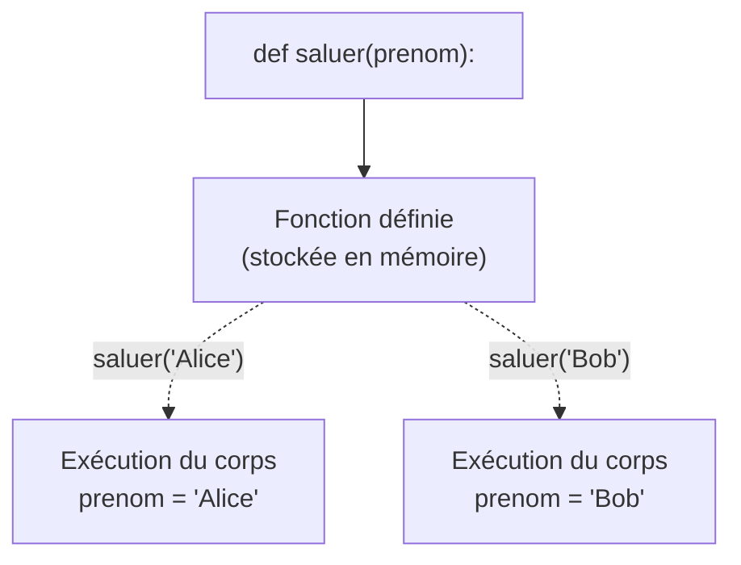
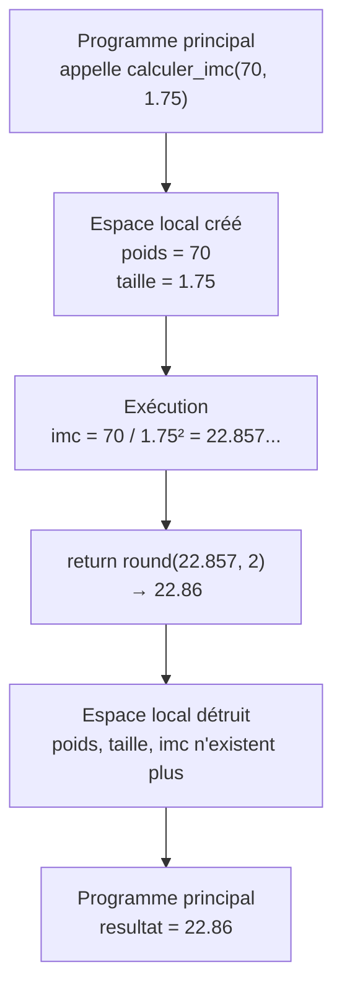

import { Tabs, TabItem, Aside, Steps, Card, CardGrid } from '@astrojs/starlight/components';

## Tu utilises déjà des sous-programmes

Regarde ce programme de jeu de devinettes, vu dans le chapitre sur les boucles :

```python
import random

print("=== JEU DE DEVINETTES ===")
print("Je pense à un nombre entre 1 et 100.")
print()

secret = random.randint(1, 100)
tentatives = 0

while True:
    reponse = int(input("Ta proposition : "))
    tentatives = tentatives + 1

    if reponse < secret:
        print("Trop petit !")
    elif reponse > secret:
        print("Trop grand !")
    else:
        print("Bravo ! Tu as trouvé", secret, "en", tentatives, "tentatives !")
        break

if tentatives <= 3:
    print("Incroyable !")
elif tentatives <= 7:
    print("Bien joué !")
else:
    print("Tu peux faire mieux !")
```

Ce programme fait plusieurs choses distinctes :

1. **Afficher un en-tête** (lignes 3–4)
2. **Générer le nombre secret** (ligne 6)
3. **Jouer la partie** — la boucle de devinettes (lignes 9–18)
4. **Évaluer la performance** (lignes 20–25)

Chacun de ces blocs est un **sous-programme** : un morceau de code qui accomplit une tâche précise et identifiable. Pour l'instant, ils sont tous mélangés dans un seul fichier, l'un à la suite de l'autre. Mais que se passe-t-il si tu veux :

- Rejouer une partie sans relancer le programme ?
- Réutiliser l'évaluation de performance dans un autre jeu ?
- Tester la boucle de devinettes indépendamment du reste ?

C'est là qu'interviennent les **fonctions** : elles permettent de découper un programme en sous-programmes nommés, réutilisables et indépendants.

---

## Des sous-programmes partout

Voici d'autres exemples, tirés des chapitres précédents, où tu as écrit du code qui pourrait être isolé en sous-programme :

**Un calcul réutilisable — l'IMC :**
```python
# Ce calcul pourrait être une fonction
imc = poids / taille ** 2
```

**Une validation de saisie :**
```python
# Ce patron se répète chaque fois qu'on valide une entrée
while True:
    note = float(input("Note (0 à 100) : "))
    if note >= 0 and note <= 100:
        break
    print("Erreur !")
```

**Un traitement dans un menu :**
```python
# Chaque option du menu est un sous-programme potentiel
match choix:
    case "1":
        km = float(input("Distance en km : "))
        milles = km * 0.621371
        print(format(km, ".2f"), "km =", format(milles, ".2f"), "milles")
    case "2":
        # ...
```

**Une formule scientifique :**
```python
# La formule de Héron pourrait être une fonction
import math
s = (a + b + c) / 2
aire = math.sqrt(s * (s - a) * (s - b) * (s - c))
```

Dans chaque cas, on a un **bloc de code cohérent** qui prend des données en entrée, effectue un traitement, et produit un résultat. C'est exactement la définition d'une fonction.

---

## Définir une fonction avec `def`

### Syntaxe

```python
def nom_de_la_fonction(parametre1, parametre2):
    instructions
    return resultat
```

<Steps>
1. Le mot-clé `def` (abréviation de *define*)
2. Le **nom** de la fonction — suit les mêmes règles qu'un nom de variable
3. Les **parenthèses** contenant les paramètres (ou vides si aucun)
4. Les **deux-points** `:`
5. Le **corps** de la fonction — bloc indenté d'instructions
6. Le `return` (optionnel) — la valeur renvoyée à l'appelant
</Steps>

### Premier exemple : saluer

```python
def saluer(prenom):
    print("Bonjour", prenom, "!")

saluer("Alice")
saluer("Bob")
```

```
Bonjour Alice !
Bonjour Bob !
```

La fonction `saluer` encapsule un comportement. On l'**appelle** autant de fois qu'on veut, avec des arguments différents. Le code à l'intérieur n'est exécuté que lors de l'appel — la définition seule ne fait rien.



### Fonction qui retourne une valeur

```python
def calculer_imc(poids, taille):
    imc = poids / taille ** 2
    return imc

# Utilisation
mon_imc = calculer_imc(70, 1.75)
print("Ton IMC est :", format(mon_imc, ".2f"))
```

```
Ton IMC est : 22.86
```

Le `return` renvoie le résultat au code qui a appelé la fonction. Ce résultat peut être stocké dans une variable, utilisé dans une expression, ou passé à une autre fonction.

```python
# Stocker le résultat
mon_imc = calculer_imc(70, 1.75)

# Utiliser directement dans un print
print("IMC :", format(calculer_imc(70, 1.75), ".2f"))

# Utiliser dans une condition
if calculer_imc(70, 1.75) > 25:
    print("Surpoids")
```

<Aside type="caution" title="return met fin à la fonction">
Dès que Python rencontre un `return`, il **sort immédiatement** de la fonction. Toute instruction après le `return` ne sera jamais exécutée :

```python
def exemple():
    return 42
    print("Ce message n'apparaîtra jamais")  # ← code mort
```
</Aside>

### Fonction sans `return`

Une fonction n'est pas obligée de retourner une valeur. Si elle n'a pas de `return` (ou a un `return` sans valeur), elle retourne `None` :

```python
def afficher_en_tete(titre):
    print("=" * 30)
    print(titre)
    print("=" * 30)

resultat = afficher_en_tete("MON PROGRAMME")
print(resultat)    # None
```

```
==============================
MON PROGRAMME
==============================
None
```

<Aside type="tip" title="Retourner ou afficher ?">
Une erreur fréquente chez les débutants : mettre un `print()` dans une fonction là où il faudrait un `return`.

```python
# ❌ Mauvaise pratique — la fonction affiche au lieu de retourner
def calculer_imc(poids, taille):
    imc = poids / taille ** 2
    print("IMC :", format(imc, ".2f"))    # Affiche, mais ne retourne rien

# On ne peut pas réutiliser le résultat !
mon_imc = calculer_imc(70, 1.75)    # mon_imc vaut None
```

```python
# ✅ Bonne pratique — la fonction retourne le résultat
def calculer_imc(poids, taille):
    imc = poids / taille ** 2
    return imc

# L'appelant décide quoi faire du résultat
mon_imc = calculer_imc(70, 1.75)
print("IMC :", format(mon_imc, ".2f"))    # Affichage ici, dans le programme principal
```

**Règle** : une fonction qui **calcule** devrait retourner. Une fonction qui **agit** (afficher un en-tête, écrire dans un fichier) n'a pas besoin de retourner.
</Aside>

---

## Identifier les dépendances d'un sous-programme

Quand tu transformes un bloc de code en fonction, la question clé est : **de quoi ce bloc dépend-il ?**

Reprenons le calcul de l'IMC tel qu'il apparaît dans un programme :

```python
# Dans le programme principal
poids = float(input("Poids (kg) : "))
taille = float(input("Taille (m) : "))
imc = poids / taille ** 2
print("Ton IMC est :", format(imc, ".2f"))
```

Pour isoler le calcul de l'IMC en fonction, il faut identifier :

<Steps>
1. **Les entrées** — de quelles valeurs le calcul a-t-il besoin ? → `poids` et `taille` → ce sont les **paramètres**
2. **La sortie** — quel résultat produit-il ? → la valeur de l'IMC → c'est le **retour**
3. **Les effets** — le calcul fait-il autre chose ? → non (pas d'affichage, pas de saisie)
</Steps>

```python
#        entrées             sortie
#        ↓      ↓               ↓
def calculer_imc(poids, taille):
    imc = poids / taille ** 2
    return imc
#          ↑
#    la formule ne dépend de rien d'autre
```

La fonction est maintenant **autonome** : elle ne dépend d'aucune variable extérieure. Tout ce dont elle a besoin lui est passé en paramètres.

### Un autre exemple : la validation de saisie

```python
# Avant : le code est dans le programme principal
while True:
    note = float(input("Note (0 à 100) : "))
    if note >= 0 and note <= 100:
        break
    print("Erreur : la note doit être entre 0 et 100.")
```

Quelles sont les dépendances ?
- **Entrées** : le message à afficher, les bornes (0 et 100)
- **Sortie** : la valeur saisie et validée
- **Effet** : la saisie se fait à l'intérieur (c'est voulu ici)

```python
def saisir_nombre(message, minimum, maximum):
    while True:
        valeur = float(input(message))
        if valeur >= minimum and valeur <= maximum:
            return valeur
        print("Erreur : la valeur doit être entre", minimum, "et", maximum)

# Utilisation — réutilisable pour n'importe quelle saisie !
note = saisir_nombre("Note (0 à 100) : ", 0, 100)
age = saisir_nombre("Âge (0 à 120) : ", 0, 120)
temperature = saisir_nombre("Température (-50 à 50) : ", -50, 50)
```

On a transformé un bloc de code **spécifique** (valider une note) en une fonction **générique** (valider n'importe quel nombre dans un intervalle). C'est la puissance de l'abstraction : en identifiant les dépendances et en les transformant en paramètres, on rend le code réutilisable.

---

## Paramètres obligatoires et optionnels

### Paramètres obligatoires

Par défaut, tous les paramètres sont **obligatoires**. L'appel doit fournir exactement le bon nombre d'arguments :

```python
def calculer_imc(poids, taille):
    return poids / taille ** 2

calculer_imc(70, 1.75)     # ✅ 2 arguments pour 2 paramètres
calculer_imc(70)            # ❌ TypeError: missing 1 required positional argument
calculer_imc(70, 1.75, 25) # ❌ TypeError: takes 2 positional arguments but 3 were given
```

### Paramètres optionnels (valeurs par défaut)

On peut donner une **valeur par défaut** à un paramètre. Si l'argument n'est pas fourni lors de l'appel, la valeur par défaut est utilisée :

```python
def saluer(prenom, formule="Bonjour"):
    print(formule, prenom, "!")

saluer("Alice")              # Utilise la valeur par défaut
saluer("Bob", "Bonsoir")     # Remplace la valeur par défaut
```

```
Bonjour Alice !
Bonsoir Bob !
```

Le paramètre `formule` est **optionnel** : il a une valeur par défaut (`"Bonjour"`), donc on peut l'omettre à l'appel.

### Exemple : la fonction `round()` revisitée

Tu as déjà utilisé `round()` de deux façons :

```python
round(3.14159)       # 1 argument → arrondit à l'entier
round(3.14159, 2)    # 2 arguments → arrondit à 2 décimales
```

C'est parce que le deuxième paramètre a une valeur par défaut. Si tu devais réécrire `round()` toi-même, ça ressemblerait à :

```python
def mon_round(nombre, decimales=0):
    facteur = 10 ** decimales
    return int(nombre * facteur + 0.5) / facteur
```

### Règle de placement

Les paramètres avec valeur par défaut doivent être placés **après** les paramètres obligatoires :

```python
# ✅ Obligatoires d'abord, optionnels ensuite
def creer_facture(montant, taxe=0.14975, rabais=0):
    total = montant * (1 + taxe) - rabais
    return round(total, 2)

# ❌ SyntaxError — un paramètre par défaut avant un obligatoire
def creer_facture(taxe=0.14975, montant):
    ...
```

```python
# Appels variés
creer_facture(100)                # montant=100, taxe=0.14975, rabais=0
creer_facture(100, 0.05)          # montant=100, taxe=0.05, rabais=0
creer_facture(100, 0.14975, 10)   # montant=100, taxe=0.14975, rabais=10
```

<Aside type="tip" title="Les valeurs par défaut sont évaluées une seule fois">
Python évalue la valeur par défaut **au moment de la définition**, pas à chaque appel. Pour les types simples (`int`, `float`, `str`, `bool`), ça ne pose pas de problème. Pour les types mutables (listes, dictionnaires), ça peut créer des surprises — mais c'est un sujet pour plus tard.
</Aside>

---

## La portée des variables

### Variables locales

Une variable créée **à l'intérieur** d'une fonction n'existe que pendant l'exécution de cette fonction. C'est une **variable locale** :

```python
def calculer_aire(rayon):
    import math
    aire = math.pi * rayon ** 2    # aire est locale
    return aire

calculer_aire(5)
print(aire)    # ❌ NameError: name 'aire' is not defined
```

La variable `aire` naît quand la fonction s'exécute et **disparaît** quand la fonction se termine. Le programme principal ne peut pas y accéder.

Les **paramètres** sont aussi des variables locales :

```python
def doubler(nombre):
    nombre = nombre * 2    # modifie la copie locale
    return nombre

x = 5
resultat = doubler(x)
print(resultat)    # 10
print(x)           # 5 — x n'a pas changé !
```

Quand tu passes `x` à `doubler()`, Python crée une **copie locale** appelée `nombre`. Modifier `nombre` dans la fonction ne touche pas `x` à l'extérieur.

### Variables globales

Une variable créée **en dehors** de toute fonction est une **variable globale**. Elle est accessible partout dans le programme, y compris à l'intérieur des fonctions :

```python
NOM_DU_PROGRAMME = "Calculatrice"    # Variable globale

def afficher_en_tete():
    print("===", NOM_DU_PROGRAMME, "===")    # ✅ Peut lire la globale

afficher_en_tete()
```

```
=== Calculatrice ===
```

Cependant, une fonction **ne peut pas modifier** une variable globale sans le déclarer explicitement :

```python
compteur = 0

def incrementer():
    compteur = compteur + 1    # ❌ UnboundLocalError
    # Python pense qu'on crée une variable locale "compteur"
    # mais on essaie de lire "compteur" avant de lui assigner une valeur

incrementer()
```

<Aside type="caution" title="Le piège de la portée">
Si tu **lis** une variable globale dans une fonction → ça fonctionne.
Si tu **assignes** une variable du même nom dans une fonction → Python crée une **nouvelle variable locale** qui masque la globale.

```python
x = 10

def afficher():
    print(x)       # ✅ Lit la globale → 10

def modifier():
    x = 20         # Crée une NOUVELLE variable locale x
    print(x)       # Affiche 20 (la locale)

modifier()
print(x)           # Affiche 10 (la globale n'a pas changé)
```
</Aside>

### Constantes globales

La seule bonne raison d'utiliser des variables globales accessibles dans les fonctions, c'est pour des **constantes** — des valeurs qui ne changent jamais :

```python
# Constantes globales (convention : MAJUSCULES)
TAUX_TPS = 0.05
TAUX_TVQ = 0.09975

def calculer_taxes(montant):
    tps = round(montant * TAUX_TPS, 2)
    tvq = round(montant * TAUX_TVQ, 2)
    return tps + tvq

taxes = calculer_taxes(100)
print("Taxes :", format(taxes, ".2f"), "$")
```

Les constantes en majuscules sont une **convention** en Python : elles signalent que la valeur ne devrait pas être modifiée. La fonction les lit, mais ne les modifie jamais.

---

## Appel de fonction et durée de vie des variables

### Ce qui se passe lors d'un appel

Quand tu appelles une fonction, Python suit ces étapes :

<Steps>
1. **Évaluation des arguments** — les expressions passées en argument sont évaluées
2. **Création de l'espace local** — un nouvel espace mémoire est créé pour la fonction
3. **Liaison paramètres → arguments** — chaque paramètre reçoit la valeur de l'argument correspondant
4. **Exécution du corps** — les instructions de la fonction s'exécutent
5. **Retour** — le `return` renvoie une valeur (ou `None`) et l'espace local est **détruit**
</Steps>

```python
def calculer_imc(poids, taille):
    imc = poids / taille ** 2
    return round(imc, 2)

resultat = calculer_imc(70, 1.75)
```



À chaque appel, un **nouvel espace local** est créé. Deux appels successifs ne partagent rien :

```python
calculer_imc(70, 1.75)     # espace local 1 : poids=70, taille=1.75
calculer_imc(85, 1.80)     # espace local 2 : poids=85, taille=1.80 (indépendant)
```

### Arguments positionnels

C'est la façon dont tu appelles des fonctions depuis le début du cours. Les arguments sont associés aux paramètres **dans l'ordre** :

```python
def creer_facture(montant, taxe, rabais):
    return round(montant * (1 + taxe) - rabais, 2)

# L'ordre des arguments détermine quel paramètre reçoit quelle valeur
creer_facture(100, 0.14975, 10)
#               ↓       ↓      ↓
#          montant    taxe   rabais
```

L'ordre est crucial. Si tu inverses deux arguments, la fonction ne le sait pas — elle utilise les valeurs telles qu'elles arrivent :

```python
# ⚠️ Arguments dans le mauvais ordre — pas d'erreur, mais résultat faux
creer_facture(0.14975, 100, 10)
#               ↓        ↓    ↓
#          montant=0.15  taxe=100  rabais=10  → résultat absurde !
```

### Arguments par mots-clés (*keyword arguments*)

On peut **nommer** les arguments lors de l'appel. L'ordre n'a alors plus d'importance :

```python
# Arguments nommés — l'ordre n'a plus d'importance
creer_facture(montant=100, taxe=0.14975, rabais=10)
creer_facture(rabais=10, montant=100, taxe=0.14975)    # Même résultat
creer_facture(taxe=0.14975, rabais=10, montant=100)    # Même résultat
```

C'est particulièrement utile avec les paramètres optionnels. Tu peux fournir **seulement ceux que tu veux modifier** :

```python
def creer_facture(montant, taxe=0.14975, rabais=0):
    return round(montant * (1 + taxe) - rabais, 2)

# Modifier seulement le rabais, garder la taxe par défaut
creer_facture(100, rabais=15)

# En positionnel, on serait obligé de fournir aussi la taxe
creer_facture(100, 0.14975, 15)    # Moins lisible
```

### Mélanger les deux modes

On peut combiner positionnels et mots-clés, à condition que les **positionnels viennent en premier** :

```python
creer_facture(100, taxe=0.05)          # ✅ Positionnel puis mot-clé
creer_facture(montant=100, 0.05)       # ❌ SyntaxError — mot-clé avant positionnel
```

<Aside type="tip" title="Quand utiliser les mots-clés ?">
Utilise les arguments par mots-clés quand :
- La fonction a **beaucoup de paramètres** → les noms clarifient le rôle de chaque argument
- Tu veux modifier un paramètre **optionnel** sans toucher aux autres
- L'ordre des arguments n'est **pas évident** (ex : `(largeur, hauteur)` — lequel est en premier ?)
</Aside>

---

## Bonnes pratiques

### Une fonction = une tâche

Chaque fonction devrait remplir **une seule tâche** clairement identifiable. Son nom devrait décrire cette tâche :

```python
# ✅ Chaque fonction fait UNE chose
def calculer_imc(poids, taille):
    return poids / taille ** 2

def categorie_imc(imc):
    if imc < 18.5:
        return "Insuffisance pondérale"
    elif imc < 25:
        return "Poids normal"
    elif imc < 30:
        return "Surpoids"
    else:
        return "Obésité"

# ❌ Cette fonction fait TROP de choses
def analyser_patient(poids, taille):
    imc = poids / taille ** 2
    if imc < 18.5:
        categorie = "Insuffisance"
    elif imc < 25:
        categorie = "Normal"
    elif imc < 30:
        categorie = "Surpoids"
    else:
        categorie = "Obésité"
    print("IMC :", format(imc, ".2f"))
    print("Catégorie :", categorie)
    # Calcule, catégorise ET affiche — trop de responsabilités
```

### Ne rien assumer du reste du programme

Une fonction devrait être **autonome** : elle ne devrait pas dépendre de variables définies ailleurs (sauf les constantes globales). Tout ce dont elle a besoin doit être passé en paramètres :

```python
# ❌ Dépend de variables globales non constantes
poids = 70
taille = 1.75

def calculer_imc():           # Pas de paramètres !
    return poids / taille ** 2  # Lit des variables globales

# ✅ Indépendante — reçoit tout en paramètres
def calculer_imc(poids, taille):
    return poids / taille ** 2
```

La première version ne fonctionne que si `poids` et `taille` existent dans le programme principal. La deuxième fonctionne **partout**, avec n'importe quelles valeurs.

### Minimiser les dépendances

Si une fonction a besoin de 8 paramètres, c'est probablement le signe qu'elle fait trop de choses. Essaie de la découper :

```python
# ⚠️ Trop de paramètres — signal d'alarme
def generer_rapport(nom, prenom, age, note1, note2, note3, programme, session):
    ...

# ✅ Mieux : découper en fonctions plus petites
def calculer_moyenne(note1, note2, note3):
    return (note1 + note2 + note3) / 3

def formater_nom(nom, prenom):
    return prenom + " " + nom
```

### Nommer clairement

Le nom d'une fonction devrait être un **verbe** (ou commencer par un verbe) qui décrit ce qu'elle fait :

```python
# ✅ Noms descriptifs
def calculer_imc(poids, taille):
    ...

def valider_note(note):
    ...

def afficher_menu():
    ...

def convertir_celsius_en_fahrenheit(celsius):
    ...

# ❌ Noms vagues ou trompeurs
def faire_truc(x, y):
    ...

def imc(p, t):        # imc est un nom, pas un verbe
    ...

def f(a, b, c):       # incompréhensible
    ...
```

### Résumé des bonnes pratiques

| Principe | Explication |
|---|---|
| **Une seule tâche** | La fonction fait une chose et la fait bien |
| **Autonome** | Ne dépend pas de variables globales non constantes |
| **Paramètres explicites** | Tout ce dont elle a besoin est passé en paramètres |
| **Retourner plutôt qu'afficher** | Les fonctions de calcul retournent ; le `print` est dans l'appelant |
| **Peu de paramètres** | 3–4 maximum ; au-delà, découper la fonction |
| **Nom descriptif** | Verbe + complément décrivant la tâche |

---

## Mettre tout ensemble : le jeu de devinettes refactorisé

Reprenons le programme du début et découpons-le en fonctions :

```python
import random

# --- Fonctions ---

def afficher_en_tete():
    print("=== JEU DE DEVINETTES ===")
    print("Je pense à un nombre entre 1 et 100.")
    print()

def jouer_partie(secret):
    tentatives = 0

    while True:
        reponse = int(input("Ta proposition : "))
        tentatives = tentatives + 1

        if reponse < secret:
            print("Trop petit !")
        elif reponse > secret:
            print("Trop grand !")
        else:
            print("Bravo ! Tu as trouvé", secret, "en", tentatives, "tentatives !")
            return tentatives

def evaluer_performance(tentatives):
    if tentatives <= 3:
        return "Incroyable !"
    elif tentatives <= 7:
        return "Bien joué !"
    else:
        return "Tu peux faire mieux !"

# --- Programme principal ---

afficher_en_tete()
secret = random.randint(1, 100)
tentatives = jouer_partie(secret)
appreciation = evaluer_performance(tentatives)
print(appreciation)
```

Le programme principal est maintenant **lisible comme un plan** :

1. Afficher l'en-tête
2. Générer le secret
3. Jouer la partie → nombre de tentatives
4. Évaluer la performance → appréciation
5. Afficher l'appréciation

Chaque fonction est testable et réutilisable indépendamment. Et ajouter une boucle « Rejouer ? » devient trivial :

```python
# --- Programme principal ---

afficher_en_tete()

while True:
    secret = random.randint(1, 100)
    tentatives = jouer_partie(secret)
    print(evaluer_performance(tentatives))
    print()

    encore = input("Rejouer ? (oui/non) : ")
    if encore != "oui":
        print("Merci d'avoir joué !")
        break
```

Sans fonctions, ajouter cette boucle aurait demandé de restructurer tout le programme. Avec des fonctions, c'est trois lignes de plus.

---

## Bonus : un programme est un sous-programme

Pense à un programme Python complet — par exemple, le jeu de devinettes. Il a :

- Des **entrées** : rien (ou des arguments en ligne de commande)
- Un **traitement** : la logique du jeu
- Des **effets** : affichage, saisie

C'est exactement la même structure qu'une fonction. En fait, on pourrait envelopper tout le programme dans une fonction :

```python
import random

def jeu_devinettes(minimum=1, maximum=100):
    print("=== JEU DE DEVINETTES ===")
    print("Je pense à un nombre entre", minimum, "et", maximum)
    print()

    secret = random.randint(minimum, maximum)
    tentatives = 0

    while True:
        reponse = int(input("Ta proposition : "))
        tentatives = tentatives + 1

        if reponse < secret:
            print("Trop petit !")
        elif reponse > secret:
            print("Trop grand !")
        else:
            print("Bravo ! Trouvé en", tentatives, "tentatives !")
            return tentatives

# Le programme entier devient un appel paramétrable
jeu_devinettes()            # Partie classique (1 à 100)
jeu_devinettes(1, 10)       # Partie facile
jeu_devinettes(1, 1000)     # Partie difficile
```

Le programme est maintenant **paramétrable** : on peut changer la difficulté sans modifier le code. C'est le même principe qu'une fonction — et c'est normal, parce qu'un programme **est** un sous-programme. Dans un projet plus grand, ce programme pourrait être importé comme un module et appelé par un autre programme.

<Aside type="tip" title="Le patron main()">
Dans beaucoup de langages et de projets Python plus avancés, on enveloppe le programme principal dans une fonction `main()` :

```python
def main():
    afficher_en_tete()
    secret = random.randint(1, 100)
    tentatives = jouer_partie(secret)
    print(evaluer_performance(tentatives))

main()
```

C'est une bonne habitude qui renforce l'idée que le programme entier est un sous-programme. Tu verras cette convention dans les projets plus structurés.
</Aside>
