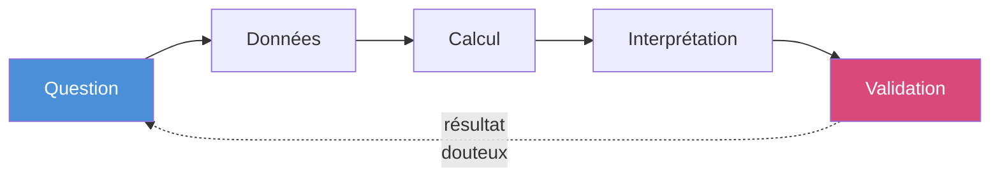
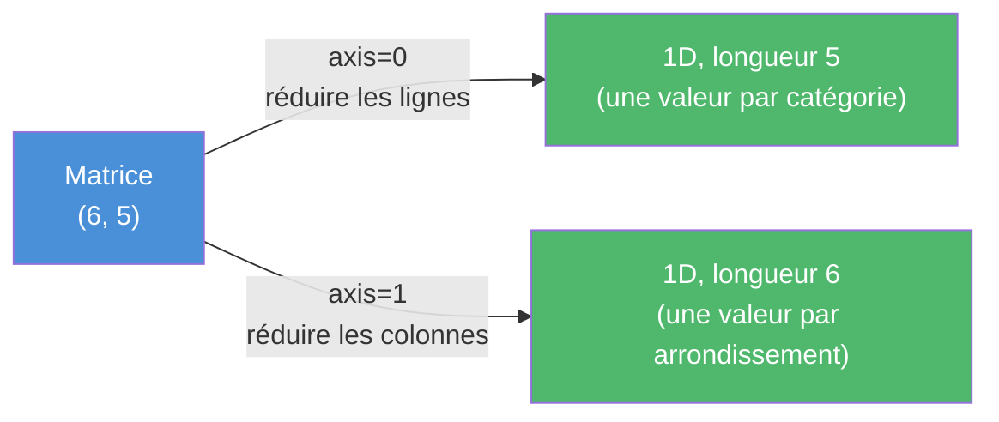
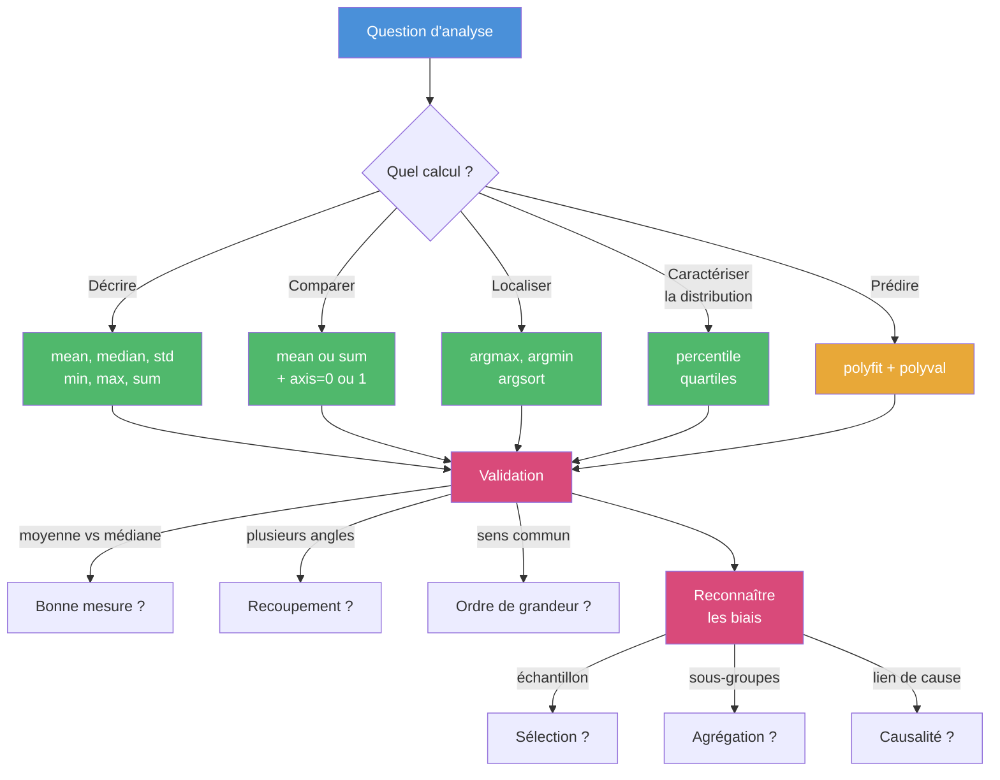

import { Tabs, TabItem, Aside, Steps, Card, CardGrid } from '@astrojs/starlight/components';

## Introduction à l'analyse de données

Avant de calculer quoi que ce soit, un principe : **une analyse statistique n'est pas un calcul au hasard**.
C'est la **réponse à une question** qu'on s'est posée d'avance.
Sans question, un nombre (même calculé correctement) ne veut rien dire. C'est la question qui guide l'interprétation
et donne un sens aux observations.



À chaque question correspond un calcul. À chaque calcul correspond une interprétation — ce que ce nombre signifie *dans le contexte*.
Et à chaque interprétation correspond une vérification. Si la validation échoue, on revient à la question : peut-être qu'elle n'était pas la bonne, ou que les données ne permettent pas d'y répondre.

#### Rappel du cas d'études

```python
import numpy as np

arrondissements = np.array([
    "Plateau", "Rosemont", "Ville-Marie", "Verdun", "Mercier-HM", "Ahuntsic"
])
categories = np.array([
    "Cinema", "Concerts", "Sports", "Jeux video", "Restos"
])
depenses = np.array([
    [285, 340, 180, 420, 1450],
    [260, 220, 165, 380, 1100],
    [310, 380, 410, 340, 1380],
    [240, 195, 145, 390,  920],
    [220, 175, 195, 410,  980],
    [255, 205, 175, 365, 1050],
])
```
---

## Décrire : qu'est-ce qu'on a en main ?

**Question :** *Avant tout, à quoi ressemblent ces données ? Quelle est l'ampleur, la dispersion, l'ordre de grandeur ?*

C'est le premier réflexe d'un analyste : prendre la mesure du jeu de données avant de poser des questions plus pointues. NumPy offre un éventail de fonctions statistiques qui, appliquées au tableau complet, donnent un portrait global.

```python
print("Moyenne :", round(float(np.mean(depenses)), 2))
print("Médiane :", float(np.median(depenses)))
print("Min    :", int(np.min(depenses)))
print("Max    :", int(np.max(depenses)))
print("Écart-type :", round(float(np.std(depenses)), 2))
print("Somme  :", int(np.sum(depenses)))
```

##### Résultat de l'exécution
```
Moyenne : 451.33
Médiane : 325.0
Min    : 145
Max    : 1450
Écart-type : 367.76
Somme  : 13540
```

**Interprétation :** une cellule de notre tableau (donc une dépense annuelle moyenne par ménage dans une catégorie pour un arrondissement) vaut environ 451 \$ en moyenne, mais la médiane est plus basse (325 \$). Les valeurs vont de 145 \$ à 1450 \$ — un facteur 10. La somme de toutes les cellules atteint 13 540 \$.

Déjà, deux choses sautent aux yeux :
- **Moyenne ≠ médiane** (451 vs 325) : la distribution est tirée vers le haut par quelques grosses valeurs.
- **L'écart-type est très grand** (368 \$) par rapport à la moyenne. Ça confirme une forte dispersion.

| Fonction | Mesure | Ce qu'elle dit |
|---|---|---|
| `np.mean(t)` | Moyenne | Le centre de gravité |
| `np.median(t)` | Médiane | La valeur du milieu une fois trié |
| `np.min(t)` / `np.max(t)` | Extrêmes | Les bornes du jeu de données |
| `np.std(t)` | Écart-type | La dispersion autour de la moyenne |
| `np.sum(t)` | Somme | Le total cumulé |
| `np.size(t)` ou `t.size` | Nombre d'éléments | La taille du jeu |

<Aside type='note' title='Médiane et moyenne'>
- La **moyenne** est sensible aux valeurs extrêmes : un seul nombre très grand la fait monter beaucoup.
- La **médiane** est la valeur qui sépare les données en deux moitiés égales une fois triées. Elle est insensible aux extrêmes.

Quand les deux sont proches, la distribution est symétrique. Quand elles divergent (comme ici),
il y a une asymétrie — souvent quelques valeurs hautes qui tirent la moyenne.
</Aside>

---

## Comparer en agrégeant

Les statistique globales vues à la section précédente sont utiles pour le portrait,
mais ne permettent pas de répondre à des questions plus contextuelles et donc intéressantes pour l'analyse.
Les vraies questions concernent les **comparaisons**: entre catégories ou entre arrondissements.

### Le paramètre `axis`

Le paramètre `axis` est ce qui transforme une statistique **globale** en une **comparaison** entre lignes ou entre colonnes. Au lieu d'appliquer la fonction à toutes les valeurs du tableau d'un coup, on lui demande de l'appliquer **dimension par dimension**.



<Aside type='tip' title='Mnémonique pour `axis`'>
- `axis=0` : on **réduit l'axe des lignes**, donc on calcule **une valeur par colonne**.
- `axis=1` : on **réduit l'axe des colonnes**, donc on calcule **une valeur par ligne**.

Autrement dit : *l'axe qu'on précise est celui qui disparaît*.
</Aside>

Toutes les fonctions statistiques vues plus haut (`np.mean`, `np.median`, `np.std`, `np.sum`, `np.min`, `np.max`...) acceptent ce paramètre.

#### Quelle catégorie domine ?

**Question :** *En moyenne, dans quelle catégorie les Montréalais dépensent-ils le plus ?*

On veut **une valeur par catégorie**. Les catégories sont en colonnes, donc on agrège sur les lignes : `axis=0`.

```python "axis=0"
moy_par_categorie = np.mean(depenses, axis=0)
print(moy_par_categorie)
```

##### Résultat de l'exécution
```
[ 261.66666667  252.5         211.66666667  384.16666667 1146.66666667]
```

Les indices 0 à 4 correspondent à : Cinéma, Concerts, Sports, Jeux vidéo, Restos. Pour rendre ça lisible, on associe noms et valeurs :

```python
for i in range(len(categories)):
    print(categories[i], ":", round(float(moy_par_categorie[i]), 2), "$")
```

##### Résultat de l'exécution
```
Cinema : 261.67 $
Concerts : 252.5 $
Sports : 211.67 $
Jeux video : 384.17 $
Restos : 1146.67 $
```

**Interprétation :** les ménages montréalais dépensent en moyenne **1147 \$** par an au restaurant — quatre fois plus que la deuxième catégorie (jeux vidéo). C'est la dépense de loisir dominante.

#### Quel arrondissement dépense le plus ?

**Question :** *Quel arrondissement a le plus gros budget loisirs total par ménage ?*

Cette fois on veut **une valeur par arrondissement** (par ligne), donc on agrège sur les colonnes : `axis=1`. Et comme on parle d'un budget total, on utilise `np.sum`, pas `np.mean`.

```python "axis=1"
total_par_arr = np.sum(depenses, axis=1)
for i in range(len(arrondissements)):
    print(arrondissements[i], ":", int(total_par_arr[i]), "$")
```

##### Résultat de l'exécution
```
Plateau : 2675 $
Rosemont : 2125 $
Ville-Marie : 2820 $
Verdun : 1890 $
Mercier-HM : 1980 $
Ahuntsic : 2050 $
```

**Interprétation :** Ville-Marie arrive en tête (2820 \$), suivi du Plateau (2675 \$). Les arrondissements plus résidentiels (Verdun, Mercier-HM, Ahuntsic) tournent autour de 2000 \$. L'écart entre le plus haut et le plus bas est d'environ 50 % — c'est significatif.

<Aside type='note' title='Choisir entre somme et moyenne'>
- **Somme** sur l'axe des catégories (`axis=1`) : on obtient le **budget total** par arrondissement (toutes catégories cumulées). C'est la dépense annuelle d'un ménage de cet arrondissement.
- **Moyenne** sur l'axe des arrondissements (`axis=0`) : on obtient la **dépense typique** par catégorie à travers la ville.

Ces deux questions sont différentes, et chacune appelle son outil.
</Aside>

---

## Localiser la position

Une moyenne ou une somme te dit *quoi*; elle indique un trait ou une caractéristique au niveau des données collectées.
Pour savoir *qui*, c'est-à-dire quel arrondissement ou quelle catégorie, il faut localiser. C'est le rôle des fonctions `argmax`, `argmin`, `argsort`.

Le préfixe `arg-` signifie qu'on cherche **l'indice** de la valeur, pas la valeur elle-même.

### `argmax` et `argmin`

```python "np.argmax"
i_max = np.argmax(total_par_arr)
print("Indice :", i_max)
print("Arrondissement :", arrondissements[i_max])
print("Total :", int(total_par_arr[i_max]), "$")
```

##### Résultat de l'exécution
```
Indice : 2
Arrondissement : Ville-Marie
Total : 2820 $
```

C'est exactement le patron qu'on retrouve partout en analyse : on calcule une statistique d'agrégation, on trouve l'indice de l'extrême, et on remonte au nom correspondant via le tableau de noms.

```python "np.argmin"
i_min = np.argmin(total_par_arr)
print("Le plus bas :", arrondissements[i_min], "(", int(total_par_arr[i_min]), "$)")
```

##### Résultat de l'exécution
```
Le plus bas : Verdun ( 1890 $)
```

### `argsort` pour le top N

`argsort` retourne les **indices** qui trieraient le tableau dans l'ordre croissant.

```python "np.argsort"
total_par_categorie = np.sum(depenses, axis=0)
print("Totaux :", total_par_categorie)
print("argsort :", np.argsort(total_par_categorie))
```

##### Résultat de l'exécution
```
Totaux : [1570 1515 1270 2305 6880]
argsort : [2 1 0 3 4]
```

L'indice 2 (Sports), la plus petite valeur, vient en premier dans l'ordre croissant.
L'indice 4 (Restos), la plus grande valeur, vient en dernier.

Pour avoir le **top 3 décroissant**, on inverse l'ordre puis on prend les 3 premiers.

```python "[::-1]" "[:3]"
ordre = np.argsort(total_par_categorie)
top_3 = ordre[::-1][:3]
print("Top 3 :")
for i in top_3:
    print("  ", categories[i], ":", int(total_par_categorie[i]), "$")
```

##### Résultat de l'exécution
```
Top 3 :
   Restos : 6880 $
   Jeux video : 2305 $
   Cinema : 1570 $
```

| Fonction | Retourne | Cas d'usage |
|---|---|---|
| `np.argmax(t)` | Indice du maximum | « Qui est en première place ? » |
| `np.argmin(t)` | Indice du minimum | « Qui est en dernière place ? » |
| `np.argsort(t)` | Indices triés croissant | Construire un classement, top N |

---

## Caractériser une distribution : les percentiles

**Question :** *Comment se répartissent les dépenses en restaurants ? Y a-t-il un consensus ou est-ce dispersé ?*

La moyenne et l'écart-type donnent une idée, mais elles peuvent masquer une distribution étrange. Les **percentiles** offrent une vue plus fine.

Un percentile à `p` est la valeur en dessous de laquelle se trouvent `p` % des observations. La **médiane** est le percentile 50.

```python "np.percentile"
restos = depenses[:, 4]
print("Restos :", restos)
print("Q1 (25 %) :", float(np.percentile(restos, 25)))
print("Q2 (médiane) :", float(np.percentile(restos, 50)))
print("Q3 (75 %) :", float(np.percentile(restos, 75)))
```

##### Résultat de l'exécution
```
Restos : [1450 1100 1380  920  980 1050]
Q1 (25 %) : 997.5
Q2 (médiane) : 1075.0
Q3 (75 %) : 1310.0
```

**Interprétation :** la moitié des arrondissements dépense entre 998 \$ et 1310 \$ en restaurants — c'est l'**intervalle interquartile**. Les valeurs en dehors (Verdun à 920 \$, Plateau à 1450 \$) sont les extrêmes.

<Aside type='tip' title='Quartiles et interquartiles'>
Q1, Q2 (médiane), Q3 sont les **quartiles**. Ils divisent les données triées en quatre parts égales :
- 25 % des valeurs sont sous Q1
- 50 % sont sous Q2
- 75 % sont sous Q3

L'**intervalle interquartile** (Q3 − Q1) résume la dispersion centrale. C'est plus robuste aux valeurs aberrantes que l'écart-type.
</Aside>

---

## L'écart-type comme révélateur

L'écart-type calculé par catégorie raconte sa propre histoire :

```python
ecart_par_cat = np.std(depenses, axis=0)
for i in range(len(categories)):
    print(categories[i], ":", round(float(ecart_par_cat[i]), 2), "$")
```

##### Résultat de l'exécution
```
Cinema : 29.25 $
Concerts : 78.04 $
Sports : 89.98 $
Jeux video : 26.84 $
Restos : 198.8 $
```

**Interprétation :** les dépenses en cinéma et en jeux vidéo sont **très uniformes** à travers la ville (écart-type d'à peine 27-29 \$).
Tous les arrondissements y consacrent à peu près le même montant.
À l'opposé, les restaurants présentent une **forte variation** (199 \$); c'est là que les comportements diffèrent le plus entre quartiers.

C'est exactement le genre de tendance qu'on cherche en analyse : **un nombre brut (l'écart-type) révèle un comportement social**. Le faible écart en cinéma suggère que c'est une dépense « démocratique » ; le fort écart en restos suggère qu'il dépend beaucoup du quartier (et probablement du revenu).

---

## Valider ses statistiques

Avoir un nombre, c'est facile. Avoir un nombre qui veut dire ce qu'on pense qu'il veut dire, c'est moins évident. Trois habitudes à prendre.

### 1. Choisir la bonne mesure

Imagine qu'on calcule la note moyenne d'une classe de 9 étudiants à un examen.

```python
notes = np.array([72, 75, 78, 80, 82, 85, 87, 90, 95])
print("Moyenne :", round(float(np.mean(notes)), 2))
print("Médiane :", float(np.median(notes)))
```

##### Résultat de l'exécution
```
Moyenne : 82.67
Médiane : 82.0
```

Bien. Maintenant, supposons une faute de saisie : la note `95` est entrée comme `950`.

```python
notes_avec_erreur = np.array([72, 75, 78, 80, 82, 85, 87, 90, 950])
print("Moyenne :", round(float(np.mean(notes_avec_erreur)), 2))
print("Médiane :", float(np.median(notes_avec_erreur)))
```

##### Résultat de l'exécution
```
Moyenne : 177.67
Médiane : 82.0
```

La **moyenne** explose à 178 — un nombre absurde pour une note. La **médiane** reste à 82, parfaitement stable.

<Aside type='danger' title='Quand préférer la médiane'>
Quand tes données peuvent contenir des **valeurs aberrantes** — fautes de saisie, mesures défectueuses, cas exceptionnels — la médiane est plus fiable que la moyenne. Elle ne se laisse pas piéger par une seule valeur monstrueuse.

Pour des **revenus**, des **dépenses**, des **temps de réponse**, où il y a souvent quelques valeurs très élevées, la médiane est presque toujours le meilleur choix.
</Aside>

### 2. Recouper plusieurs statistiques

Une seule statistique peut tromper. Deux qui pointent dans la même direction sont plus convaincantes.

Reprenons la question *« Ville-Marie est-il vraiment l'arrondissement le plus dépensier ? »*. On a vu que sa **somme** était la plus haute (2820 \$). Mais c'est aussi son **maximum par catégorie** qui est élevé. Et sa **moyenne par catégorie** ?

```python
moy_par_arr = np.mean(depenses, axis=1)
max_par_arr = np.max(depenses, axis=1)
total_par_arr = np.sum(depenses, axis=1)

for i in range(len(arrondissements)):
    print(
        arrondissements[i],
        "→ moy :", round(float(moy_par_arr[i]), 1),
        ", max :", int(max_par_arr[i]),
        ", total :", int(total_par_arr[i])
    )
```

##### Résultat de l'exécution
```
Plateau → moy : 535.0 , max : 1450 , total : 2675
Rosemont → moy : 425.0 , max : 1100 , total : 2125
Ville-Marie → moy : 564.0 , max : 1380 , total : 2820
Verdun → moy : 378.0 , max : 920 , total : 1890
Mercier-HM → moy : 396.0 , max : 980 , total : 1980
Ahuntsic → moy : 410.0 , max : 1050 , total : 2050
```

Trois indicateurs, trois fois la même histoire : Ville-Marie et Plateau dominent, Verdun ferme la marche. **Quand plusieurs angles convergent**, on a une bonne raison de croire à la conclusion.

### 3. Tester la cohérence des ordres de grandeur

Toujours vérifier qu'un nombre **a du sens** dans le contexte réel avant d'y croire.

Notre moyenne globale est **451 \$ par cellule**. Une cellule, c'est *une catégorie pour un arrondissement*. Et le total par arrondissement (2000 à 2800 \$) — est-ce plausible pour un budget annuel de loisirs d'un ménage montréalais ? Oui, c'est dans la fourchette de quelques milliers de dollars par année, ce que confirme Statistique Canada.

À l'inverse, si on avait obtenu une moyenne de 45 \$ ou de 45 000 \$ par cellule, ça aurait sonné une alarme — soit les données sont mal lues, soit l'unité a été mal interprétée, soit le calcul est faux.

<Aside type='tip' title='Le test du sens commun'>
Avant de présenter un chiffre, demande-toi : *« Est-ce que ce nombre, exprimé dans son unité, correspond à quelque chose de plausible ? »* Si tu ne peux pas répondre, c'est que tu n'as pas encore compris ton résultat.
</Aside>

---

## Reconnaître les biais

Une statistique correctement calculée peut quand même donner une **lecture trompeuse** du monde si on ne se méfie pas de certains pièges. Une analyse honnête ne se contente pas de bien calculer ; elle reconnaît les limites de ce que les données peuvent dire. Voici trois biais courants à garder en tête.

### Biais de sélection

Tes données ne représentent peut-être pas ce que tu prétends mesurer. Notre tableau couvre 6 arrondissements sur les 19 de Montréal. Quand on calcule une moyenne sur ce sous-ensemble, on parle des dépenses **dans ces 6 arrondissements**, pas des dépenses moyennes des Montréalais en général.

C'est une distinction subtile mais essentielle : *qui ou quoi a été inclus dans les données détermine ce qu'on peut en dire*. Un sondage fait uniquement le mardi à 10 h ne révèle pas les habitudes du samedi soir. Des données collectées seulement auprès d'utilisateurs d'une application ne disent rien des non-utilisateurs.

### Biais d'agrégation

Une moyenne globale peut **cacher** des sous-groupes très différents. On a calculé 1147 \$ comme dépense moyenne en restos pour la ville. Mais à l'intérieur, Plateau dépense 1450 \$ et Verdun 920 \$ — un facteur 1,6.

```python
print("Moyenne globale en restos :", round(float(np.mean(depenses[:, 4])), 2))
print("Min :", int(np.min(depenses[:, 4])))
print("Max :", int(np.max(depenses[:, 4])))
```

##### Résultat de l'exécution
```
Moyenne globale en restos : 1146.67
Min : 920
Max : 1450
```

La moyenne suggère une norme. Mais aucun arrondissement ne dépense exactement cette somme : la **moyenne masque la diversité réelle**. Dans des cas extrêmes, deux sous-groupes en directions opposées peuvent même donner une moyenne globale mensongère — c'est le **paradoxe de Simpson**, qu'on rencontrera dans des cours plus avancés.

### Corrélation n'est pas causalité

Si Ville-Marie dépense plus en restos *et* attire plus de touristes, on peut être tenté de dire que « les touristes causent les dépenses ». Mais le tableau ne dit rien de cela. Peut-être que les deux phénomènes ont une cause commune (la densité commerciale du centre-ville). Peut-être qu'ils sont indépendants.

**Une corrélation observée dans des données ne prouve pas un lien de cause à effet.** Pour démontrer une causalité, il faut une démarche scientifique plus rigoureuse : expérience contrôlée, modèle théorique, etc.

<Aside type='caution' title='Le réflexe critique'>
Avant de conclure quoi que ce soit à partir d'une statistique, demande-toi :
- Est-ce que mes données couvrent vraiment ce que je prétends mesurer ?
- Est-ce qu'une moyenne ou une somme cache des sous-groupes très différents ?
- Est-ce que je confonds une corrélation avec une cause ?

Ces réflexes valent autant pour ton analyse que pour celles que tu lis dans les médias.
</Aside>

---

## Pour aller plus loin : un premier modèle prédictif

Tout ce qu'on a fait jusqu'ici **décrit** les données. On peut aussi vouloir **prédire** : si la tendance se maintient, à quoi s'attendre demain ?

Imagine qu'on a la dépense moyenne en restaurants à Montréal pour les 5 dernières années :

```python
annees = np.array([2020, 2021, 2022, 2023, 2024])
restos_moy = np.array([920, 870, 1010, 1110, 1180])
```

À l'œil, ça monte (sauf en 2021). On cherche la **droite** qui résume le mieux cette tendance.

`np.polyfit(x, y, degré)` fait exactement ça : elle calcule les coefficients du polynôme de degré donné qui colle le mieux aux points. Pour une droite, le degré est `1` — la fonction retourne deux coefficients : la **pente** et l'**ordonnée à l'origine**.

```python "np.polyfit"
coeffs = np.polyfit(annees, restos_moy, 1)
print("Coefficients :", coeffs)
print("Pente :", round(float(coeffs[0]), 2), "$/année")
```

##### Résultat de l'exécution
```
Coefficients : [ 7.60000e+01 -1.52654e+05]
Pente : 76.0 $/année
```

**Interprétation :** la dépense en restaurants augmente d'environ **76 \$ par ménage par année**. Si la tendance se maintient, on peut **extrapoler** vers 2025 avec `np.polyval`, qui évalue le polynôme en un point donné.

```python "np.polyval"
prediction_2025 = np.polyval(coeffs, 2025)
print("Prédiction 2025 :", round(float(prediction_2025), 2), "$")
```

##### Résultat de l'exécution
```
Prédiction 2025 : 1246.0 $
```

<Aside type='caution' title='Une prédiction reste une hypothèse'>
Un modèle dit « si la tendance des 5 dernières années se prolonge ». Il **ne sait rien** d'une crise économique, d'un changement d'habitudes, d'une pandémie qui arrive. C'est pour ça qu'on parle de **modèle** : c'est une simplification utile, pas une vérité.

Vérifie toujours la qualité de l'ajustement en regardant les écarts entre valeurs prédites et valeurs réelles, et reste critique sur la portée des conclusions.
</Aside>

```python
predits = np.polyval(coeffs, annees)
ecarts = restos_moy - predits
print("Valeurs prédites :", predits)
print("Écarts (réel - prédit) :", ecarts)
```

##### Résultat de l'exécution
```
Valeurs prédites : [ 866.  942. 1018. 1094. 1170.]
Écarts (réel - prédit) : [ 54. -72.  -8.  16.  10.]
```

L'écart le plus grand est en 2021 (−72 \$) : la pandémie a fait baisser la dépense en restaurants en dessous de la tendance. La droite ne capture pas cet épisode — elle le **lisse**. Toujours bon de savoir ce qu'un modèle gomme.

---

## Synthèse



| Tu veux savoir... | Outil NumPy |
|---|---|
| ...la valeur typique d'un ensemble | `np.mean(t)`, `np.median(t)` |
| ...la dispersion | `np.std(t)`, `np.percentile(t, [25, 75])` |
| ...les bornes | `np.min(t)`, `np.max(t)` |
| ...une statistique par ligne ou colonne | Ajouter `axis=0` ou `axis=1` |
| ...qui détient le record | `np.argmax(t)`, `np.argmin(t)` |
| ...un classement complet | `np.argsort(t)` |
| ...prolonger une tendance | `np.polyfit(x, y, 1)` puis `np.polyval` |

L'outil NumPy n'est qu'à moitié de l'analyse.
L'autre moitié, c'est de **savoir quelle question on pose**,
**interpréter** ce que le nombre veut dire, **valider** que ce nombre raconte vraiment l'histoire qu'on lui prête, et **rester critique** sur les biais possibles.

Prochaine étape : **rendre ces résultats compréhensibles** pour quelqu'un qui ne lit pas le code.