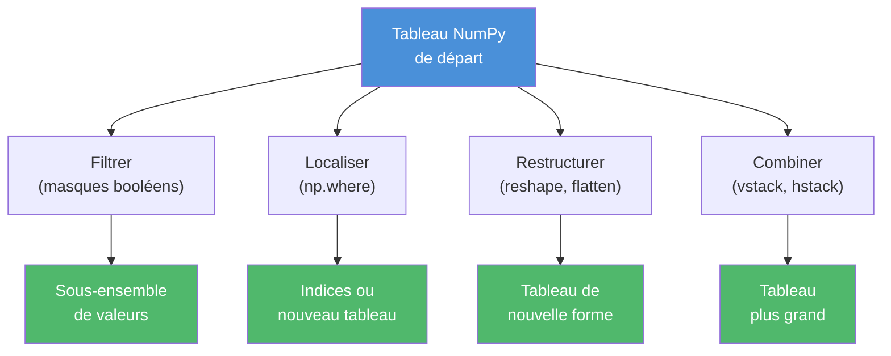

import { Tabs, TabItem, Aside, Steps, Card, CardGrid } from '@astrojs/starlight/components';

## D'un tableau à une analyse

Tu sais maintenant **créer** des tableaux NumPy, lire leurs dimensions, accéder à leurs cellules et faire des opérations vectorisées dessus.  
Cependant, pour une véritable analyse, il faut aller plus loin :

- **Sélectionner** seulement ce qui nous intéresse (les valeurs au-dessus d'un seuil, les lignes qui répondent à un critère)
- **Localiser** où sont les valeurs particulières
- **Restructurer** les tableaux (changer leur forme, en assembler plusieurs)

Cette page couvre ces manipulations. Elles sont la fondation de tout ce qui suivra : analyser des données, c'est d'abord savoir les filtrer et les recombiner.

<Aside type='note' title='Rappel Numpy'>
- Un tableau NumPy se crée avec `np.array(liste)`
- `tableau.shape` donne les dimensions, `tableau.dtype` donne le type des éléments
- Indexation 2D : `tableau[i, j]` (un élément), `tableau[i, :]` (une ligne), `tableau[:, j]` (une colonne)
- Les opérations s'appliquent **élément par élément** : `tableau * 2` double chaque valeur, sans boucle
</Aside>

---

## Cas d'étude : les dépenses en loisirs

Toute la matière de cette semaine s'organise autour d'un même jeu de données : les dépenses annuelles moyennes des ménages montréalais en divertissement, par arrondissement et par catégorie. C'est aussi le terrain de ton **projet d'équipe** des prochaines semaines.

Voici notre tableau de travail (données fictives). Les données sont organisées sous forme de tableau (matrice) avec :

- Lignes → arrondissements (dans l'ordre de la liste arrondissements)
- Colonnes → catégories de loisirs (dans l'ordre de la liste categories)
- Valeurs → montant dépensé (en dollars)

```python
import numpy as np

arrondissements = np.array([
    "Plateau", "Rosemont", "Ville-Marie", "Verdun", "Mercier-HM", "Ahuntsic"
])

categories = np.array([
    "Cinema", "Concerts", "Sports", "Jeux video", "Restos"
])

# Dépense annuelle moyenne par ménage ($)
# Lignes : arrondissements 
# Colonnes : catégories 
depenses = np.array([
    [285, 340, 180, 420, 1450],   # Plateau
    [260, 220, 165, 380, 1100],   # Rosemont
    [310, 380, 410, 340, 1380],   # Ville-Marie
    [240, 195, 145, 390,  920],   # Verdun
    [220, 175, 195, 410,  980],   # Mercier-HM
    [255, 205, 175, 365, 1050],   # Ahuntsic
])

print(depenses.shape)
```

On peut lire la matrice comme un tableau:

| Arrondissement | Cinema | Concerts | Sports | Jeux video | Restos |
| -------------- | ------ | -------- | ------ | ---------- | ------ |
| Plateau        | 285    | 340      | 180    | 420        | 1450   |
| Rosemont       | 260    | 220      | 165    | 380        | 1100   |
| Ville-Marie    | 310    | 380      | 410    | 340        | 1380   |
| Verdun         | 240    | 195      | 145    | 390        | 920    |
| Mercier-HM     | 220    | 175      | 195    | 410        | 980    |
| Ahuntsic       | 255    | 205      | 175    | 365        | 1050   |

##### Résultat de l'exécution
```
(6, 5)
```

Le tableau a **6 lignes** (arrondissements) et **5 colonnes** (catégories). La cellule `depenses[0, 4]` (`1450`) signifie : *au Plateau, on dépense en moyenne 1450 \$ par ménage par année en restaurants-sorties*.

<Aside type='tip' title='Une cellule, une histoire'>
À chaque cellule du tableau correspond un fait précis. Quand tu manipules ces nombres, garde en tête ce qu'ils représentent.
C'est ce qui distingue un calcul mathématique d'une analyse. **Le contexte est crucial.**
</Aside>

---

## Filtrer avec des conditions

### Comparer : un masque booléen

Quand tu compares un tableau NumPy à une valeur, tu obtiens un nouveau tableau **de booléens**, de la même forme.

```python "depenses > 1000"
chers = depenses > 1000
print(chers)
```

##### Résultat de l'exécution
```
[[False False False False  True]
 [False False False False  True]
 [False False False False  True]
 [False False False False False]
 [False False False False False]
 [False False False False  True]]
```

Chaque cellule du tableau initial a été remplacée par `True` si la dépense dépasse 1000 \$, par `False` sinon. C'est ce qu'on appelle un **masque booléen**. Du premier coup d'œil, on voit que les seules dépenses au-dessus de 1000 \$ sont en restaurants-sorties (dernière colonne).

Tous les opérateurs de comparaison fonctionnent : `>`, `<`, `>=`, `<=`, `==`, `!=`.

```python "depenses == 1450"
print(depenses == 1450)
```

##### Résultat de l'exécution
```
[[False False False False  True]
 [False False False False False]
 [False False False False False]
 [False False False False False]
 [False False False False False]
 [False False False False False]]
```

### Filtrer avec un masque

Quand on **indexe** un tableau avec un masque booléen, NumPy ne garde que les cellules où le masque vaut `True`.

```python "depenses[depenses > 1000]"
print(depenses[depenses > 1000])
```

##### Résultat de l'exécution
```
[1450 1100 1380 1050]
```

Le résultat est un **tableau 1D** : on perd la structure 2D parce que les valeurs filtrées ne forment plus une grille rectangulaire. Mais on a maintenant en main les 4 dépenses qui dépassent 1000 \$.

#### Combien y en a-t-il ? 

On peut compter directement sur le masque avec `np.sum`.

```python
print(np.sum(depenses > 1000))
```

##### Résultat de l'exécution
```
4
```

`np.sum` additionne les `True` (qui valent 1) et les `False` (qui valent 0). C'est un patron très courant en analyse de données : **compter combien d'éléments respectent une condition**.

### Combiner plusieurs conditions

Pour combiner deux conditions, on utilise `&` (et), `|` (ou), `~` (non).

<Aside type='danger' title='Pas and / or / not !'>
Avec NumPy, on **ne peut pas** utiliser les mots-clés Python `and`, `or`, `not` sur des tableaux. Il faut utiliser les opérateurs `&`, `|`, `~`. Et chaque condition combinée **doit** être entourée de parenthèses :

```python
# ❌ Erreur (priorité des opérateurs)
masque = depenses >= 200 & depenses <= 400

# ✅ Correct
masque = (depenses >= 200) & (depenses <= 400)
```

Sans parenthèses, Python évalue `200 & depenses` avant la comparaison.
</Aside>

#### Exemple: Dépenses entre 200 et 400 $ inclusivement

```python "(depenses >= 200) & (depenses <= 400)"
modere = (depenses >= 200) & (depenses <= 400)
print(depenses[modere])
```

##### Résultat de l'exécution
```
[285 340 260 220 380 310 380 340 240 390 220 255 205 365]
```

#### Exemple: Dépenses très faibles OU très élevées

```python
extreme = (depenses < 200) | (depenses > 1000)
print("Nombre d'extrêmes :", np.sum(extreme))
```

##### Résultat de l'exécution
```
Nombre d'extrêmes : 11
```

#### Exemple: Dépenses raisonnables — entre 200 (inclus) et 500 (exclus)

```python
raisonnable = (depenses >= 200) & (depenses < 500)
print("Nombre de cellules raisonnables :", np.sum(raisonnable))
```

##### Résultat de l'exécution
```
Nombre de cellules raisonnables : 17
```

### Filtrer des lignes entières

Les masques deviennent vraiment puissants quand on les construit à partir d'**une seule colonne** pour ensuite **sélectionner les lignes correspondantes** dans plusieurs tableaux.


#### Exemple: Trouver les arrondissements où on dépense plus de 250 $

On veut connaître les arrondissements où on dépense plus de 250 \$ par année en cinéma. Le cinéma, c'est la colonne d'indice `0`.

```python "depenses[:, 0]"
masque_cinema = depenses[:, 0] > 250
print(masque_cinema)
```

##### Résultat de l'exécution
```
[ True  True  True False False  True]
```

Le masque a une longueur de 6 — un booléen par arrondissement. On peut maintenant l'utiliser sur le tableau `arrondissements` pour récupérer les noms correspondants.

```python "arrondissements[masque_cinema]"
print(arrondissements[masque_cinema])
```

##### Résultat de l'exécution
```
['Plateau' 'Rosemont' 'Ville-Marie' 'Ahuntsic']
```

Le même masque peut s'appliquer aux lignes du tableau 2D pour récupérer **tous les chiffres** de ces arrondissements.

```python "depenses[masque_cinema]"
print(depenses[masque_cinema])
```

##### Résultat de l'exécution
```
[[ 285  340  180  420 1450]
 [ 260  220  165  380 1100]
 [ 310  380  410  340 1380]
 [ 255  205  175  365 1050]]
```

<Aside type='tip' title='Le patron à retenir'>
**Construire le masque à partir d'une dimension, l'appliquer sur plusieurs tableaux liés.** 
C'est ce que tu ferais pour répondre à des questions comme « Dans les arrondissements à hauts revenus, comment se répartissent les dépenses ? » : un masque sur la colonne *revenu*, appliqué ensuite à toutes les colonnes de dépenses.
</Aside>

---

## Localiser avec `np.where`

`np.where(condition)` retourne les **indices** des cellules où la condition est vraie.

```python
indices = np.where(depenses > 1000)
print(indices)
```

##### Résultat de l'exécution
```
(array([0, 1, 2, 5]), array([4, 4, 4, 4]))
```

Le résultat est un tuple : un tableau d'indices de **lignes**, et un tableau d'indices de **colonnes**. La paire `(0, 4)` signifie « ligne 0, colonne 4 » — donc Plateau, Restos. La paire `(1, 4)` → Rosemont, Restos. Et ainsi de suite.

`np.where` a aussi une **forme à trois arguments** : `np.where(condition, valeur_si_vrai, valeur_si_faux)`. Au lieu de retourner des indices, elle retourne un **nouveau tableau** où chaque cellule a été remplacée selon la condition.


#### Exemple: Catégoriser comme "Elevé" si > 300, "Moyen" sinon
```python
categorisation = np.where(depenses > 300, "Elevé", "Moyen")
print(categorisation)
```

##### Résultat de l'exécution
```
[['Moyen' 'Elevé' 'Moyen' 'Elevé' 'Elevé']
 ['Moyen' 'Moyen' 'Moyen' 'Elevé' 'Elevé']
 ['Elevé' 'Elevé' 'Elevé' 'Elevé' 'Elevé']
 ['Moyen' 'Moyen' 'Moyen' 'Elevé' 'Elevé']
 ['Moyen' 'Moyen' 'Moyen' 'Elevé' 'Elevé']
 ['Moyen' 'Moyen' 'Moyen' 'Elevé' 'Elevé']]
```

C'est un outil très pratique pour **classer** des valeurs en catégories sans écrire de boucle.

---

## Restructurer les tableaux

### Changer la forme avec `reshape`

`reshape` réorganise les éléments d'un tableau dans une nouvelle forme sans changer leur ordre, ni leurs valeurs.

```python "np.arange(12)" "reshape((3, 4))"
nombres = np.arange(12)
print(nombres)
print(nombres.shape)

grille = nombres.reshape((3, 4))
print(grille)
print(grille.shape)
```

##### Résultat de l'exécution
```
[ 0  1  2  3  4  5  6  7  8  9 10 11]
(12,)
[[ 0  1  2  3]
 [ 4  5  6  7]
 [ 8  9 10 11]]
(3, 4)
```

Le produit des dimensions de la nouvelle forme doit égaler le nombre total d'éléments. Ici : 3 × 4 = 12.

L'opération inverse, c-à-d, passer d'une grille à un tableau 1D, s'appelle **aplatir** (`flatten`).

```python ".flatten()"
plat = grille.flatten()
print(plat)
```

##### Résultat de l'exécution
```
[ 0  1  2  3  4  5  6  7  8  9 10 11]
```

Cas pratique sur nos données : aplatir le tableau pour voir toutes les dépenses sans tenir compte de la structure arrondissement/catégorie.

```python "depenses.flatten()"
toutes = depenses.flatten()
print(toutes.shape)
print(toutes[:8])  # Les 8 premières
```

##### Résultat de l'exécution
```
(30,)
[ 285  340  180  420 1450  260  220  165]
```

On a transformé 6 × 5 = 30 valeurs en un seul tableau 1D. Utile quand on veut une statistique globale sans tenir compte de la structure (par exemple : la dépense moyenne **toute catégorie et tout arrondissement confondus**).

<Aside type='tip' title='Reshape automatique avec -1'>
Tu peux mettre `-1` à la place d'une dimension pour laisser NumPy la calculer automatiquement.

```python
nombres = np.arange(12)
nombres.reshape((3, -1))   # NumPy déduit 4
nombres.reshape((-1, 2))   # NumPy déduit 6
```

Pratique quand on connaît une dimension mais pas l'autre.
</Aside>

### Empiler des tableaux

Pour combiner plusieurs tableaux, NumPy offre trois fonctions principales : `vstack`, `hstack`, et la forme générale `concatenate`.

```python "np.vstack"
# Imagine qu'on reçoit les données de Lachine et Saint-Laurent en retard
lachine = np.array([235, 200, 150, 370, 1020])
saint_laurent = np.array([245, 215, 170, 395, 1080])

# Empiler ces deux nouvelles lignes
nouvelles_lignes = np.vstack([lachine, saint_laurent])
print(nouvelles_lignes)
print(nouvelles_lignes.shape)
```

##### Résultat de l'exécution
```
[[ 235  200  150  370 1020]
 [ 245  215  170  395 1080]]
(2, 5)
```

```python
# Combiner avec le tableau original (6 lignes + 2 lignes = 8 lignes)
depenses_complet = np.vstack([depenses, nouvelles_lignes])
print(depenses_complet.shape)
```

##### Résultat de l'exécution
```
(8, 5)
```

`vstack` empile **verticalement** (ajout de lignes — pense au V comme un entonnoir où les lignes s'empilent), `hstack` empile **horizontalement** (ajout de colonnes).

```python "np.hstack"
# Ajouter une colonne (ex: une nouvelle catégorie "Parcs")
parcs = np.array([[80], [110], [140], [95], [105], [85]])
depenses_avec_parcs = np.hstack([depenses, parcs])
print(depenses_avec_parcs.shape)
```

##### Résultat de l'exécution
```
(6, 6)
```

<Aside type='caution' title='Forme du tableau à empiler'>
Pour `hstack`, le tableau qu'on ajoute comme colonne doit avoir la **même hauteur** que le tableau de base et être présenté comme une colonne (forme `(6, 1)`, pas `(6,)`). Si tu pars d'un tableau 1D, tu peux le reformater :

```python
parcs_1d = np.array([80, 110, 140, 95, 105, 85])
parcs_col = parcs_1d.reshape((-1, 1))   # Devient (6, 1)
```
</Aside>

| Fonction | Effet | Exigence sur les formes |
|---|---|---|
| `np.vstack([a, b])` | Empile verticalement (ajoute des lignes) | Même nombre de colonnes |
| `np.hstack([a, b])` | Empile horizontalement (ajoute des colonnes) | Même nombre de lignes |
| `np.concatenate([a, b], axis=...)` | Forme générale, contrôle de l'axe | Compatible selon l'axe choisi |

---

## Synthèse



| Tu veux... | Outil |
|---|---|
| ...savoir quelles cellules respectent une condition | Comparaison (`>`, `<`, `==`) → masque booléen |
| ...extraire ces cellules | `tableau[masque]` |
| ...compter combien il y en a | `np.sum(masque)` |
| ...combiner des conditions | `&` (et), `\|` (ou), `~` (non), avec parenthèses |
| ...connaître les indices | `np.where(condition)` |
| ...remplacer selon la condition | `np.where(condition, vrai, faux)` |
| ...changer la forme | `tableau.reshape((dimensions))` |
| ...aplatir en 1D | `tableau.flatten()` |
| ...empiler des lignes | `np.vstack([a, b])` |
| ...empiler des colonnes | `np.hstack([a, b])` |
