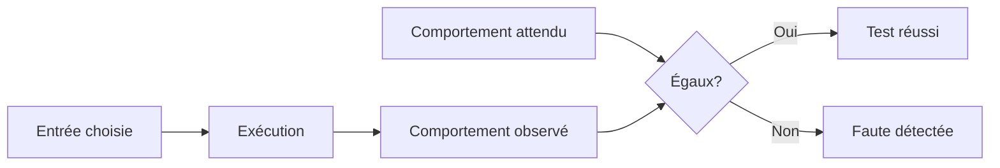
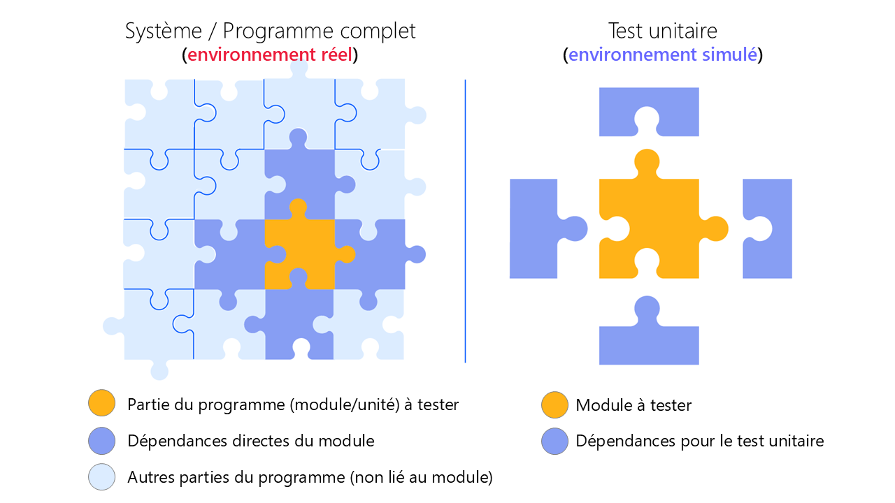

import { Aside, Steps, Card, CardGrid, Tabs, TabItem } from '@astrojs/starlight/components';
import {StepFlow} from './../../../components/StepFlow';

## Qu'est-ce qu'un test?


Un test compare le **comportement attendu** d'un programme à son **comportement observé**.

- Si les deux coïncident, le test **réussit**.
- Si les deux diffèrent, le test **échoue** et révèle une faute.

Tester, c'est une technique de détection de fautes qui tente délibérément de faire échouer le programme ou de l'amener à un état erroné. 

**La démarche est planifiée:** tu choisis des entrées précises, tu anticipes les sorties correspondantes, puis tu compares.



### Les limites des tests

Un test peut indiquer la présence d'erreur ou fautes (*bug*), mais jamais qu'il n'en reste **aucun**. Même avec des milliers de tests, il est impossible de garantir qu'un programme est sans faute: les cas non testés restent des zones d'ombre.

<Aside type="tip" title="Prouver l'absence de fautes">
Démonstration mathématiques.
</Aside>

## Le test unitaire

Un **test unitaire** est un type de test qui vérifie le bon fonctionnement d'une **petite unité** de code, typiquement une fonction, de manière isolée du reste du programme.
C'est l'un des tests les plus courramment utilisés dans le développement logiciel.



### Exemple

Imaginons une fonction qui calcule le carré d'un nombre:

```python
def carre(nombre):
    return nombre * nombre
```

Pour tester cette fonction, on vérifie son comportement sur plusieurs entrées:

```python
print(carre(3))    # attendu: 9
print(carre(0))    # attendu: 0
print(carre(-4))   # attendu: 16
```

Pour l'instant, c'est **toi** qui compares mentalement chaque résultat affiché avec le résultat attendu. C'est fastidieux et peu fiable. On peut faire mieux.

## L'énoncé `assert`

L'énoncé `assert` vérifie automatiquement qu'une condition est vraie. Si la condition est fausse, le programme s'interrompt avec une erreur `AssertionError`.

### Syntaxe

```python
assert condition
assert condition, "message d'erreur"
```

- Si `condition` est **vraie**, le programme continue silencieusement.
- Si `condition` est **fausse**, une exception `AssertionError` est levée et le programme s'arrête.

### Exemple

```python
def carre(nombre):
    return nombre * nombre

assert carre(3) == 9
assert carre(0) == 0
assert carre(-4) == 16
print("Tous les tests ont réussi.")
```

##### Résultat de l'exécution

```
Tous les tests ont réussi.
```

Et si une assertion échoue (simulons une faute):

```python {2}
assert carre(3) == 9
assert carre(0) == 1, "carre(0) devrait valoir 0"
assert carre(-4) == 16
```

##### Résultat de l'exécution

```
AssertionError: carre(0) devrait valoir 0
```

Python t'indique **exactement** quelle assertion a échoué et pourquoi (autant que possible).

## Critères d'un bon test

<CardGrid>
<Card title="Indépendant" icon="puzzle">
Un test ne dépend pas du résultat d'un autre test. Chaque test se tient seul.
</Card>
<Card title="Reproductible" icon="random">
Exécuté plusieurs fois, le test donne toujours le même résultat.
</Card>
<Card title="Rapide" icon="rocket">
Un test rapide s'exécute souvent. Un test lent finit par être ignoré.
</Card>
<Card title="Lisible" icon="open-book">
Le nom du test et son contenu expliquent clairement ce qui est vérifié.
</Card>
<Card title="Ciblé" icon="approve-check">
Un test vérifie **une seule chose**. S'il échoue, on sait exactement quoi.
</Card>
<Card title="Couvrant" icon="list-format">
L'ensemble des tests couvre les cas normaux, les cas limites et les cas d'erreur.
</Card>
</CardGrid>

## Écriture étape par étape: périmètre d'un triangle

**Problème.** Calculer le périmètre d'un triangle à partir des coordonnées de ses trois sommets.

### Analyse

Le périmètre est la somme des longueurs des trois côtés. Chaque côté est la **distance** entre deux sommets. Cette distance se calcule avec le **théorème de Pythagore**:

$$
h = \sqrt{\text{base}^2 + \text{hauteur}^2}
$$

### Décomposition fonctionnelle

On décompose le problème en trois fonctions, de la plus simple à la plus complexe:


<StepFlow client:only steps={[
    { label: "`perimetre_triangle(x1, y1, x2, y2, x3, y3)`" },
    { label: "`distance(x1, y1, x2, y2)`" },
    { label: "`hypotenuse(base, hauteur)`" },
  ]} />

<Steps>

1. **`hypotenuse(base, hauteur)`** calcule l'hypoténuse à partir de la base et de la hauteur d'un triangle rectangle.

2. **`distance(x1, y1, x2, y2)`** utilise `hypotenuse` pour calculer la distance entre deux points.

3. **`perimetre_triangle(...)`** utilise `distance` trois fois pour additionner les côtés.

</Steps>

<Aside title="La règle d'or">
On écrit **et on teste** chaque fonction **avant** de passer à la suivante. Si on construit sur des fondations non testées, une faute dans `hypotenuse` fera échouer `perimetre_triangle` sans qu'on sache pourquoi.
</Aside>

### Étape 1: `hypotenuse`

```python
from math import sqrt

def hypotenuse(base, hauteur):
    return sqrt(base ** 2 + hauteur ** 2)
```

#### Tests avec des triplets bien connus

```python
assert hypotenuse(3, 4) == 5
assert hypotenuse(5, 12) == 13
assert hypotenuse(8, 15) == 17
assert hypotenuse(0, 0) == 0        # cas limite
print("hypotenuse: OK")
```

##### Résultat de l'exécution

```
hypotenuse: OK
```

### Étape 2: `distance`

```python
def distance(x1, y1, x2, y2):
    base = x2 - x1
    hauteur = y2 - y1
    return hypotenuse(base, hauteur)
```

#### Tests

```python
assert distance(0, 0, 3, 4) == 5       # origine vers (3, 4)
assert distance(1, 1, 1, 1) == 0       # même point
assert distance(-1, -1, 2, 3) == 5     # coordonnées négatives
assert distance(0, 0, -3, -4) == 5     # direction inverse
print("distance: OK")
```

##### Résultat de l'exécution

```
distance: OK
```

<Aside title="Pourquoi ces tests?">
On ne teste pas seulement le cas « facile » `(0, 0, 3, 4)`. On vérifie aussi les **coordonnées négatives**, la **distance nulle** et la **direction inverse**. Un bon test attrape ce que tu n'avais pas prévu.
</Aside>

### Étape 3: `perimetre_triangle`

```python
def perimetre_triangle(x1, y1, x2, y2, x3, y3):
    cote1 = distance(x1, y1, x2, y2)
    cote2 = distance(x2, y2, x3, y3)
    cote3 = distance(x3, y3, x1, y1)
    return cote1 + cote2 + cote3
```

#### Tests

```python
# Triangle rectangle de côtés 3, 4, 5 -> périmètre = 12
assert perimetre_triangle(0, 0, 3, 0, 0, 4) == 12

# Triangle "dégénéré" (points alignés) -> deux fois la distance max
assert perimetre_triangle(0, 0, 1, 0, 2, 0) == 4

print("perimetre_triangle: OK")
```

##### Résultat de l'exécution

```
perimetre_triangle: OK
```

<Aside type="tip" title="L'avantage de tester par étapes">
Tester `hypotenuse` avant `distance`, puis `distance` avant `perimetre_triangle`, permet de **localiser** une faute précisément. Si `perimetre_triangle` échoue mais les deux autres passent, la faute est forcément dans `perimetre_triangle` lui-même, pas dans ses dépendances.
</Aside>

## Pour aller plus loin

### La librairie `pytest`

`pytest` est une librairie facilitant l'orchestration de tests unitaire très populaire dans la communauté Python. 
Elle demande simplement de respecter une convention: ajouter le préfixe `test_` aux fonctions de tests. 
Après on peut utiliser des `assert` ordinaires pour formuler nos cas de tests.

```python
# test_hypotenuse.py
from math import sqrt

def hypotenuse(base, hauteur):
    return sqrt(base ** 2 + hauteur ** 2)

def test_triangle_3_4_5():
    assert hypotenuse(3, 4) == 5

def test_cas_limite_zero():
    assert hypotenuse(0, 0) == 0
```

Exécution depuis le terminal:

```sh
pytest test_hypotenuse.py
```

<Aside type="tip" title="Non inclus: Librairie à installer">
`pytest` n'est pas inclus avec Python. Tout comme `numpy`, il faut l'installer avec `pip install pytest`.
</Aside>

### Les autres types de tests

Les tests unitaires ne sont qu'une famille parmi plusieurs:

- **Tests d'intégration** — vérifient que plusieurs modules fonctionnent bien **ensemble**.
- **Tests fonctionnels** — vérifient qu'une fonctionnalité complète répond au besoin de l'utilisateur.
- **Tests de régression** — vérifient qu'une correction n'a pas réintroduit un ancien bug.
- **Tests de performance** — mesurent la rapidité ou la consommation de ressources.
- **Tests de bout en bout (end-to-end)** — simulent un parcours complet de l'utilisateur dans l'application.

<Aside type="tip">
Dans ce cours, on se limite aux tests **unitaires** avec `assert`. 
</Aside>

## Résumé

- Un test compare un comportement **attendu** à un comportement **observé**.
- `assert` est l'outil le plus simple: **silence = succès, erreur = faute**.
- On teste chaque fonction **indépendamment**, de la plus simple à la plus complexe.
- Les tests ne prouvent **pas** l'absence de fautes, mais ils en **révèlent** la présence.