import { Tabs, TabItem, Aside, Steps, Card, CardGrid } from '@astrojs/starlight/components';

## De l'analyse à la communication

Cette semaine, on apprend à **construire des graphiques en Python** avec **Matplotlib**, la bibliothèque de visualisation la plus utilisée dans l'écosystème scientifique.

L'idée centrale de Matplotlib : tu pars d'une **figure vide**, et tu y empiles des éléments — une courbe, des axes, un titre, une légende, des couleurs. Comme un dessin qu'on construit couche par couche.

<Aside type='note' title='Dépendance avec Numpy'>
Matplotlib dépend (à besoin) de Numpy pour fonctionner. Il faut donc toujours s'assurer que Numpy est installé pour l'utiliser. 
Par convention, on importe `numpy` avant d'importer `matplotlib`. 

```python
import numpy as np
import matplotlib.pyplot as plt
```

Ici, le second `import` charge le sous-module `pyplot` sous le nom court `plt`. C'est une convention universelle dans la communauté Python.
</Aside>

---

## Le premier graphique en quatre lignes

On veut représenter l'évolution de la dépense moyenne en restaurants à Montréal sur 5 ans.

```python
import numpy as np
import matplotlib.pyplot as plt

annees = np.array([2020, 2021, 2022, 2023, 2024])
restos = np.array([920, 870, 1010, 1110, 1180])

plt.plot(annees, restos)
plt.show()
```

##### Résultat de l'exécution

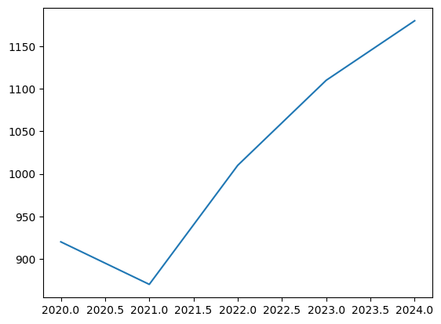

1. `plt.plot(x, y)` trace une ligne qui relie les points donnés. 
2. `plt.show()` ouvre la fenêtre du graphique.

Mais ce graphique est nu : aucun titre, pas d'unités, pas de marqueurs aux points, pas de quadrillage. **Personne ne devrait jamais publier un graphique aussi nu**.

<Aside type='note' title='Show ou pas show ?'>
Dans certains environnements (Jupyter, VS Code interactif), le graphique apparaît
automatiquement sans `plt.show()`. Dans un script Python lancé en ligne de commande, 
`plt.show()` est nécessaire pour que la fenêtre s'ouvre. En cas de doute, ajoute-le
toujours — ça ne fait jamais de mal.
</Aside>

---

## Habiller un graphique

On reprend le même graphique en lui ajoutant ce qui le rend lisible.

```python "marker" "color" "title" "xlabel" "ylabel" "grid"
plt.plot(annees, restos, marker="o", color="steelblue")
plt.title("Dépense moyenne en restaurants à Montréal")
plt.xlabel("Année")
plt.ylabel("Dépense moyenne ($)")
plt.grid(True, alpha=0.3)
plt.show()
```

##### Résultat de l'exécution

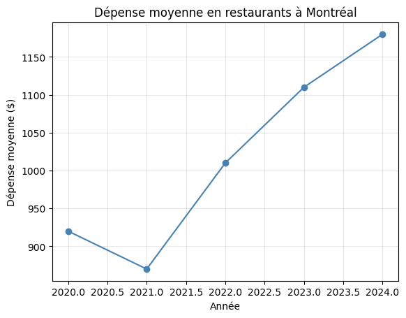

#### Explication des ajouts

| Élément | Code | Ce que ça fait |
|---|---|---|
| Marqueurs aux points | `marker="o"` | Affiche un cercle à chaque point. Autres : `"s"` (carré), `"^"` (triangle), `"x"`, `"*"` |
| Couleur | `color="steelblue"` | Couleur nommée. Les **noms HTML standards** fonctionnent (`"red"`, `"darkorange"`, etc.) |
| Titre | `plt.title(...)` | Au-dessus du graphique |
| Étiquettes des axes | `plt.xlabel(...)`, `plt.ylabel(...)` | Sous l'axe X et à gauche de l'axe Y |
| Quadrillage | `plt.grid(True, alpha=0.3)` | Lignes de fond. `alpha` règle la transparence (0 = invisible, 1 = opaque) |

<Aside type='tip' title='La règle des trois étiquettes'>
Tout graphique destiné à être vu par quelqu'un d'autre que toi doit avoir au minimum :

1. Un **titre** qui dit de quoi il s'agit
2. Une **étiquette d'axe X** avec son unité
3. Une **étiquette d'axe Y** avec son unité

Sans ça, le graphique est inutilisable.
</Aside>

---

## Diagramme en barres

On reprend les données loisirs des semaines précédentes :

```python
arrondissements = np.array([
    "Plateau", "Rosemont", "Ville-Marie", "Verdun", "Mercier-HM", "Ahuntsic"
])
categories = np.array(["Cinema", "Concerts", "Sports", "Jeux video", "Restos"])
depenses = np.array([
    [285, 340, 180, 420, 1450],
    [260, 220, 165, 380, 1100],
    [310, 380, 410, 340, 1380],
    [240, 195, 145, 390,  920],
    [220, 175, 195, 410,  980],
    [255, 205, 175, 365, 1050],
])
```

#### Quelle catégorie attire le plus de dépenses dans toute la ville ? 

On somme par catégorie, puis on trace.

```python "np.sum" "bar"
total_par_cat = np.sum(depenses, axis=0)

plt.bar(categories, total_par_cat, color="steelblue")
plt.title("Total des dépenses par catégorie")
plt.ylabel("Total des dépenses ($)")
plt.show()
```

##### Résultat de l'exécution

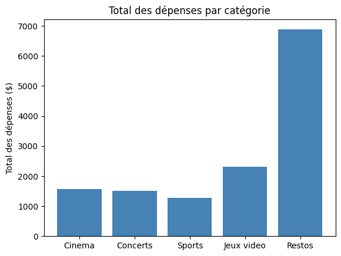

#### Explication de la construction

- `plt.bar(categories, valeurs)` prend deux arguments : les **étiquettes** et les **hauteurs** de barre. 
- La barre de Restos écrase visuellement les autres. L'œil capture la différence instantanément.

### Barres horizontales et tri

Pour des étiquettes longues (ex: noms d'arrondissements), les **barres horizontales** sont plus lisibles. 

<Aside type='tip' title='Améliorer la lisibilité en triant'>
**Trier les barres** améliore presque toujours la lecture. 
Cela évite les parcours *en saccade* (balayage gauche-droite, haut-bas répétitif).
</Aside>

```python
total_par_arr = np.sum(depenses, axis=1)

# Trier par ordre croissant pour avoir le plus haut en haut
ordre = np.argsort(total_par_arr)
arr_tri = arrondissements[ordre]
tot_tri = total_par_arr[ordre]

plt.barh(arr_tri, tot_tri, color="steelblue")
plt.title("Dépenses totales par arrondissement")
plt.xlabel("Total des dépenses ($)")
plt.show()
```

`plt.barh` est l'équivalent horizontal de `plt.bar`.

##### Résultat de l'exécution

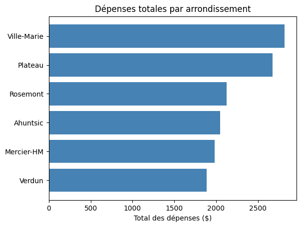

---

## L'histogramme

#### Comment se répartissent les dépenses dans l'ensemble du jeu de données ? 

On veut **une distribution**, pas une comparaison.

```python
plt.hist(depenses.flatten(), bins=10, color="steelblue", edgecolor="black")
plt.title("Distribution des dépenses (toutes cellules)")
plt.xlabel("Dépense ($)")
plt.ylabel("Nombre de cellules")
plt.show()
```

##### Résultat de l'exécution

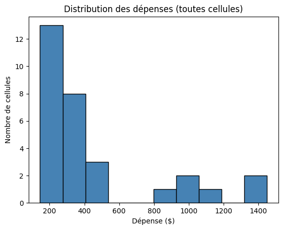

#### Explication de la construction

- `depenses.flatten()` aplatit la matrice 2D en un tableau 1D — l'histogramme a besoin d'une seule série de valeurs.
- `bins=10` demande 10 intervalles. Ce nombre change radicalement l'apparence. Essaie avec d'autres valeurs.
- `edgecolor="black"` dessine les contours des barres pour mieux les distinguer.

L'histogramme révèle clairement l'**asymétrie** de la distribution : 
la plupart des cellules sont sous 500 \$, mais quelques-unes (les Restos) sont très loin à droite.

---

## Le nuage de points

#### Y a-t-il une relation entre dépenses en cinéma et dépenses en concerts ?

```python
cinema = depenses[:, 0]
concerts = depenses[:, 1]

plt.scatter(cinema, concerts, s=80, color="steelblue")
for i in range(len(arrondissements)):
    plt.annotate(arrondissements[i], (cinema[i], concerts[i]),
                 xytext=(5, 5), textcoords="offset points", fontsize=9)

plt.title("Dépenses cinéma vs concerts par arrondissement")
plt.xlabel("Cinéma ($)")
plt.ylabel("Concerts ($)")
plt.grid(True, alpha=0.3)
plt.show()
```

##### Résultat de l'exécution

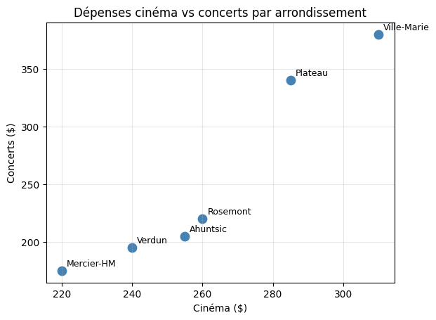

#### Explication de la construction

- `plt.scatter(x, y)` place un point pour chaque paire de coordonnées. 
- `s=80` règle la taille des points.
- `plt.annotate(texte, (x, y), ...)` ajoute une étiquette à un point. 
- L'argument `xytext=(5, 5)` décale l'étiquette de 5 pixels vers la droite et le haut pour qu'elle ne soit pas collée sur le point.

**Lecture du graphique :** les arrondissements qui dépensent plus en cinéma dépensent aussi plus en concerts. Ville-Marie et Plateau sont en haut à droite, Verdun et Mercier-HM en bas à gauche. C'est une **corrélation positive**.

<Aside type='caution' title='Corrélation, pas causalité'>
Une corrélation visible sur un graphique **ne prouve pas** que dépenser plus en 
cinéma cause des dépenses en concerts. Les deux peuvent simplement avoir une 
cause commune (le revenu du quartier, la densité d'offre culturelle...). 
</Aside>

---

## La boîte à moustaches
 
La **boîte à moustaches** (*boxplot*) résume une distribution en un seul coup d'œil : médiane, quartiles, étendue, valeurs aberrantes. Elle est particulièrement puissante pour **comparer plusieurs distributions** côte à côte.
 
```python
# plt.boxplot prend une liste de tableaux : un par catégorie à comparer
data_par_cat = [depenses[:, i] for i in range(len(categories))]
 
plt.boxplot(data_par_cat, tick_labels=categories)
plt.title("Distribution des dépenses par catégorie")
plt.ylabel("Dépense ($)")
plt.grid(True, alpha=0.3, axis="y")
plt.show()
```
 
##### Résultat de l'exécution
 
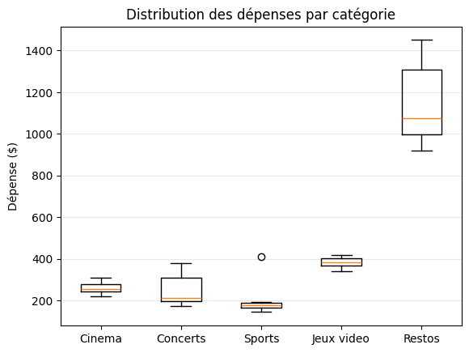
 
#### Comment lire chaque boîte
 
- La **ligne orange** au milieu de la boîte est la **médiane**.
- Le bas de la boîte est le **premier quartile** (Q1) ; le haut est le **troisième quartile** (Q3). La boîte contient donc 50 % des valeurs centrales.
- Les **moustaches** (lignes en haut et en bas) s'étendent jusqu'aux valeurs extrêmes considérées non aberrantes.
- Les **points isolés** au-delà des moustaches sont des **valeurs aberrantes** détectées automatiquement par Matplotlib.
Le code utilise une **compréhension de liste** : `[depenses[:, i] for i in range(len(categories))]` construit une liste de 5 tableaux 1D (un par catégorie). C'est ce que `boxplot` attend — une liste de séries à comparer.
 
**Lecture du graphique :** la boîte de Restos s'étire de 920 \$ à 1450 \$ et est nettement au-dessus des autres. 
Cinéma et Jeux vidéo ont des boîtes très petites, ce qui confirme l'observation faite à la page d'analyse : 
ces catégories sont **très uniformes** d'un arrondissement à l'autre. Le **point isolé** au-dessus de
la boîte de Sports correspond à Ville-Marie (410 \$).  
Matplotlib l'a automatiquement signalé comme aberrant. C'est exactement le genre d'anomalie qu'on cherche à détecter en analyse exploratoire.
 
<Aside type='tip' title='Quand utiliser un boxplot ?'>
Le boxplot brille pour comparer **plusieurs distributions** côte à côte. Pour une seule distribution, l'**histogramme** est généralement plus parlant pour un public non technique parce que sa lecture est plus intuitive.
</Aside>

---

## Plusieurs courbes sur un même graphique

C'est là qu'on commence à raconter des histoires : superposer plusieurs séries pour les comparer.

```python
annees = np.array([2020, 2021, 2022, 2023, 2024])
restos_evol = np.array([920, 870, 1010, 1110, 1180])
cinema_evol = np.array([280, 180, 230, 260, 270])
sports_evol = np.array([200, 150, 190, 215, 225])

plt.plot(annees, restos_evol, marker="o", label="Restos")
plt.plot(annees, cinema_evol, marker="s", label="Cinéma")
plt.plot(annees, sports_evol, marker="^", label="Sports")
plt.title("Évolution des dépenses par catégorie (Montréal)")
plt.xlabel("Année")
plt.ylabel("Dépense moyenne ($)")
plt.legend()
plt.grid(True, alpha=0.3)
plt.show()
```

##### Résultat de l'exécution

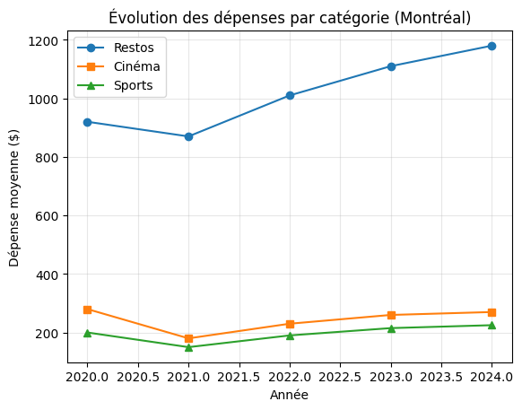

Trois nouveautés :

- **Plusieurs `plt.plot`** consécutifs : Matplotlib les empile sur la même figure jusqu'au prochain `plt.show()`.
- **`label="..."`** : c'est ce qui apparaîtra dans la légende.
- **`plt.legend()`** : déclenche l'affichage de la légende. Sans cet appel, les `label` sont stockés mais invisibles.

Matplotlib choisit automatiquement une couleur différente pour chaque série. Tu peux les fixer manuellement avec `color="..."` si tu veux contrôler.

**Lecture :** on voit clairement le creux pandémique de 2021 dans les trois catégories, et la remontée plus lente du cinéma par rapport aux restaurants.

---

{/* ## Combiner avec l'analyse : tracer une tendance

Tu te souviens de `np.polyfit` qui calcule une droite de tendance ? On peut maintenant la **visualiser** en surimpression sur les données réelles.

```python
coeffs = np.polyfit(annees, restos_evol, 1)
predits = np.polyval(coeffs, annees)

plt.scatter(annees, restos_evol, color="steelblue", s=60, label="Données réelles")
plt.plot(annees, predits, color="darkorange", linestyle="--", label="Tendance linéaire")
plt.title("Tendance des dépenses en restaurants")
plt.xlabel("Année")
plt.ylabel("Dépense moyenne ($)")
plt.legend()
plt.grid(True, alpha=0.3)
plt.show()
```

##### Résultat de l'exécution

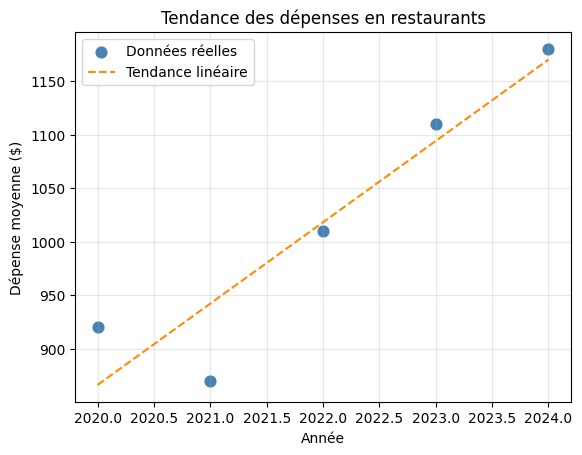

Deux éléments combinés sur le même graphique :

- Les **points** réels (avec `scatter`)
- La **droite de tendance** calculée par `polyfit` (avec `plot` en `linestyle="--"` pour pointillés)

Voir la droite passer **à côté** du point de 2021 rend visible ce qu'on disait la semaine dernière : *la régression linéaire lisse l'épisode pandémique*. Le graphique montre ce que les chiffres seuls suggéraient.

| `linestyle` | Apparence |
|---|---|
| `"-"` (défaut) | Ligne continue |
| `"--"` | Pointillés |
| `":"` | Pointillés serrés |
| `"-."` | Tiret-point |

--- */}

## Plusieurs graphiques côte à côte : `subplots`

Parfois, on veut afficher plusieurs graphiques dans la même figure. Matplotlib offre `plt.subplots(lignes, colonnes)` qui retourne deux choses : la **figure** complète et un **tableau d'axes**, un par sous-graphique.

```python
fig, axes = plt.subplots(1, 2, figsize=(11, 4))

# Sous-graphique de gauche : barres
axes[0].bar(categories, total_par_cat, color="steelblue")
axes[0].set_title("Total par catégorie")
axes[0].set_ylabel("Total ($)")

# Sous-graphique de droite : barres horizontales triées
axes[1].barh(arr_tri, tot_tri, color="seagreen")
axes[1].set_title("Total par arrondissement")
axes[1].set_xlabel("Total ($)")

fig.tight_layout()
plt.show()
```

##### Résultat de l'exécution

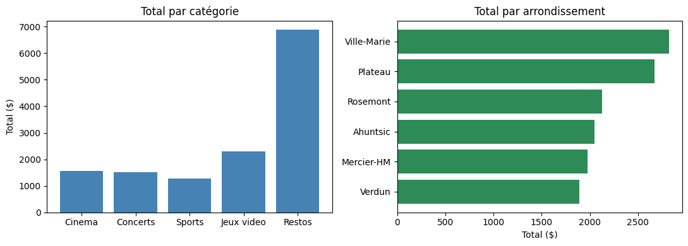

Quelques différences importantes par rapport à l'API simple :

- `plt.subplots(1, 2)` crée 1 ligne × 2 colonnes — donc deux graphiques côte à côte.
- `figsize=(11, 4)` règle la taille en pouces (largeur, hauteur).
- `axes[0]` et `axes[1]` sont des objets : on n'utilise plus `plt.title(...)` mais `axes[0].set_title(...)`. La règle est simple : remplacer `plt.foo(...)` par `axes[i].set_foo(...)` sur les axes individuels.
- `fig.tight_layout()` ajuste automatiquement les marges pour que rien ne se chevauche.

<Aside type='note' title="Deux styles d'API">
Matplotlib propose deux styles d'utilisation : l'API **simple** (`plt.title`, `plt.bar`...) qu'on a utilisée jusqu'ici, et l'API **orientée objet** (`axes.set_title`, `axes.bar`...) qu'on découvre avec `subplots`. Pour des graphiques uniques, l'API simple suffit largement. Pour plusieurs graphiques ou des cas plus complexes, l'API orientée objet devient indispensable.
</Aside>

---

 
## Sauvegarder un graphique
 
Pour intégrer un graphique dans un document, un site, on le sauvegarde dans un fichier au lieu de l'afficher.
 
```python
plt.bar(categories, total_par_cat, color="steelblue")
plt.title("Total des dépenses par catégorie")
plt.ylabel("Total des dépenses ($)")
plt.savefig("depenses_par_categorie.png", dpi=150, bbox_inches="tight")
plt.close()
```

 
- `plt.savefig("nom.png")` : sauvegarde la figure courante. Le format est déduit de l'extension (`.png`, `.pdf`, `.svg`, `.jpg`...).
- `dpi=150` : résolution en points par pouce. 100 pour l'écran, 150-300 pour l'impression.
- `bbox_inches="tight"` : rogne les marges blanches autour du graphique.
- `plt.close()` après la sauvegarde : libère la mémoire si tu génères plusieurs graphiques en boucle.
<Aside type='tip' title="Show ou save, pas les deux">
Quand tu appelles `plt.show()` puis `plt.savefig()`, l'ordre compte : sur certains systèmes,
 `show()` ferme la figure, et le fichier sauvegardé devient vide.   
 La règle sûre : **savefig avant show**, ou alors n'utilise que l'un des deux.
</Aside>
---
 
## Le diagramme circulaire
 
Le diagramme circulaire (ou *pie chart*, ou camembert) montre les **parts d'un tout**. Chaque secteur représente une catégorie ; sa surface est proportionnelle à sa part.
 
```python
total_par_cat = np.sum(depenses, axis=0)
 
plt.pie(total_par_cat, labels=categories, autopct="%1.1f%%", startangle=90)
plt.title("Répartition des dépenses par catégorie")
plt.show()
```
 
##### Résultat de l'exécution
 
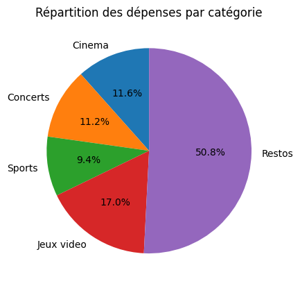
 
#### Trois paramètres à connaître
 
- `labels=categories` : les étiquettes de chaque secteur.
- `autopct="%1.1f%%"` : affiche automatiquement le **pourcentage** sur chaque 
secteur, avec une décimale. Le `%%` final n'est qu'une astuce pour afficher le caractère `%` lui-même.
- `startangle=90` : démarre le premier secteur à 12 h plutôt qu'à 3 h. 
Une convention de présentation courante.
**Lecture du graphique :** Restos occupe à lui seul plus de la moitié du budget 
loisirs (50,8 %). Les autres catégories se partagent l'autre moitié, avec Jeux vidéo en deuxième (17 %).
 
<Aside type='danger' title='Le piège du diagramme circulaire'>
Le diagramme circulaire est **largement déconseillé** par les spécialistes de la visualisation. 
Regarde le graphique ci-dessus : peux-tu dire d'un coup d'œil si **Cinéma** (11,6 %) ou **Concerts** (11,2 %) est plus grand ? 

L'œil compare très mal les angles et les surfaces.
Avec le **même jeu de données**, le diagramme en barres présenté plus haut rend la 
comparaison instantanée. 

Garde le diagramme circulaire pour les cas où :
 
- Tu as **peu de catégories** (4-5 maximum)
- Les **proportions sont très différentes** (pas de tranches similaires)
- Tu présentes à un **public non technique** habitué à ce format
Dans le doute, choisis un diagramme en barres.
</Aside>
---
 
{/* ## Antipattern : le piège de l'axe Y tronqué
 
On a vu la semaine dernière qu'un axe Y qui ne commence pas à 0 peut **dramatiser** des écarts minuscules. Voilà ce que ça donne en code :
 
```python
valeurs = np.array([102, 105, 100, 103])
labels = np.array(["A", "B", "C", "D"])
 
fig, axes = plt.subplots(1, 2, figsize=(10, 4))
 
# À GAUCHE : trompeur
axes[0].bar(labels, valeurs, color="indianred")
axes[0].set_ylim(99, 106)
axes[0].set_title("Axe Y tronqué (trompeur)")
axes[0].set_ylabel("Valeur")
 
# À DROITE : honnête
axes[1].bar(labels, valeurs, color="seagreen")
axes[1].set_ylim(0, 110)
axes[1].set_title("Axe Y commençant à 0")
axes[1].set_ylabel("Valeur")
 
fig.tight_layout()
plt.show()
```
 
##### Résultat de l'exécution
 

 
À gauche, B paraît cinq fois plus grand que C — alors que la différence est de 
5 sur 100, soit 5 %. À droite, l'œil reçoit l'information correcte.
 
`axes[i].set_ylim(min, max)` règle les bornes de l'axe Y. Par défaut, Matplotlib 
choisit des bornes pertinentes — mais pour un diagramme en barres, **il faut presque
 toujours forcer `set_ylim(0, ...)`** pour respecter ce principe. */}
 
---
 
## Synthèse
 
| Tu veux... | Fonction |
|---|---|
| ...une courbe / évolution | `plt.plot(x, y)` |
| ...un diagramme en barres vertical | `plt.bar(labels, valeurs)` |
| ...un diagramme en barres horizontal | `plt.barh(labels, valeurs)` |
| ...une distribution (une série) | `plt.hist(tableau, bins=N)` |
| ...comparer plusieurs distributions | `plt.boxplot(liste_de_tableaux)` |
| ...un nuage de points | `plt.scatter(x, y)` |
| ...les parts d'un tout (avec parcimonie) | `plt.pie(valeurs, labels=...)` |
| ...un titre | `plt.title("...")` |
| ...nommer les axes | `plt.xlabel("...")`, `plt.ylabel("...")` |
| ...une légende | Ajouter `label=` à chaque trace, puis `plt.legend()` |
| ...un quadrillage | `plt.grid(True, alpha=0.3)` |
| ...plusieurs graphiques côte à côte | `fig, axes = plt.subplots(lignes, colonnes)` |
| ...sauvegarder | `plt.savefig("nom.png", dpi=150, bbox_inches="tight")` |

---

## Pourquoi Matplotlib plutôt qu'Excel ?

### Ce que Matplotlib fait mieux

**Reproductibilité.** Ton graphique est défini par du code. Six mois plus tard, 
tu relances le script et tu obtiens exactement le même rendu. Avec Excel, il 
faut se souvenir de chaque clic : quelle plage, quel type de graphique, quelle 
couleur. Pour un projet, un rapport, une publication scientifique, cette traçabilité est essentielle.

**Intégration.** Lecture des données, nettoyage, analyse, visualisation, export : 
tout est dans le même script. Pas d'aller-retour entre une feuille de calcul et un graphique séparé.

**Gros volumes.** Excel plafonne autour d'un million de lignes par feuille — et rame bien avant. 
Matplotlib, couplé à NumPy, gère des dizaines de millions de points sans broncher.

**Contrôle total.** Chaque pixel est paramétrable. Quand tu veux un rendu inhabituel — 
annotations précises, échelles spéciales, superpositions complexes — Excel a un menu
 de choix prédéfinis ; Matplotlib offre une bibliothèque de primitives.

**Gratuit, libre, partout.** Pas de licence, fonctionne sur tous les systèmes, sans restriction d'usage. 
Des outils comme Statistica coûtent plusieurs centaines de dollars par poste.

### Ce qu'Excel (ou Statistica) fait mieux

**Rapidité initiale.** Premier graphique dans Excel : 30 secondes, deux clics. 
Premier graphique avec Matplotlib : il faut connaître Python, NumPy, l'API. 
Pour *jeter un œil rapidement* à des données, Excel gagne haut la main.

**Interactivité.** Dans Excel, on tire un coin pour étendre une plage, on clique
 sur une barre pour voir sa valeur, on filtre dynamiquement. Matplotlib produit des images **statiques**.

**Partage facile.** Un collègue qui n'a pas Python ne peut pas modifier ton graphique. La plupart des gens en milieu professionnel utilisent Excel.

**Statistiques avancées clé en main.** Statistica est un outil **statistique spécialisé** : 
tests d'hypothèses, régressions multiples, ANOVA, analyses factorielles, le tout avec 
interfaces et tableaux de résultats prêts à interpréter. Matplotlib ne fait que tracer ; 
pour les analyses avancées, il faut compléter avec d'autres bibliothèques (`scipy.stats`, `scikit-learn`...).

### Le bon outil au bon moment

Il n'y a pas un outil supérieur dans l'absolu. Le bon choix dépend du contexte :

| Situation | Outil naturel |
|---|---|
| Exploration rapide, présentation à un public non technique | Excel |
| Analyse statistique formelle (tests, modélisation guidée) | Statistica, R, SPSS |
| Pipeline reproductible, automatisation, gros volumes, publication scientifique | Matplotlib |
| Visualisation interactive en ligne | Plotly, Tableau |
