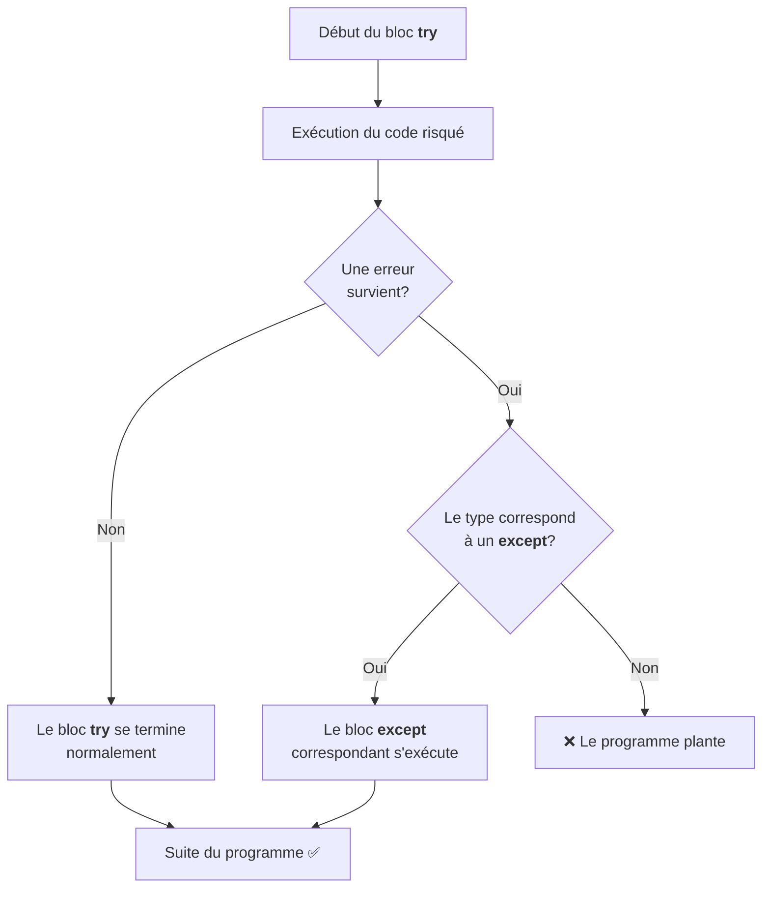

import { Aside, Steps, Card, CardGrid, Tabs, TabItem } from '@astrojs/starlight/components';

Jusqu'ici, toutes nos données vivaient **dans le code**. 
Cependant, très souvent les données qu'on souhaite traiter avec un programme ne sont pas connues d'avance et ne seront pas entrées une à une par l'utilisateur.

Cette page t'apprend à aller chercher des données **à l'extérieur** de ton programme, dans des fichiers, et à réagir quand quelque chose tourne mal en cours de route.

---

## D'où viennent les données?

Tu connais déjà deux façons de fournir des données à un programme :

| Source | Exemple | Limite |
|---|---|---|
| Prédéfinie (dans le code) | `prix = 4.50`<br/>`notes = [78, 85, 92]` | Figé dans le code |
| Saisie utilisateur (`input`) | `input("Ton nom? ")` | Une valeur à la fois |

Ces deux approches sont très limitantes et créent une dépendance avec les programmeurs (pour la mise à jour du code)
ou avec l'utilisateur (pour fournir les données). 

Les **fichiers** brisent cette limite. Un fichier CSV exporté d'un tableur (ex: Excel), un rapport téléchargé, un journal de transactions — toutes ces sources évoluent indépendamment de ton programme. 
Ton code va les **lire**, les transformer, et potentiellement **écrire** les résultats dans un nouveau fichier ou modifier le fichier source.

<Aside type="tip">
Dans ce cours, on se concentre sur les fichiers **texte** et en particulier le format **CSV**. 
D'autres formats existent (JSON, XML...), mais le CSV couvre la majorité des cas en analyse de données.
</Aside>

---

## Ouvrir et lire un fichier

### La fonction `open()`

Pour accéder à un fichier, Python a besoin de deux informations : **le chemin** vers le fichier et **le mode** d'accès.

```python
fichier = open("donnees.csv", "r")
```

<Aside type="tip" title="Qu'est-ce qu'un chemin?">
Le chemin (*path*) est une suite de dossiers qui permet d'indiquer l'emplacement d'un fichier ou d'un dossier sur l'ordinateur.  
**Exemple :** 
- Pour un dossier: `"C:\Users\lelaf\GitHub\code\"`
- Pour un fichier: `"C:\Users\lelaf\GitHub\code\04_tarif_stm.py"`
</Aside>

#### Modes les plus courants

| Mode | Signification |
|---|---|
| `"r"` | Lecture (*read*) — le fichier doit exister |
| `"w"` | Écriture (*write*) — crée le fichier ou **écrase** le contenu existant |
| `"a"` | Ajout (*append*) — ajoute à la fin sans effacer |

<Aside type="caution">
Le mode `"w"` est destructif. Si le fichier existe déjà, **tout son contenu est effacé** dès l'ouverture. Pas d'avertissement, pas de confirmation.
</Aside>

### Lire le contenu

Une fois le fichier ouvert, on peut accéder (lire) au contenu :

#### Méthode `read()`

Avec la méthode `read`, tout le contenu du fichier est lu et retourné dans **une seule chaîne de caractères**.

```python "read()" "close"
fichier = open("donnees.csv", "r")
contenu = fichier.read()
fichier.close()
print(contenu)
```

##### Résultat de l'exécution

```
produit,quantite,prix_unitaire
Café,150,4.50
Thé,85,3.75
Chocolat chaud,60,5.25
Jus d'orange,120,4.00
Limonade,95,3.50
```

#### Méthode `readlines()`

Avec la méthode `readlines`, tout le contenu est lu et retourné sous forme de **liste où chaque élément est une ligne** du fichier.

```python "readlines" "close"
fichier = open("donnees.csv", "r")
lignes = fichier.readlines()
fichier.close()
print(lignes)
```

##### Résultat de l'exécution

```
['produit,quantite,prix_unitaire\n', 'Café,150,4.50\n', 'Thé,85,3.75\n', ...]
```

<Aside type='note' title='Caractère \n à la fin de chaque ligne'>
Remarque le `\n` à la fin de chaque ligne: c'est le caractère de saut de ligne. 
Tu peux utiliser la méthode `strip()` pour l'enlever.

```py
lignes =  ['produit,quantite,prix\n', 'Café,150,4.50\n', 'Thé,85,3.75\n']
lignes_nettoyees = []
for ligne in lignes:
    lignes_nettoyees.append(ligne.strip("\n"))
```
</Aside>


### Fermer le fichier

Tu as remarqué les appels à `fichier.close()` dans les exemples précédents. 
Oublier de fermer un fichier peut causer des problèmes : données non sauvegardées, fichier verrouillé, mémoire gaspillée. 
Le problème, c'est qu'on oublie *souvent* de fermer.

#### Le bloc `with`

Python offre une solution élégante : le bloc `with`.

```python
with open("donnees.csv", "r") as fichier:
    contenu = fichier.read()
    print("Dans le with — fichier ouvert :", not fichier.closed)

print("Après le with — fichier fermé :", fichier.closed)
```

##### Résultat de l'exécution

```
Dans le with — fichier ouvert : True
Après le with — fichier fermé : True
```

Le `with` ferme automatiquement le fichier dès qu'on sort du bloc, même si une erreur survient entre-temps. **C'est la seule façon d'ouvrir un fichier** dans ce cours. Oublie `open()`/`close()` séparés.

<Aside type="note" title='Le mot-clé `as`'>
Le mot-clé `as` donne un nom temporaire au fichier ouvert. 
Tu l'utilises à l'intérieur du bloc `with`, puis il se ferme tout seul.
</Aside>

### L'encodage

Les fichiers texte utilisent un **encodage** pour représenter les caractères. Sur macOS et Linux, c'est généralement UTF-8 par défaut. Sur Windows, c'est parfois autre chose — et là, les accents deviennent du charabia.

Pour éviter les surprises, précise toujours l'encodage :

```python
with open("donnees.csv", "r", encoding="utf-8") as fichier:
    contenu = fichier.read()
```

---

## Le format CSV

### Structure

CSV signifie *Comma-Separated Values* — des valeurs séparées par des virgules (ou autres caractères). C'est le format universel pour les données tabulaires. Un fichier CSV ressemble à ceci :

```csv
produit,quantite,prix_unitaire
Café,150,4.50
Thé,85,3.75
Chocolat chaud,60,5.25
```

La première ligne contient les **en-têtes** (les noms de colonnes). Chaque ligne suivante est un **enregistrement**. Les valeurs sont séparées par des virgules.

### Approche naïve : `split()`

Tu pourrais lire un CSV ligne par ligne et découper avec `split(",")` :

```python
with open("donnees_ventes.csv", "r") as fichier:
    lignes = fichier.readlines()

en_tete = lignes[0].strip().split(",")
print("En-tête :", en_tete)

for ligne in lignes[1:]:
    valeurs = ligne.strip().split(",")
    nom = valeurs[0]
    quantite = int(valeurs[1])
    prix = float(valeurs[2])
    total = quantite * prix
    print(nom + " : " + str(quantite) + " x " + str(prix) + " $ = " + str(total) + " $")
```

##### Résultat de l'exécution

```
En-tête : ['produit', 'quantite', 'prix_unitaire']
Café : 150 x 4.5 $ = 675.0 $
Thé : 85 x 3.75 $ = 318.75 $
Chocolat chaud : 60 x 5.25 $ = 315.0 $
Jus d'orange : 120 x 4.0 $ = 480.0 $
Limonade : 95 x 3.5 $ = 332.5 $
```

Ça fonctionne tant que les données sont simples. Cependant, regarde ce qui arrive quand une valeur **contient elle-même une virgule** :

```csv
nom,adresse,ville
"Tremblay, Marc","123, rue Principale",Montréal
```

```python
ligne = '"Tremblay, Marc","123, rue Principale",Montréal'
print(ligne.split(","))
```

##### Résultat de l'exécution

```
['"Tremblay', ' Marc"', '"123', ' rue Principale"', 'Montréal']
```

**Cinq morceaux au lieu de trois.** Le `split(",")` coupe bêtement à chaque virgule, sans considérer les guillemets.

### Le module `csv`

Le module `csv` de Python gère correctement les guillemets, les virgules à l'intérieur des champs, les sauts de ligne dans les valeurs.

#### Accès par position avec `csv.reader` 

```python
import csv

with open("donnees_ventes.csv", "r") as fichier:
    lecteur = csv.reader(fichier)
    en_tete = next(lecteur)
    print("En-tête :", en_tete)

    for rangee in lecteur:
        print(rangee)
```

##### Résultat de l'exécution

```
En-tête : ['produit', 'quantite', 'prix_unitaire']
['Café', '150', '4.50']
['Thé', '85', '3.75']
['Chocolat chaud', '60', '5.25']
["Jus d'orange", '120', '4.00']
['Limonade', '95', '3.50']
```

Chaque rangée est une **liste de chaînes**. Pour accéder à la quantité, tu utilises `rangee[1]`. La fonction `next()` avance le lecteur d'une ligne.

<Aside type="caution">
Toutes les valeurs sont des **chaînes**, même les nombres. `rangee[1]` donne `"150"`, pas `150`. Tu dois convertir toi-même avec `int()` ou `float()`.
</Aside>

#### Accès par nom de colonne avec `csv.DictReader`

```python
import csv

with open("donnees_ventes.csv", "r") as fichier:
    lecteur = csv.DictReader(fichier)
    for rangee in lecteur:
        nom = rangee["produit"]
        quantite = int(rangee["quantite"])
        prix = float(rangee["prix_unitaire"])
        print(nom + " — " + str(quantite) + " unités à " + str(prix) + " $")
```

##### Résultat de l'exécution

```
Café — 150 unités à 4.5 $
Thé — 85 unités à 3.75 $
Chocolat chaud — 60 unités à 5.25 $
Jus d'orange — 120 unités à 4.0 $
Limonade — 95 unités à 3.5 $
```

`DictReader` utilise la première ligne comme clés. Chaque rangée devient un dictionnaire, rendant même l'adressage dans le code plus lisible: `rangee["produit"]` dit clairement ce qu'on va chercher.

---

## Écrire dans un fichier

Très similaire à la lecture, on ouvre (accède) d'abord le fichier en *mode écriture* (`w`), 
puis on utilise la méthode `write` pour ajouter du contenu au fichier. 

### Écriture de texte

```python
with open("resultats.txt", "w") as fichier:
    fichier.write("Rapport de ventes\n")
    fichier.write("=================\n")
    fichier.write("Total : 2121.25 $\n")
```

<Aside type="caution">
La méthode `write()` **n'ajoute pas de saut de ligne automatiquement**.   
Tu dois inclure `\n` à la fin de chaque ligne toi-même.
</Aside>

### Écriture CSV

```python
import csv

ventes = [
    ["Café", 150, 4.50],
    ["Thé", 85, 3.75],
    ["Chocolat chaud", 60, 5.25],
]

with open("export.csv", "w", newline="") as fichier:
    ecrivain = csv.writer(fichier)
    ecrivain.writerow(["produit", "quantite", "prix_unitaire"])
    for vente in ventes:
        ecrivain.writerow(vente)
```

<Aside type="note" title='Le paramètre `newline`'>
Le paramètre `newline=""` dans `open()` est important pour l'écriture CSV. Sans lui, Windows ajoute des lignes vides entre chaque rangée.
</Aside>

---

## Gestion d'erreur (exceptions)


On ne peut pas toujours prévoir une erreur, mais on peut prévoir un **chemin alternatif** en cas d'erreur.

<Aside type='note' title='Un peu de vocabulaire'>
- **Erreur (*error*):** Provient d'une mauvaise implémentation (côté programmeur)
- **Faute ou défaut (*fault*, *defect*):** État interne invalide d'un programme après avoir rencontré une erreur
- **Défaillance (*failure*):** Manifestation externe d'une faute. Observable (ex: le programme dévie de sa spécification)
</Aside>


### Des erreurs que tu connais déjà

Tu as sûrement déjà vu ces messages en rouge dans ta console. 
Parfois, l'erreur ne vient pas de ton code, mais plutôt des **données**.

```
Traceback (most recent call last):
  File "script.py", line 3, in <module>
ValueError: invalid literal for int() with base 10: 'abc'
```

#### Erreurs fréquentes

| Erreur | Cause | Exemple |
|---|---|---|
| `ValueError` | Conversion impossible | `int("abc")` |
| `IndexError` | Index hors limites | `notes[5]` quand la liste a 3 éléments |
| `KeyError` | Clé absente du dictionnaire | `etudiant["age"]` quand la clé n'existe pas |
| `TypeError` | Opération entre types incompatibles | `"5" + 3` |
| `ZeroDivisionError` | Division par zéro | `10 / 0` |

### Nouvelles erreurs liées aux fichiers

La lecture de fichiers introduit une nouvelle catégorie d'erreurs — celles qui dépendent de **l'environnement** et non de la logique du programme :

| Erreur | Cause |
|---|---|
| `FileNotFoundError` | Le fichier n'existe pas au chemin donné |
| `PermissionError` | Pas les droits de lecture ou d'écriture |
| `UnicodeDecodeError` | Mauvais encodage |

Ces erreurs sont particulières : **tu ne peux pas les prévenir en regardant ton code**. 
Le fichier peut exister sur ton ordinateur mais pas sur celui de ton collègue.  
Les données peuvent être propres dans un fichier et corrompues dans un autre. 
Ton programme doit pouvoir **réagir** plutôt que planter.

---

## L'instruction `try`-`except`

La plupart des langages de programmation de haut niveau offrent un mécanisme facilitant le traitement des exceptions.
Bien entendu, cela inclut également Python.

### Principe

Si une opération ou un appel de fonction risque de causer une erreur ou de soulever une exception, il faut encapsuler l'instruction dans un contexte permettant de traiter l'erreur.

```python "try" "except"
try:
    fichier = open("inexistant.csv", "r")
except FileNotFoundError:
    print("Le fichier n'existe pas!")
```

##### Résultat de l'exécution

```
Le fichier n'existe pas!
```

Le bloc `try` contient le code **risqué**. Si une erreur du type spécifié survient, Python saute au bloc `except` au lieu de planter. Le reste du programme continue normalement.

#### Exemple de base

```python "try" "except ZeroDivisionError"
try:
    numerateur = 10
    denominateur = 0

    result = numerateur / denominateur

    print(result)
except ZeroDivisionError:
    print("Erreur (Division par zéro): Le dénominateur ne peut être égal à 0.")
```

##### Résultat de l'exécution

```
Erreur (Division par zéro): Le dénominateur ne peut être égal à 0.
```

### Récupérer le message d'erreur

Le mot-clé `as` capture l'objet d'erreur dans une variable :

```python "try" "except" "as"
try:
    fichier = open("inexistant.csv", "r")
except FileNotFoundError as e:
    print("Erreur : " + str(e))
```

##### Résultat de l'exécution

```
Erreur : [Errno 2] No such file or directory: 'inexistant.csv'
```

### Intercepter plusieurs types d'erreurs

Un même bloc `try` peut avoir **plusieurs** blocs `except`, chacun pour un type d'erreur différent :

#### Exemple 1

```python "try" "except"
def lire_csv(chemin):
    resultats = []
    try:
        with open(chemin, "r") as fichier:
            lignes = fichier.readlines()

        en_tete = lignes[0].strip().split(",")

        for i in range(1, len(lignes)):
            valeurs = lignes[i].strip().split(",")
            rangee = {}
            for j in range(len(en_tete)):
                rangee[en_tete[j]] = valeurs[j]
            resultats.append(rangee)

    except FileNotFoundError:
        print("Erreur : le fichier '" + chemin + "' n'existe pas.")
    except IndexError:
        print("Erreur : le fichier semble mal formaté.")

    return resultats
```

#### Exemple 2

```python "try" "except"
try:    
    tab_pair = [12, 4, 8, 20]
    print(tab_pair[5])

except ZeroDivisionError:
    print("Dénominateur ne peut être égal à 0")
except IndexError:
    print("Index en dehors des limites du tableau.")
```

##### Résultat de l'exécution

```
Index en dehors des limites du tableau.
```

Python essaie les blocs `except` **dans l'ordre**. Dès qu'il trouve le bon type, il exécute ce bloc et ignore les suivants.

<Aside type="caution" title="Évite l'utilisation de `except` générique">
Ne mets jamais un `except` générique sans type d'erreur (`except:` tout court). Ça attrape **tout**, y compris les erreurs que tu voudrais voir, comme les fautes de frappe dans tes noms de variables. Toujours nommer le type d'erreur attendu.
</Aside>

### Flux d'exécution



<Aside type="tip" title="En cas d'erreur">
Que l'erreur soit interceptée ou non, **les instructions qui suivaient l'erreur dans le bloc `try` ne s'exécutent jamais**. Python saute directement au `except` correspondant (ou plante si aucun ne correspond).
</Aside>