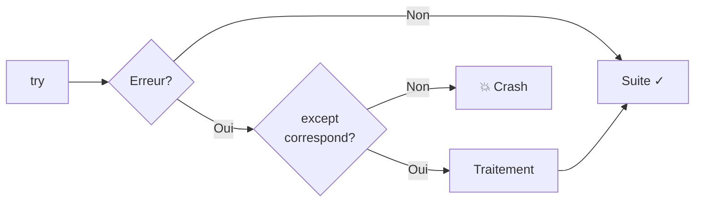

import { Aside, Steps, Card, CardGrid, Tabs, TabItem } from '@astrojs/starlight/components';

Cette page résume **l'ensemble de la matière** vue pendant la session. 
Ce n'est pas un remplacement des notes de cours — c'est un aide-mémoire compact pour réviser avant l'examen.

---

## 1. Variables, types et opérations

### Types de base

| Type | Description | Exemple |
|---|---|---|
| `int` | Nombre entier | `42`, `-7`, `0` |
| `float` | Nombre à virgule | `3.14`, `-0.5` |
| `str` | Chaîne de caractères | `"Bonjour"`, `'A'` |
| `bool` | Booléen | `True`, `False` |

### Conversions

```python
int("42")        # str → int
float("3.14")    # str → float
str(42)          # int → str
int(3.99)        # float → int (tronque, ne pas confondre avec round)
```

### Opérateurs arithmétiques

| Opérateur | Description | Exemple | Résultat |
|---|---|---|---|
| `+` `-` `*` | Addition, soustraction, multiplication | `7 * 3` | `21` |
| `/` | Division réelle | `7 / 2` | `3.5` |
| `//` | Division entière | `7 // 2` | `3` |
| `%` | Modulo (reste) | `7 % 2` | `1` |
| `**` | Puissance | `2 ** 3` | `8` |

<Aside type="caution">
Priorité : `**` → `*` `/` `//` `%` → `+` `-`. En cas de doute, utilise des parenthèses.
</Aside>

### Opérateurs d'affectation composés

```python
x += 3     # x = x + 3
x -= 1     # x = x - 1
x *= 2     # x = x * 2
x /= 4     # x = x / 4
```

---

## 2. Entrée et sortie

```python
# Sortie
print("Bonjour", nom, "! Tu as", age, "ans.")

# Entrée — toujours une chaîne
reponse = input("Ton nom? ")
age = int(input("Ton âge? "))
```

<Aside type="caution">
`input()` retourne **toujours** un `str`. Il faut convertir avec `int()` ou `float()` pour faire des calculs.
</Aside>

---

## 3. Conditions

```python
if condition:
    instructions
elif autre_condition:
    instructions
else:
    instructions
```

### Opérateurs de comparaison

| Opérateur | Signification |
|---|---|
| `==` `!=` | Égal / Différent |
| `<` `>` `<=` `>=` | Comparaisons numériques |

### Opérateurs logiques

| Opérateur | Signification |
|---|---|
| `and` | Les deux doivent être vraies |
| `or` | Au moins une doit être vraie |
| `not` | Inverse le booléen |

### Opérateur ternaire

```python
mention = "réussite" if note >= 60 else "échec"
```

---

## 4. Boucles

### `while` — répéter tant qu'une condition est vraie

```python
compteur = 0
while compteur < 5:
    print(compteur)
    compteur = compteur + 1
```

### `for` — parcourir une séquence

```python
# Avec range
for i in range(5):           # 0, 1, 2, 3, 4
    print(i)

for i in range(2, 8):        # 2, 3, 4, 5, 6, 7
    print(i)

for i in range(0, 10, 2):    # 0, 2, 4, 6, 8
    print(i)

# Parcourir une liste
for fruit in fruits:
    print(fruit)

# Avec indice
for i in range(len(fruits)):
    print(i, fruits[i])
```

### Contrôle de boucle

| Mot-clé | Effet |
|---|---|
| `break` | Sort immédiatement de la boucle |
| `continue` | Saute à l'itération suivante |

### Patron accumulateur

```python
total = 0
for valeur in liste:
    total = total + valeur
```

---

## 5. Fonctions intégrées et modules

### Fonctions globales essentielles

| Fonction | Description |
|---|---|
| `print()` | Afficher (ne retourne rien) |
| `input()` | Saisie utilisateur (retourne `str`) |
| `int()`, `float()`, `str()`, `bool()` | Conversion de type |
| `len()` | Longueur (liste, chaîne, dict) |
| `round(x, n)` | Arrondir à `n` décimales |
| `format(x, spec)` | Formater un nombre en chaîne |
| `abs()`, `max()`, `min()`, `sum()` | Opérations numériques |
| `range()` | Séquence d'entiers |
| `type()` | Connaître le type d'une valeur |
| `sorted()` | Retourne une copie triée |

### Modules courants

```python
import math         # math.sqrt(), math.pi, math.ceil()
import random       # random.randint(), random.choice()
import statistics   # statistics.mean(), statistics.median()
```

### Variantes d'import

```python
import math                    # math.sqrt(16)
from math import sqrt          # sqrt(16)
from math import sqrt, pi      # sqrt(16), pi
import numpy as np             # np.array([1, 2, 3])
```

---

## 6. Créer ses propres fonctions

### Syntaxe

```python
def nom_fonction(param1, param2):
    instructions
    return resultat
```

### Paramètres optionnels

```python
def saluer(nom, langue="fr"):
    if langue == "fr":
        print("Bonjour " + nom)
    else:
        print("Hello " + nom)

saluer("Alice")           # langue="fr" par défaut
saluer("Bob", "en")       # langue="en"
```

### Portée des variables

```python
x = 10                  # Variable globale

def modifier():
    x = 20              # Variable LOCALE (nouvelle, pas la globale)
    return x

print(modifier())       # 20
print(x)                # 10 — la globale n'a pas changé
```

<Aside type="caution">
Une fonction peut **lire** une variable globale, mais si elle **assigne** un nom identique, elle crée une variable locale qui masque la globale. Utilise des paramètres et des retours plutôt que des variables globales.
</Aside>

### Bonnes pratiques

| Principe | Explication |
|---|---|
| Une seule tâche | Chaque fonction fait **une chose** |
| Autonome | Ne dépend pas de variables globales (sauf constantes) |
| `return` plutôt que `print` | Retourner le résultat, pas l'afficher |
| Paramètres explicites | Tout ce dont elle a besoin est passé en paramètre |
| Nom descriptif | `calculer_imc` plutôt que `f1` |

---

## 7. Les listes

### Création et manipulation

```python
notes = [72, 85, 91, 68]
vide = []

notes.append(77)          # Ajouter à la fin
notes.insert(0, 95)       # Insérer à la position 0
notes.pop(2)              # Retirer l'élément à l'indice 2
notes.remove(68)          # Retirer la première occurrence de 68
notes.sort()              # Trier en place (retourne None!)
notes.reverse()           # Inverser en place
```

### Indexation et tranchage

```python
notes[0]          # Premier élément
notes[-1]         # Dernier élément
notes[1:4]        # Éléments d'indice 1, 2, 3
notes[:3]         # Les 3 premiers
notes[2:]         # À partir de l'indice 2
notes[::-1]       # Copie inversée
```

### Parcours

```python
# Par valeur
for note in notes:
    print(note)

# Par indice
for i in range(len(notes)):
    print(i, notes[i])
```

### Copie

```python
copie = notes[:]        # Vraie copie (tranchage complet)
copie = list(notes)     # Vraie copie (constructeur)
alias = notes           # ⚠️ PAS une copie — même objet en mémoire
```

---

## 8. Dictionnaires

### Création et accès

```python
etudiant = {"nom": "Tremblay", "note": 85, "groupe": "A"}

etudiant["nom"]              # "Tremblay"
etudiant["age"]              # ❌ KeyError
etudiant.get("age", 0)       # 0 (valeur par défaut)
etudiant["age"] = 20         # Ajout d'une clé
etudiant["note"] = 90        # Modification
```

### Parcours

```python
for cle in etudiant:                    # Clés seulement
    print(cle)

for cle, valeur in etudiant.items():    # Clés et valeurs
    print(cle, ":", valeur)
```

### Patron compteur de fréquences

```python
compteur = {}
for element in liste:
    compteur[element] = compteur.get(element, 0) + 1
```

---

## 9. Ensembles

```python
voyelles = {"a", "e", "i", "o", "u"}
vide = set()                            # ⚠️ pas {} (c'est un dict)
```

| Opération | Syntaxe | Description |
|---|---|---|
| Union | `a \| b` | Tous les éléments |
| Intersection | `a & b` | Éléments communs |
| Différence | `a - b` | Dans `a` mais pas dans `b` |
| Différence symétrique | `a ^ b` | Dans l'un ou l'autre, pas les deux |
| Appartenance | `x in a` | Très rapide (contrairement aux listes) |

---

## 10. Listes imbriquées et matrices

```python
matrice = [
    [1, 2, 3],
    [4, 5, 6],
    [7, 8, 9]
]

matrice[1][2]       # 6 (ligne 1, colonne 2)
len(matrice)        # 3 (nombre de lignes)
len(matrice[0])     # 3 (nombre de colonnes)
```

---

## 11. Chaînes de caractères

### Méthodes courantes

| Méthode | Description | Exemple |
|---|---|---|
| `.upper()` / `.lower()` | Majuscules / minuscules | `"Abc".upper()` → `"ABC"` |
| `.strip()` | Enlever les espaces aux extrémités | `" hi ".strip()` → `"hi"` |
| `.split(sep)` | Découper en liste | `"a,b,c".split(",")` → `["a","b","c"]` |
| `.replace(a, b)` | Remplacer | `"abc".replace("b", "X")` → `"aXc"` |
| `.find(s)` | Position (ou -1) | `"hello".find("ll")` → `2` |
| `.count(s)` | Nombre d'occurrences | `"abba".count("b")` → `2` |
| `.startswith(s)` | Commence par? | `"Bonjour".startswith("Bon")` → `True` |
| `.isdigit()` | Que des chiffres? | `"42".isdigit()` → `True` |

### Indexation

Les chaînes se comportent comme des listes **en lecture seule** :

```python
mot = "Python"
mot[0]       # "P"
mot[-1]      # "n"
mot[2:5]     # "tho"

for lettre in mot:
    print(lettre)
```

---

## 12. NumPy

### Création de tableaux

```python
import numpy as np

a = np.array([1, 2, 3, 4])           # 1D
m = np.array([[1, 2], [3, 4]])        # 2D
z = np.zeros((3, 4))                  # Matrice 3×4 de zéros
```

### Propriétés

```python
m.shape       # (2, 2) — dimensions
m.dtype       # dtype('int64') — type des éléments
m.ndim        # 2 — nombre de dimensions
```

### Opérations vectorisées

```python
a = np.array([10, 20, 30])
a * 2              # array([20, 40, 60])
a + 5              # array([15, 25, 35])
a > 15             # array([False, True, True]) — masque booléen
a[a > 15]          # array([20, 30]) — filtrage
```

### Statistiques avec `axis`

```python
m = np.array([[1, 2, 3],
              [4, 5, 6]])

np.sum(m)              # 21 (tout)
np.sum(m, axis=0)      # array([5, 7, 9])   — par colonne
np.sum(m, axis=1)      # array([6, 15])      — par ligne

np.mean(m, axis=0)     # Moyenne par colonne
np.std(m, axis=1)      # Écart-type par ligne
np.argmax(m, axis=1)   # Indice du max par ligne
```

<Aside type="tip">
`axis=0` réduit les **lignes** (résultat = une valeur par colonne).
`axis=1` réduit les **colonnes** (résultat = une valeur par ligne).
</Aside>

---

## 13. Fichiers

### Lecture

```python
with open("donnees.csv", "r", encoding="utf-8") as fichier:
    contenu = fichier.read()          # Tout en une chaîne
    # ou
    lignes = fichier.readlines()      # Liste de lignes
```

### Module CSV

```python
import csv

# csv.reader — accès par position
with open("donnees.csv", "r") as fichier:
    lecteur = csv.reader(fichier)
    en_tete = next(lecteur)           # Sauter l'en-tête
    for rangee in lecteur:
        print(rangee[0], rangee[1])   # Toujours des str!

# csv.DictReader — accès par nom
with open("donnees.csv", "r") as fichier:
    lecteur = csv.DictReader(fichier)
    for rangee in lecteur:
        print(rangee["produit"])
```

### Écriture

```python
with open("resultats.txt", "w") as fichier:
    fichier.write("Ligne 1\n")       # \n obligatoire

import csv
with open("export.csv", "w", newline="") as fichier:
    ecrivain = csv.writer(fichier)
    ecrivain.writerow(["col1", "col2"])
```

<Aside type="caution">
Le mode `"w"` **écrase** le fichier existant sans avertissement.
Toutes les valeurs lues d'un CSV sont des **chaînes** — il faut convertir avec `int()` ou `float()`.
</Aside>

---

## 14. Gestion d'erreurs — `try`-`except`

### Syntaxe

```python
try:
    code_risque
except TypeError:
    traitement_erreur_type
except ValueError:
    traitement_erreur_valeur
```

### Erreurs courantes

| Erreur | Cause typique |
|---|---|
| `ValueError` | `int("abc")` — conversion impossible |
| `IndexError` | `liste[10]` — index hors limites |
| `KeyError` | `dict["absent"]` — clé inexistante |
| `TypeError` | `"5" + 3` — types incompatibles |
| `ZeroDivisionError` | `10 / 0` |
| `FileNotFoundError` | `open("inexistant.csv")` |

### Récupérer le message

```python
try:
    x = int("abc")
except ValueError as e:
    print("Erreur : " + str(e))
```

### Flux d'exécution



<Aside type="caution">
Ne jamais utiliser `except:` sans type d'erreur — ça masque toutes les erreurs, y compris les bugs.
</Aside>

---

## 15. Tests unitaires

### Le `assert`

```python
assert calculer_imc(70, 1.75) == 22.86
assert len([]) == 0
assert 5 > 3, "Message si échec"
```

### Stratégies de test

| Catégorie | Ce qu'on teste |
|---|---|
| Cas normaux | Comportement attendu avec des entrées typiques |
| Cas limites | Listes vides, zéros, valeurs extrêmes |
| Cas d'erreur | Entrées invalides, types incorrects |

---

## Aide-mémoire `format()`

```python
format(3.14159, ".2f")      # "3.14"   — 2 décimales
format(42, "05d")            # "00042"  — 5 chiffres, zéros devant
format(0.856, ".1%")         # "85.6%"  — pourcentage
format(1234567, ",")         # "1,234,567" — séparateur de milliers
```