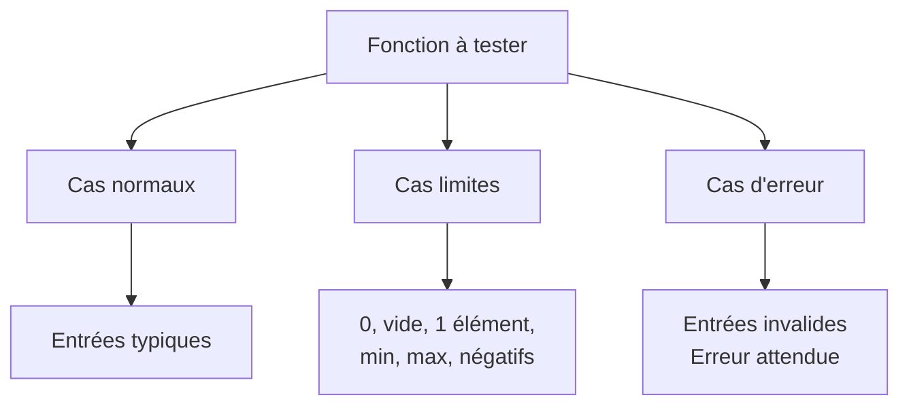

import { Aside, Steps, Card, CardGrid, Tabs, TabItem } from '@astrojs/starlight/components';

Savoir qu'`assert` existe, c'est un début. Savoir **quoi tester** et **comment organiser** ses tests, c'est ce qui fait la différence entre trois tests qui ne prouvent rien et une vraie couverture.

## Que faut-il tester?

Pour chaque fonction, on vise trois catégories de cas. Si l'une manque, il y a un angle mort.

- **Cas normaux:** Les entrées **typiques** que la fonction rencontrera la plupart du temps. C'est le chemin attendu.
- **Cas limites:** Les **frontières**: zéro, vide, un seul élément, minimum, maximum, entrées identiques, valeurs négatives.
- **Cas d'erreur:** Les entrées **invalides** qui ne devraient jamais arriver. La fonction doit-elle lever une erreur? Retourner une valeur spéciale?




## Cas normaux

Le plus simple. Tu choisis des entrées **représentatives** et tu vérifies que la fonction produit le résultat attendu.

```python
def moyenne(nombres):
    return sum(nombres) / len(nombres)

# Cas normaux - nombres entiers
assert moyenne([10, 20, 30]) == 20
assert moyenne([1, 2, 3, 4, 5]) == 3
assert moyenne([100, 200]) == 150

# Cas normaux - nombres flottants
assert moyenne([1.0, 2.0, 3.0]) == 2.0
assert moyenne([2.5, 3.5]) == 3.0
assert moyenne([0.5, 1.5, 2.5, 3.5]) == 2.0
```

<Aside title="Un seul cas normal ne suffit pas">
Un test avec `[10, 20, 30]` qui donne `20` ne prouve presque rien: la fonction pourrait simplement retourner `20` dans tous les cas! 
En variant les entrées — entiers **et** flottants, positifs **et** négatifs — tu augmentes la confiance que la logique est correcte.
</Aside>

<Aside type="caution" title="Choisir ses flottants prudemment">
Les cas choisis ci-dessus donnent des résultats **exacts** en flottant (ex. `2.5 + 3.5 = 6.0` précisément). 
Pour des cas comme `moyenne([0.1, 0.2, 0.3])`, l'égalité `==` peut échouer à cause de l'imprécision des `float`. 
</Aside>

## Cas limites

Les fautes se cachent **aux frontières**. Voici les cas limites à toujours considérer:

| Contexte | Cas limites à tester |
| --- | --- |
| Nombres | `0`, nombre négatif, très grand nombre |
| Listes | liste vide `[]`, liste à un seul élément `[x]` |
| Chaînes | chaîne vide `""`, un seul caractère |
| Intervalles | la borne inférieure, la borne supérieure |
| Comparaisons | deux valeurs égales, `a == b` |

```python
# Cas limites pour moyenne
assert moyenne([5]) == 5            # un seul élément
assert moyenne([0, 0, 0]) == 0      # que des zéros
assert moyenne([-10, 10]) == 0      # valeurs négatives
assert moyenne([-5, -10, -15]) == -10
```

## Cas d'erreur

Certaines entrées n'ont **aucun sens** pour ta fonction. Trois situations peuvent se produire:

1. **Python lève déjà une erreur** (ex. `ZeroDivisionError`, `TypeError`). Dans ce cas, il suffit de vérifier que la bonne erreur survient.
2. **Python laisse passer silencieusement** avec un résultat aberrant (ex. `inf`). C'est le **piège silencieux**, encore plus dangereux qu'un crash.
3. **On ajoute notre propre validation** pour rejeter explicitement l'entrée.

Dans tous les cas, on veut **tester le comportement**; qu'il s'agisse d'une exception ou d'une valeur particulière.

{/* ### Erreur 1: liste vide (`ZeroDivisionError`)

Si on appelle `moyenne` sur une liste vide, `len(nombres)` vaut `0`, et la division lève `ZeroDivisionError`. Comment tester ça?

<Tabs>
<TabItem label="Avec try/except">

```python
try:
    moyenne([])
    # Si on arrive ici, AUCUNE erreur n'a été levée: c'est un bug
    assert False, "moyenne([]) aurait dû lever ZeroDivisionError"
except ZeroDivisionError:
    # Comportement attendu: on ne fait rien
    pass
```

Le truc: le `assert False` n'est **jamais** censé s'exécuter. Si Python arrive à cette ligne, c'est que `moyenne([])` n'a pas planté comme prévu.

</TabItem>
<TabItem label="Avec unittest">

```python
import unittest

class TestMoyenne(unittest.TestCase):
    def test_liste_vide_leve_erreur(self):
        self.assertRaises(ZeroDivisionError, moyenne, [])
```

Beaucoup plus propre. `assertRaises` attend que l'appel `moyenne([])` lève une `ZeroDivisionError`. Si l'erreur survient, le test passe. Si elle ne survient pas, le test échoue.

</TabItem>
</Tabs>

### Erreur 2: éléments non-numériques (`TypeError`)

Que se passe-t-il si quelqu'un appelle `moyenne(["a", "b", "c"])`? L'opération `sum(["a", "b", "c"])` essaie d'additionner `0 + "a"` et Python lève `TypeError: unsupported operand type(s)`.

```python
# Tous les éléments sont des chaînes
try:
    moyenne(["a", "b", "c"])
    assert False, "moyenne avec des chaînes aurait dû lever TypeError"
except TypeError:
    pass

# Mélange nombres et chaînes
try:
    moyenne([1, 2, "trois"])
    assert False, "moyenne avec un mélange aurait dû lever TypeError"
except TypeError:
    pass
```

<Aside title="Deux entrées invalides, deux tests">
`["a", "b", "c"]` et `[1, 2, "trois"]` sont **deux** cas distincts. Le premier teste le cas « aucun nombre », le second teste « mélange de types ». Un bug pourrait casser l'un sans casser l'autre.
</Aside>

### Erreur 3: nombres trop grands (le piège silencieux)

Et si on passe des nombres si grands que leur somme déborde? En Python, les entiers sont illimités, mais les `float` ne le sont pas. Au-delà d'environ 1,8 × 10³⁰⁸, un `float` devient `inf` (infini).

```python
from math import isinf

# Python NE LÈVE PAS d'erreur: il retourne `inf` silencieusement
resultat = moyenne([1e308, 1e308, 1e308])
assert isinf(resultat), "le résultat devrait être infini"
```

<Aside type="danger" title="Un bug silencieux est pire qu'un crash">
Quand Python crashe, tu **sais** qu'il y a un problème. Quand Python retourne `inf` ou un résultat subtilement faux, ton programme continue avec une valeur aberrante qui peut contaminer tous les calculs suivants. Tester explicitement ce cas **documente** le comportement actuel et alerte quiconque modifiera le code plus tard.
</Aside> */}

## Organiser son code de test

Quand tu accumules des tests, trois problèmes apparaissent:

1. **Répétition**: tu répètes `assert fonction(x) == y, "..."` avec le même format de message.
2. **Désordre**: les tests de fonctions différentes sont mélangés.
3. **Tout ou rien**: la première assertion qui échoue arrête tout.

### Le pattern `eval_test`

Au lieu de répéter la même structure, on crée une **fonction d'évaluation** locale qui encapsule le motif.

```python
def format_time_test():
    def eval_test(t, expect):
        actual = format_time(t)
        msg = "format_time(" + str(t) + ") => '" + str(actual) + "' | Attendu: '" + str(expect) + "'"
        assert actual == expect, msg

    # Cas normaux
    eval_test(45, "45min")
    eval_test(95, "1h35min")
    eval_test(140, "2h20min")

    # Cas limites
    eval_test(0, "0min")       # zéro minute
    eval_test(60, "1h00min")   # pile une heure
```

Les avantages:

- **Lecture facile**: on voit d'un coup d'œil tous les cas couverts.
- **Message uniforme**: chaque échec affiche le même format clair.
- **Ajout rapide**: ajouter un cas = une ligne.

### Grouper les tests par fonction

On enveloppe chaque groupe de tests dans sa propre fonction, puis on les appelle toutes depuis une fonction `test()` principale.

```python
def test():
    def format_time_test():
        def eval_test(t, expect):
            actual = format_time(t)
            msg = "format_time(" + str(t) + ") => '" + str(actual) + "' | Attendu: '" + str(expect) + "'"
            assert actual == expect, msg

        eval_test(0, "0min")
        eval_test(45, "45min")
        eval_test(60, "1h00min")

    def moyenne_test():
        def eval_test(nombres, expect):
            actual = moyenne(nombres)
            msg = "moyenne(" + str(nombres) + ") => " + str(actual) + " | Attendu: " + str(expect)
            assert actual == expect, msg

        eval_test([10, 20, 30], 20)
        eval_test([5], 5)

    format_time_test()
    moyenne_test()


# test()   # Décommenter pour exécuter les tests
```

<Aside type="tip" title="Activer ou désactiver les tests">
Le commentaire `# test()` en bas permet d'activer ou désactiver l'exécution des tests d'un seul geste, sans supprimer de code. Pratique pendant le développement.
</Aside>

## Exemple complet: `moyenne`

Reprenons `moyenne(nombres)` avec **les trois catégories** dans le même bloc de tests.

```python
def moyenne(nombres):
    return sum(nombres) / len(nombres)

# Test unitaire
def moyenne_test():
    def eval_test(nombres, expect):
        actual = moyenne(nombres)
        msg = "moyenne(" + str(nombres) + ") => " + str(actual) + " | Attendu: " + str(expect)
        assert actual == expect, msg


    # --- Cas normaux ---
    # Entiers
    eval_test([10, 20, 30], 20)
    eval_test([1, 2, 3, 4, 5], 3)
    eval_test([100, 200], 150)
    # Flottants
    eval_test([1.0, 2.0, 3.0], 2.0)
    eval_test([2.5, 3.5], 3.0)

    # --- Cas limites ---
    eval_test([5], 5)                   # un seul élément
    eval_test([0, 0, 0], 0)             # que des zéros
    eval_test([-10, 10], 0)             # mélange positifs/négatifs
    eval_test([-5, -10, -15], -10)      # tout négatif


moyenne_test()
print("Tous les tests moyenne ont réussi.")
```

##### Résultat de l'exécution

```
Tous les tests moyenne ont réussi.
```

{/* <Aside title="Deux helpers, deux rôles">
`eval_test` vérifie une **égalité**. `eval_erreur` vérifie qu'une **erreur** survient. En les séparant, chaque test garde une intention claire et un message d'échec adapté.
</Aside> */}

## Liste de vérification

Avant de déclarer une fonction « testée », vérifie:

<Steps>

1. **Au moins deux cas normaux** avec des valeurs différentes.

2. **Les cas limites pertinents** pour ton type d'entrée (zéro, vide, un élément, bornes).

3. **Les cas d'erreur** si la fonction peut recevoir des entrées invalides.

4. **Un message d'erreur clair** qui montre l'entrée, la sortie obtenue et la sortie attendue.

5. **Des tests indépendants** qui ne dépendent pas de l'ordre d'exécution.

6. **Un test rapide** qui peut être relancé à chaque modification du code.

</Steps>

## Résumé

- Les fautes se cachent surtout **aux frontières**: teste les cas limites systématiquement.
- Un test qui vérifie qu'une **erreur attendue** survient est tout aussi précieux qu'un test de cas normal.
- Un helper `eval_test` local rend le code de test **plus court, plus lisible et plus uniforme**.
- Grouper les tests par fonction et les appeler depuis un `test()` central donne une structure **facile à désactiver et à étendre**.